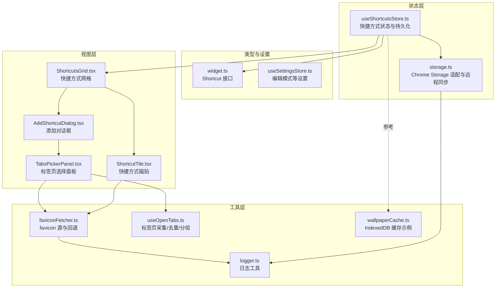
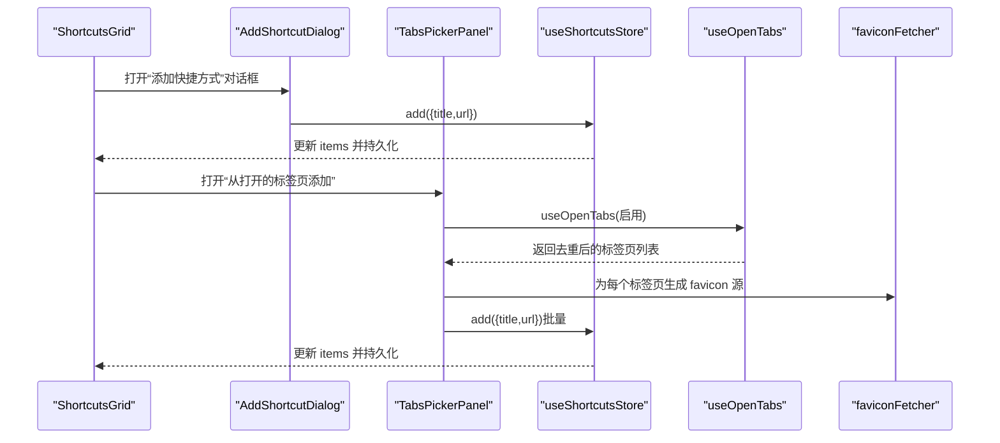
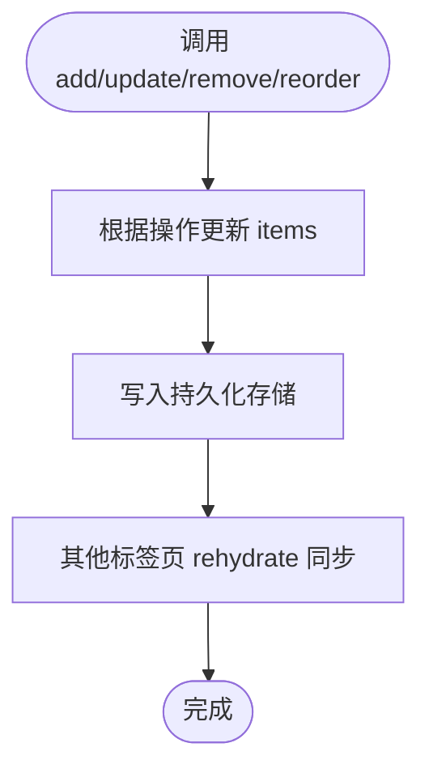
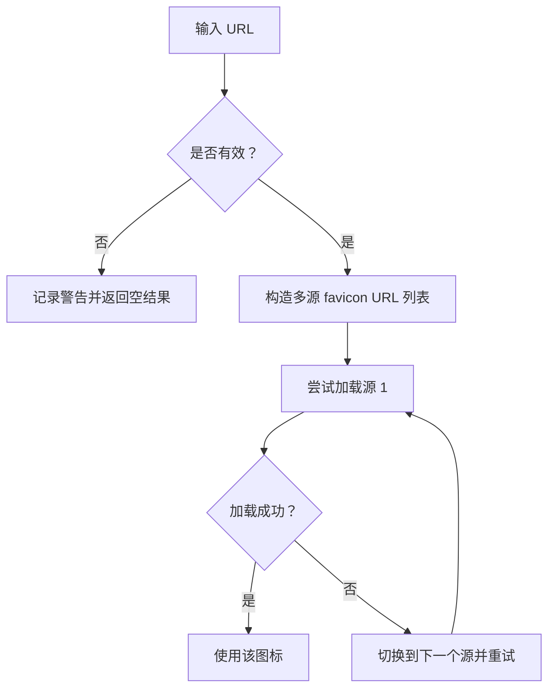
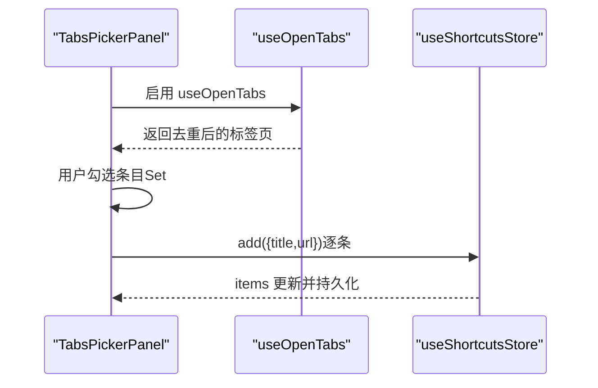
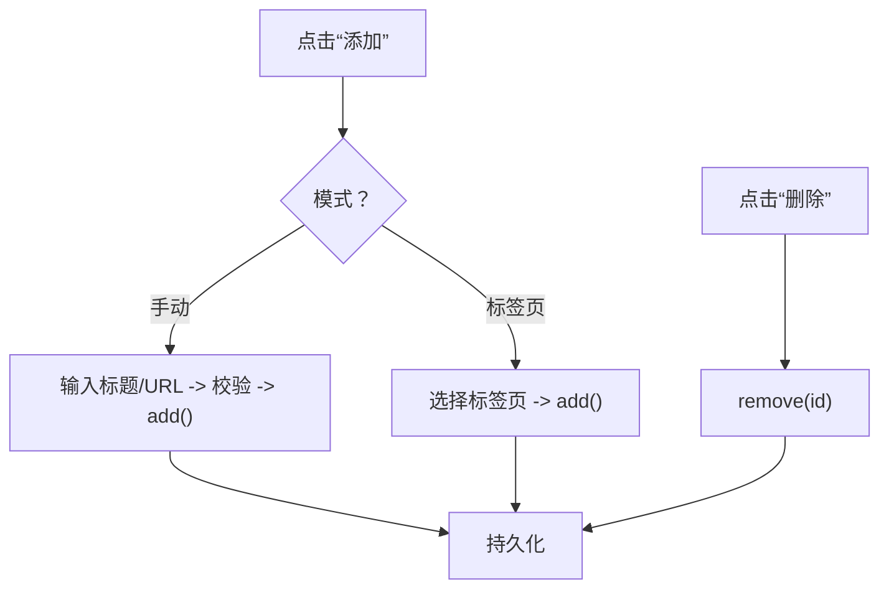
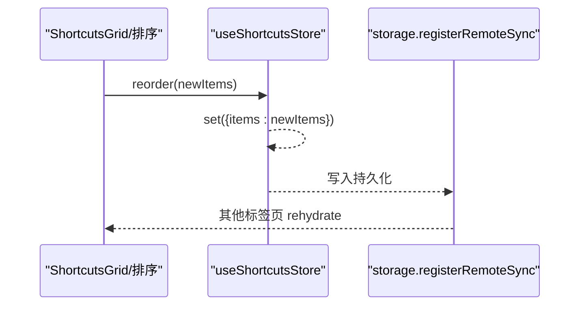
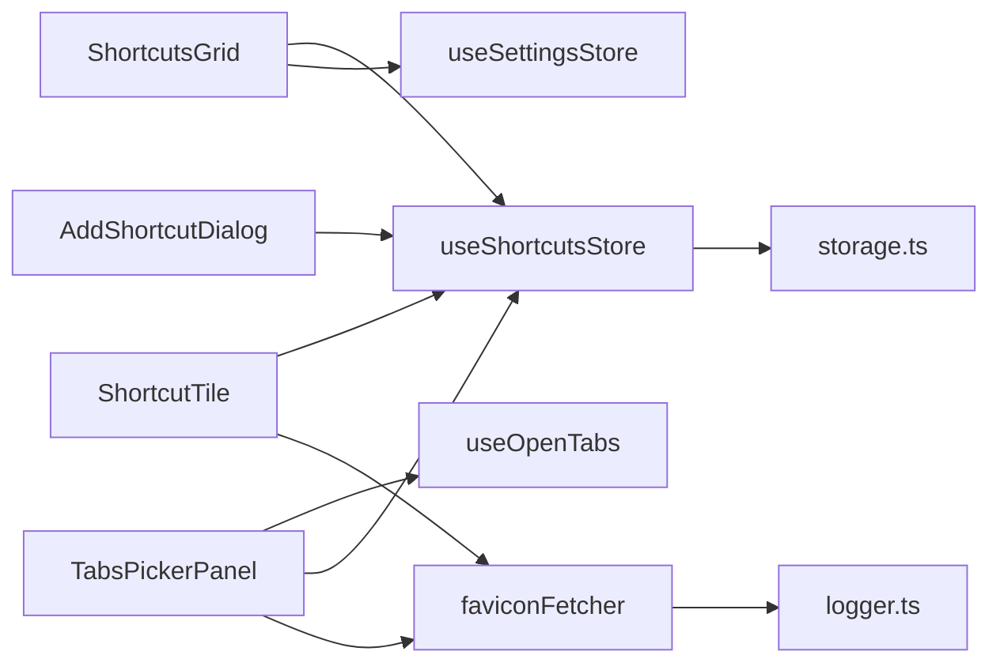

# 快捷方式状态管理

<cite>
**本文引用的文件**
- [useShortcutsStore.ts](file://src/store/useShortcutsStore.ts)
- [storage.ts](file://src/store/storage.ts)
- [widget.ts](file://src/types/widget.ts)
- [faviconFetcher.ts](file://src/components/widgets/Shortcuts/faviconFetcher.ts)
- [useOpenTabs.ts](file://src/components/widgets/Shortcuts/useOpenTabs.ts)
- [AddShortcutDialog.tsx](file://src/components/widgets/Shortcuts/AddShortcutDialog.tsx)
- [ShortcutTile.tsx](file://src/components/widgets/Shortcuts/ShortcutTile.tsx)
- [ShortcutsGrid.tsx](file://src/components/widgets/Shortcuts/ShortcutsGrid.tsx)
- [TabsPickerPanel.tsx](file://src/components/widgets/Shortcuts/TabsPickerPanel.tsx)
- [useSettingsStore.ts](file://src/store/useSettingsStore.ts)
- [logger.ts](file://src/lib/logger.ts)
- [wallpaperCache.ts](file://src/lib/wallpaperCache.ts)
- [useShortcutsStore.test.ts](file://src/store/useShortcutsStore.test.ts)
</cite>

## 目录

1. [简介](#简介)
2. [项目结构](#项目结构)
3. [核心组件](#核心组件)
4. [架构总览](#架构总览)
5. [详细组件分析](#详细组件分析)
6. [依赖关系分析](#依赖关系分析)
7. [性能考量](#性能考量)
8. [故障排查指南](#故障排查指南)
9. [结论](#结论)
10. [附录](#附录)

## 简介

本文件聚焦于“快捷方式状态管理”的完整技术文档，围绕 Zustand 状态库中的 useShortcutsStore 实现进行深入剖析，涵盖快捷方式的数据结构、状态管理逻辑、添加/删除/编辑流程、favicon 获取与缓存机制、排序与批量操作、与浏览器标签页的关联状态，以及性能优化与内存管理策略。同时提供可视化图示与常见问题解决方案，帮助开发者快速理解并扩展该模块。

## 项目结构

快捷方式相关代码主要分布在以下位置：

- 状态层：src/store/useShortcutsStore.ts（Zustand store）、src/store/storage.ts（持久化与跨页面同步）
- 类型定义：src/types/widget.ts（Shortcut 接口）
- 视图层：src/components/widgets/Shortcuts/\*.tsx（对话框、网格、磁贴、标签页选择面板）
- 工具层：src/components/widgets/Shortcuts/faviconFetcher.ts（favicon 解析与回退）、src/components/widgets/Shortcuts/useOpenTabs.ts（浏览器标签页采集与去重）
- 设置层：src/store/useSettingsStore.ts（编辑模式等全局设置）
- 日志与缓存：src/lib/logger.ts、src/lib/wallpaperCache.ts（日志与壁纸缓存，便于理解错误处理与缓存策略）

图表来源

- [useShortcutsStore.ts:1-54](file://src/store/useShortcutsStore.ts#L1-L54)
- [storage.ts:1-63](file://src/store/storage.ts#L1-L63)
- [widget.ts:1-34](file://src/types/widget.ts#L1-L34)
- [useSettingsStore.ts:1-89](file://src/store/useSettingsStore.ts#L1-L89)
- [ShortcutsGrid.tsx:1-38](file://src/components/widgets/Shortcuts/ShortcutsGrid.tsx#L1-L38)
- [ShortcutTile.tsx:1-79](file://src/components/widgets/Shortcuts/ShortcutTile.tsx#L1-L79)
- [AddShortcutDialog.tsx:1-115](file://src/components/widgets/Shortcuts/AddShortcutDialog.tsx#L1-L115)
- [TabsPickerPanel.tsx:1-288](file://src/components/widgets/Shortcuts/TabsPickerPanel.tsx#L1-L288)
- [faviconFetcher.ts:1-42](file://src/components/widgets/Shortcuts/faviconFetcher.ts#L1-L42)
- [useOpenTabs.ts:1-176](file://src/components/widgets/Shortcuts/useOpenTabs.ts#L1-L176)
- [logger.ts:1-35](file://src/lib/logger.ts#L1-L35)
- [wallpaperCache.ts:1-94](file://src/lib/wallpaperCache.ts#L1-L94)

章节来源

- [useShortcutsStore.ts:1-54](file://src/store/useShortcutsStore.ts#L1-L54)
- [storage.ts:1-63](file://src/store/storage.ts#L1-L63)
- [widget.ts:1-34](file://src/types/widget.ts#L1-L34)
- [useSettingsStore.ts:1-89](file://src/store/useSettingsStore.ts#L1-L89)

## 核心组件

- useShortcutsStore：负责快捷方式列表的增删改查与持久化，支持默认项、随机 ID、本地存储与多页面同步。
- storage：封装 Chrome Storage 与本地存储的统一接口，并提供水合与远程同步注册。
- Shortcut 类型：定义快捷方式的字段（id、title、url、iconUrl）。
- faviconFetcher：提供 favicon URL 构造与多源回退、首字母与颜色生成。
- useOpenTabs：采集浏览器标签页、过滤与去重、分组与变更监听。
- 视图组件：ShortcutsGrid、ShortcutTile、AddShortcutDialog、TabsPickerPanel 负责 UI 交互与状态联动。

章节来源

- [useShortcutsStore.ts:6-50](file://src/store/useShortcutsStore.ts#L6-L50)
- [storage.ts:6-32](file://src/store/storage.ts#L6-L32)
- [widget.ts:1-6](file://src/types/widget.ts#L1-L6)
- [faviconFetcher.ts:3-41](file://src/components/widgets/Shortcuts/faviconFetcher.ts#L3-L41)
- [useOpenTabs.ts:80-94](file://src/components/widgets/Shortcuts/useOpenTabs.ts#L80-L94)
- [ShortcutsGrid.tsx:9-37](file://src/components/widgets/Shortcuts/ShortcutsGrid.tsx#L9-L37)
- [ShortcutTile.tsx:13-78](file://src/components/widgets/Shortcuts/ShortcutTile.tsx#L13-L78)
- [AddShortcutDialog.tsx:24-86](file://src/components/widgets/Shortcuts/AddShortcutDialog.tsx#L24-L86)
- [TabsPickerPanel.tsx:21-201](file://src/components/widgets/Shortcuts/TabsPickerPanel.tsx#L21-L201)

## 架构总览

快捷方式状态管理采用“状态层 + 视图层 + 工具层”的分层设计：

- 状态层：Zustand store + 持久化中间件，确保数据在多标签页间同步。
- 视图层：通过 hooks 订阅状态，渲染快捷方式磁贴、对话框与标签页选择面板。
- 工具层：favicon 回退策略、标签页采集与去重、日志记录。

图表来源

- [ShortcutsGrid.tsx:9-37](file://src/components/widgets/Shortcuts/ShortcutsGrid.tsx#L9-L37)
- [AddShortcutDialog.tsx:24-86](file://src/components/widgets/Shortcuts/AddShortcutDialog.tsx#L24-L86)
- [TabsPickerPanel.tsx:21-201](file://src/components/widgets/Shortcuts/TabsPickerPanel.tsx#L21-L201)
- [useOpenTabs.ts:98-157](file://src/components/widgets/Shortcuts/useOpenTabs.ts#L98-L157)
- [faviconFetcher.ts:13-26](file://src/components/widgets/Shortcuts/faviconFetcher.ts#L13-L26)
- [useShortcutsStore.ts:23-50](file://src/store/useShortcutsStore.ts#L23-L50)

## 详细组件分析

### useShortcutsStore：快捷方式状态与持久化

- 数据结构：items 为 Shortcut 数组；Shortcut 包含 id、title、url、iconUrl。
- 默认项：初始化包含多个常用站点，作为用户首次体验的基础。
- 增删改查：
  - add：追加新快捷方式，使用随机 ID。
  - update：按 id 局部更新字段。
  - remove：按 id 过滤删除。
  - reorder：整组替换 items，用于拖拽排序。
- 持久化与同步：
  - 使用 persist 中间件，存储到 Chrome Storage 或本地存储。
  - 支持 skipHydration 与迁移版本。
  - 注册水合与远程同步回调，保证多标签页一致。

图表来源

- [useShortcutsStore.ts:23-50](file://src/store/useShortcutsStore.ts#L23-L50)
- [storage.ts:37-62](file://src/store/storage.ts#L37-L62)

章节来源

- [useShortcutsStore.ts:6-50](file://src/store/useShortcutsStore.ts#L6-L50)
- [storage.ts:6-32](file://src/store/storage.ts#L6-L32)
- [useShortcutsStore.test.ts:17-68](file://src/store/useShortcutsStore.test.ts#L17-L68)

### favicon 获取与缓存机制

- 多源回退：优先使用 chrome://favicon2，其次 DuckDuckGo IP3，最后 Google s2。
- 错误处理：无效 URL 时返回空字符串或空数组，并通过日志记录。
- 首字母与颜色：当所有源均不可用时，基于 title 生成首字母与固定色板颜色。
- 缓存策略：当前快捷方式磁贴与标签页磁贴在渲染时动态尝试多个源，失败自动切换下一个，形成“源级缓存”。若需全局缓存，可参考壁纸缓存的 IndexedDB 模式（best-effort）。

图表来源

- [faviconFetcher.ts:3-26](file://src/components/widgets/Shortcuts/faviconFetcher.ts#L3-L26)
- [logger.ts:20-30](file://src/lib/logger.ts#L20-L30)

章节来源

- [faviconFetcher.ts:3-41](file://src/components/widgets/Shortcuts/faviconFetcher.ts#L3-L41)
- [logger.ts:1-35](file://src/lib/logger.ts#L1-L35)

### 与浏览器标签页的关联状态

- 标签页采集：useOpenTabs 在启用时查询所有标签页，过滤掉无用协议与无效条目。
- 去重策略：以规范化 URL 为主键，保留标题更长或当前窗口的条目，避免重复。
- 分组展示：按窗口分组，突出当前窗口，便于选择。
- 选择状态：使用 Set 维护“可添加”集合，支持全选/反选与提交。
- 提交流程：遍历已选中且不在现有快捷方式中的条目，调用 store.add 批量添加。

图表来源

- [TabsPickerPanel.tsx:21-110](file://src/components/widgets/Shortcuts/TabsPickerPanel.tsx#L21-L110)
- [useOpenTabs.ts:98-157](file://src/components/widgets/Shortcuts/useOpenTabs.ts#L98-L157)
- [useShortcutsStore.ts:27-39](file://src/store/useShortcutsStore.ts#L27-L39)

章节来源

- [useOpenTabs.ts:19-94](file://src/components/widgets/Shortcuts/useOpenTabs.ts#L19-L94)
- [TabsPickerPanel.tsx:21-201](file://src/components/widgets/Shortcuts/TabsPickerPanel.tsx#L21-L201)

### 添加、删除与编辑状态处理

- 添加：
  - 手动输入：AddShortcutDialog 校验并调用 store.add。
  - 标签页导入：TabsPickerPanel 选择后逐条调用 store.add。
- 删除：ShortcutTile 在编辑模式下显示删除按钮，点击触发 store.remove。
- 编辑：当前实现不直接暴露“编辑标题/URL”的入口，可通过重新添加或后续扩展实现。

图表来源

- [AddShortcutDialog.tsx:24-86](file://src/components/widgets/Shortcuts/AddShortcutDialog.tsx#L24-L86)
- [ShortcutTile.tsx:14-66](file://src/components/widgets/Shortcuts/ShortcutTile.tsx#L14-L66)
- [TabsPickerPanel.tsx:91-110](file://src/components/widgets/Shortcuts/TabsPickerPanel.tsx#L91-L110)
- [useShortcutsStore.ts:27-39](file://src/store/useShortcutsStore.ts#L27-L39)

章节来源

- [AddShortcutDialog.tsx:24-86](file://src/components/widgets/Shortcuts/AddShortcutDialog.tsx#L24-L86)
- [ShortcutTile.tsx:13-78](file://src/components/widgets/Shortcuts/ShortcutTile.tsx#L13-L78)
- [TabsPickerPanel.tsx:91-110](file://src/components/widgets/Shortcuts/TabsPickerPanel.tsx#L91-L110)

### 排序与批量操作的状态同步

- 排序：reorder 将传入的新顺序整组替换 items，确保 UI 与状态一致。
- 批量：TabsPickerPanel 支持全选/反选与批量提交，逐条调用 add，最终一次持久化。
- 多标签页同步：storage.registerRemoteSync 确保其他标签页 rehydrate，避免状态漂移。

图表来源

- [useShortcutsStore.ts:40-40](file://src/store/useShortcutsStore.ts#L40-L40)
- [storage.ts:49-62](file://src/store/storage.ts#L49-L62)

章节来源

- [useShortcutsStore.ts:14-21](file://src/store/useShortcutsStore.ts#L14-L21)
- [TabsPickerPanel.tsx:80-89](file://src/components/widgets/Shortcuts/TabsPickerPanel.tsx#L80-L89)

### 与编辑模式的关联

- 编辑模式由 useSettingsStore 控制，ShortcutsGrid 读取 editMode 决定磁贴是否可删除。
- 编辑模式切换不会影响快捷方式数据，仅改变 UI 行为。

章节来源

- [useSettingsStore.ts:20-31](file://src/store/useSettingsStore.ts#L20-L31)
- [ShortcutsGrid.tsx:10-11](file://src/components/widgets/Shortcuts/ShortcutsGrid.tsx#L10-L11)

## 依赖关系分析

- 组件耦合：
  - ShortcutsGrid 依赖 useShortcutsStore 与 useSettingsStore。
  - ShortcutTile 依赖 useShortcutsStore 与 faviconFetcher。
  - AddShortcutDialog 依赖 useShortcutsStore。
  - TabsPickerPanel 依赖 useOpenTabs、faviconFetcher 与 useShortcutsStore。
- 外部依赖：
  - Chrome Storage：通过 storage.ts 统一封装。
  - 日志：通过 logger.ts 输出警告与错误。
  - 类型：widget.ts 定义 Shortcut 结构。

图表来源

- [ShortcutsGrid.tsx:9-37](file://src/components/widgets/Shortcuts/ShortcutsGrid.tsx#L9-L37)
- [ShortcutTile.tsx:13-78](file://src/components/widgets/Shortcuts/ShortcutTile.tsx#L13-L78)
- [AddShortcutDialog.tsx:24-86](file://src/components/widgets/Shortcuts/AddShortcutDialog.tsx#L24-L86)
- [TabsPickerPanel.tsx:21-201](file://src/components/widgets/Shortcuts/TabsPickerPanel.tsx#L21-L201)
- [useShortcutsStore.ts:23-50](file://src/store/useShortcutsStore.ts#L23-L50)
- [storage.ts:6-32](file://src/store/storage.ts#L6-L32)
- [faviconFetcher.ts:1-42](file://src/components/widgets/Shortcuts/faviconFetcher.ts#L1-L42)
- [logger.ts:1-35](file://src/lib/logger.ts#L1-L35)

章节来源

- [useShortcutsStore.ts:1-54](file://src/store/useShortcutsStore.ts#L1-L54)
- [storage.ts:1-63](file://src/store/storage.ts#L1-L63)

## 性能考量

- 渲染性能
  - 使用 memo 包裹 ShortcutTile，减少不必要的重渲染。
  - 使用 useMemo 计算 favicon 源列表，避免每次渲染都重新计算。
- 网络与缓存
  - favicon 多源回退在渲染时自动切换，无需额外缓存；如需全局缓存，可参考壁纸缓存的 IndexedDB 模式（best-effort）。
- 存储与同步
  - 持久化采用 JSON 序列化，版本迁移避免频繁写入。
  - 多标签页同步通过 onChanged 监听，减少冗余 rehydrate。
- 内存管理
  - 对象 URL（如壁纸缓存）应适时释放，避免内存泄漏；当前快捷方式磁贴未显式创建对象 URL，风险较低。
  - IndexedDB 缓存示例展示了只读/读写事务与异常忽略，适合参考其健壮性设计。

章节来源

- [ShortcutTile.tsx:13-22](file://src/components/widgets/Shortcuts/ShortcutTile.tsx#L13-L22)
- [TabsPickerPanel.tsx:257-287](file://src/components/widgets/Shortcuts/TabsPickerPanel.tsx#L257-L287)
- [storage.ts:53-62](file://src/store/storage.ts#L53-L62)
- [wallpaperCache.ts:17-68](file://src/lib/wallpaperCache.ts#L17-L68)

## 故障排查指南

- favicon 无法显示
  - 检查 URL 是否有效；无效会返回空结果并记录警告。
  - 确认网络可达性；多源回退会依次尝试。
- 标签页未显示或显示重复
  - 确认 useOpenTabs 已启用；检查过滤规则与去重逻辑。
  - 若标题为空，会回退到主机名作为标题。
- 添加失败或未生效
  - 确认 store.add 调用成功；检查持久化是否写入。
  - 多标签页未同步：确认 storage.registerRemoteSync 是否注册。
- 编辑模式无效
  - 确认 useSettingsStore.editMode 状态正确；ShortcutsGrid 依赖该状态控制删除按钮显示。

章节来源

- [faviconFetcher.ts:7-10](file://src/components/widgets/Shortcuts/faviconFetcher.ts#L7-L10)
- [useOpenTabs.ts:19-94](file://src/components/widgets/Shortcuts/useOpenTabs.ts#L19-L94)
- [storage.ts:49-62](file://src/store/storage.ts#L49-L62)
- [useSettingsStore.ts:54](file://src/store/useSettingsStore.ts#L54)

## 结论

useShortcutsStore 通过简洁的状态模型与完善的持久化/同步机制，实现了快捷方式的可靠管理。配合 favicon 多源回退、标签页采集与去重、批量添加与排序等功能，构建了完整的用户体验闭环。建议在后续迭代中：

- 引入“编辑标题/URL”的直接入口；
- 可选引入全局 favicon 缓存；
- 优化批量添加的性能与反馈；
- 加强错误边界与提示文案。

## 附录

- 测试覆盖点：默认项、新增、更新、删除、排序等关键行为均有单元测试保障。
- 类型安全：Shortcut 接口约束字段，避免运行期错误。

章节来源

- [useShortcutsStore.test.ts:17-68](file://src/store/useShortcutsStore.test.ts#L17-L68)
- [widget.ts:1-6](file://src/types/widget.ts#L1-L6)
