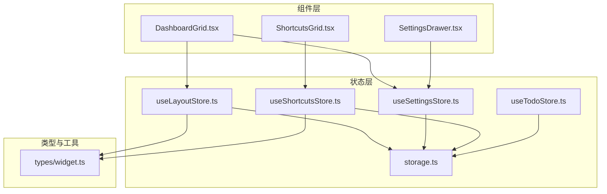
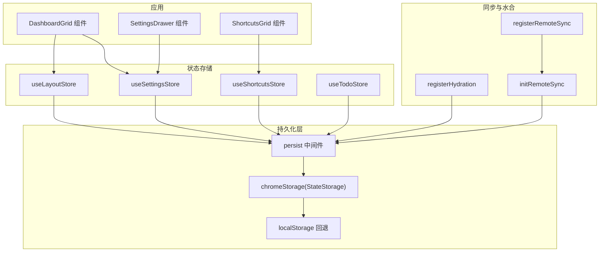
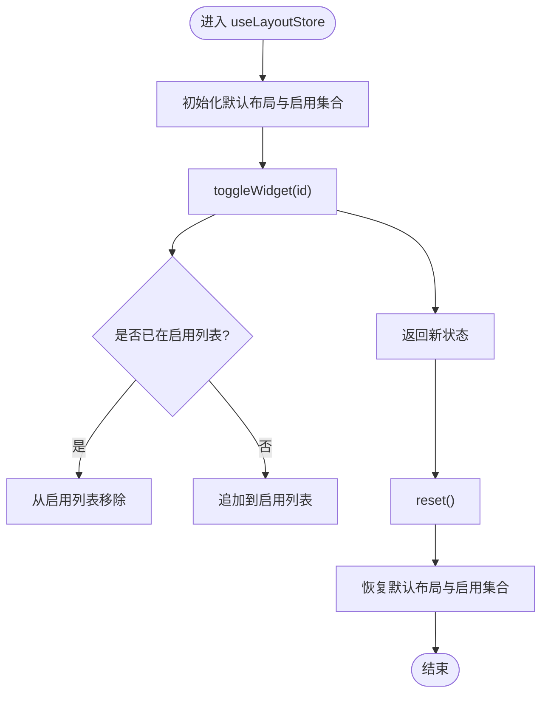
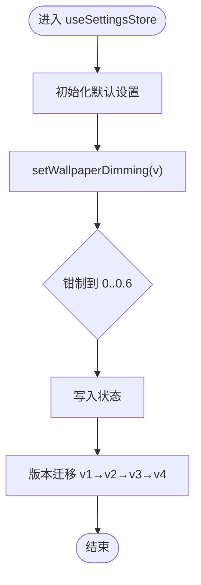
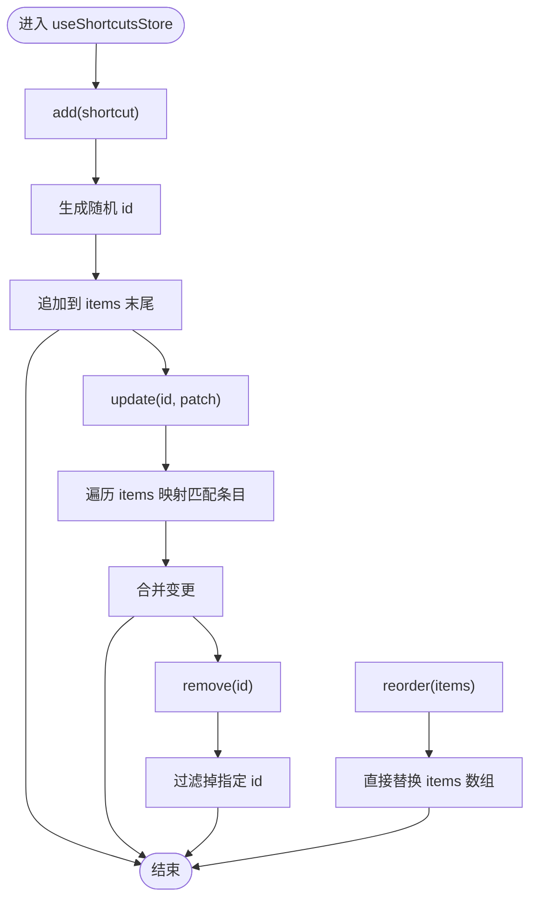
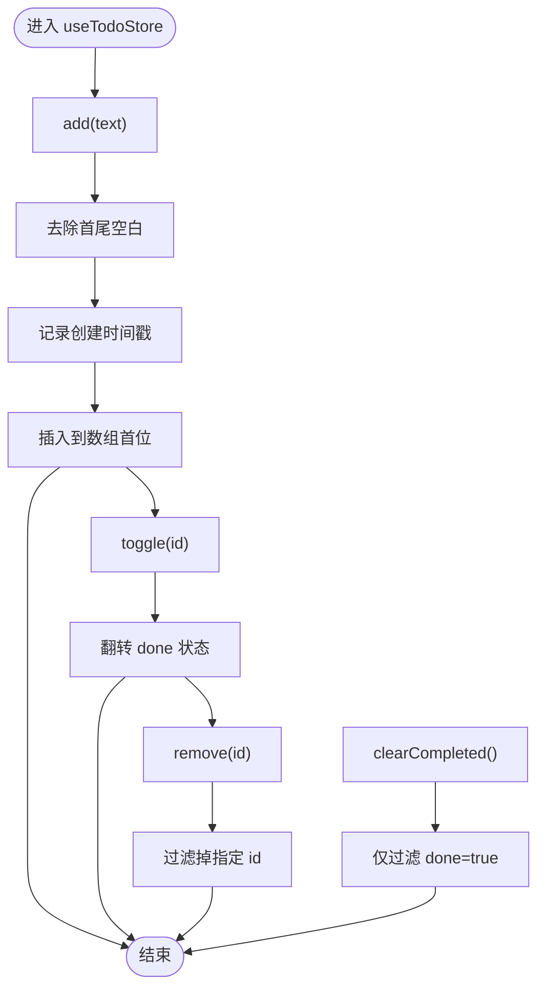
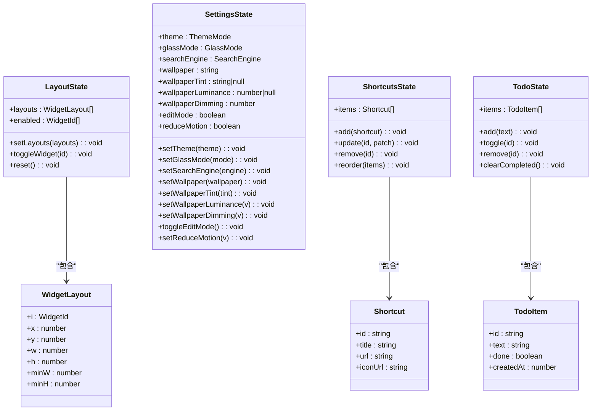
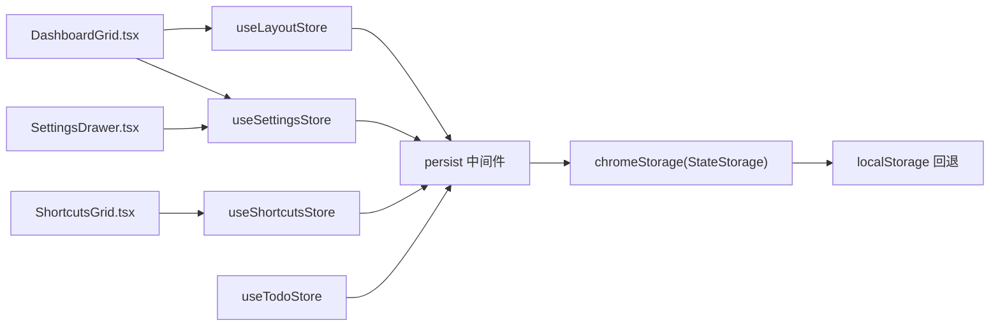

# 状态管理系统

<cite>
**本文引用的文件**
- [src/store/useLayoutStore.ts](file://src/store/useLayoutStore.ts)
- [src/store/useSettingsStore.ts](file://src/store/useSettingsStore.ts)
- [src/store/useShortcutsStore.ts](file://src/store/useShortcutsStore.ts)
- [src/store/useTodoStore.ts](file://src/store/useTodoStore.ts)
- [src/store/storage.ts](file://src/store/storage.ts)
- [src/types/widget.ts](file://src/types/widget.ts)
- [src/components/layout/DashboardGrid.tsx](file://src/components/layout/DashboardGrid.tsx)
- [src/components/widgets/Shortcuts/ShortcutsGrid.tsx](file://src/components/widgets/Shortcuts/ShortcutsGrid.tsx)
- [src/components/settings/SettingsDrawer.tsx](file://src/components/settings/SettingsDrawer.tsx)
- [src/store/useLayoutStore.test.ts](file://src/store/useLayoutStore.test.ts)
- [src/store/useSettingsStore.test.ts](file://src/store/useSettingsStore.test.ts)
- [src/store/useShortcutsStore.test.ts](file://src/store/useShortcutsStore.test.ts)
- [src/store/useTodoStore.test.ts](file://src/store/useTodoStore.test.ts)
</cite>

## 目录

1. [简介](#简介)
2. [项目结构](#项目结构)
3. [核心组件](#核心组件)
4. [架构总览](#架构总览)
5. [详细组件分析](#详细组件分析)
6. [依赖关系分析](#依赖关系分析)
7. [性能考量](#性能考量)
8. [故障排查指南](#故障排查指南)
9. [结论](#结论)
10. [附录：调试与最佳实践](#附录调试与最佳实践)

## 简介

本文件系统性梳理基于 Zustand 的状态管理方案，重点覆盖以下方面：

- 各个 store 的设计模式与职责边界：useLayoutStore、useSettingsStore、useShortcutsStore、useTodoStore
- 与 Chrome Storage 的集成与数据持久化策略
- 状态同步机制（本地 rehydrate 与远程同步）
- 异步操作处理与错误恢复
- 订阅模式与组件更新优化
- 调试工具使用与常见问题排查
- 最佳实践与性能优化建议
- 具体代码示例路径与扩展指南

## 项目结构

状态管理相关代码集中于 src/store 目录，采用“按领域拆分”的模块化组织方式：

- 每个 store 独立文件，职责单一，便于维护与测试
- 通过 persist 中间件与自定义 StateStorage 实现跨页面/多标签页的数据持久化
- 通过注册水合与远程同步回调，确保多实例一致性

图示来源

- [src/store/useLayoutStore.ts:1-58](file://src/store/useLayoutStore.ts#L1-L58)
- [src/store/useSettingsStore.ts:1-89](file://src/store/useSettingsStore.ts#L1-L89)
- [src/store/useShortcutsStore.ts:1-54](file://src/store/useShortcutsStore.ts#L1-L54)
- [src/store/useTodoStore.ts:1-59](file://src/store/useTodoStore.ts#L1-L59)
- [src/store/storage.ts:1-63](file://src/store/storage.ts#L1-L63)
- [src/components/layout/DashboardGrid.tsx:1-110](file://src/components/layout/DashboardGrid.tsx#L1-L110)
- [src/components/widgets/Shortcuts/ShortcutsGrid.tsx:1-38](file://src/components/widgets/Shortcuts/ShortcutsGrid.tsx#L1-L38)
- [src/components/settings/SettingsDrawer.tsx:1-22](file://src/components/settings/SettingsDrawer.tsx#L1-L22)
- [src/types/widget.ts:1-34](file://src/types/widget.ts#L1-L34)

章节来源

- [src/store/useLayoutStore.ts:1-58](file://src/store/useLayoutStore.ts#L1-L58)
- [src/store/useSettingsStore.ts:1-89](file://src/store/useSettingsStore.ts#L1-L89)
- [src/store/useShortcutsStore.ts:1-54](file://src/store/useShortcutsStore.ts#L1-L54)
- [src/store/useTodoStore.ts:1-59](file://src/store/useTodoStore.ts#L1-L59)
- [src/store/storage.ts:1-63](file://src/store/storage.ts#L1-L63)
- [src/types/widget.ts:1-34](file://src/types/widget.ts#L1-L34)

## 核心组件

本节对四个核心 store 的职责、数据结构与关键方法进行概览式说明。

- useLayoutStore
  - 职责：管理仪表盘小部件布局与启用状态；支持重置为默认布局
  - 关键字段：layouts（WidgetLayout[]）、enabled（WidgetId[]）
  - 关键方法：setLayouts、toggleWidget、reset
  - 持久化键：tab:layout

- useSettingsStore
  - 职责：主题、玻璃效果、搜索引擎、壁纸、动态亮度与可访问性等全局设置
  - 关键字段：theme、glassMode、searchEngine、wallpaper、wallpaperTint、wallpaperLuminance、wallpaperDimming、editMode、reduceMotion
  - 关键方法：setTheme、setGlassMode、setSearchEngine、setWallpaper、setWallpaperTint、setWallpaperLuminance、setWallpaperDimming、toggleEditMode、setReduceMotion
  - 持久化键：tab:settings；版本迁移策略覆盖 v1→v2→v3→v4

- useShortcutsStore
  - 职责：用户自定义快捷方式列表的增删改与排序
  - 关键字段：items（Shortcut[]）
  - 关键方法：add、update、remove、reorder
  - 持久化键：tab:shortcuts

- useTodoStore
  - 职责：待办事项列表的增删改与清理已完成项
  - 关键字段：items（TodoItem[]）
  - 关键方法：add、toggle、remove、clearCompleted
  - 持久化键：tab:todo

章节来源

- [src/store/useLayoutStore.ts:6-12](file://src/store/useLayoutStore.ts#L6-L12)
- [src/store/useSettingsStore.ts:10-31](file://src/store/useSettingsStore.ts#L10-L31)
- [src/store/useShortcutsStore.ts:6-12](file://src/store/useShortcutsStore.ts#L6-L12)
- [src/store/useTodoStore.ts:12-18](file://src/store/useTodoStore.ts#L12-L18)

## 架构总览

Zustand + persist + 自定义 Chrome Storage 的整体架构如下：

图示来源

- [src/components/layout/DashboardGrid.tsx:1-110](file://src/components/layout/DashboardGrid.tsx#L1-L110)
- [src/components/widgets/Shortcuts/ShortcutsGrid.tsx:1-38](file://src/components/widgets/Shortcuts/ShortcutsGrid.tsx#L1-L38)
- [src/components/settings/SettingsDrawer.tsx:1-22](file://src/components/settings/SettingsDrawer.tsx#L1-L22)
- [src/store/useLayoutStore.ts:32-54](file://src/store/useLayoutStore.ts#L32-L54)
- [src/store/useSettingsStore.ts:35-84](file://src/store/useSettingsStore.ts#L35-L84)
- [src/store/useShortcutsStore.ts:23-49](file://src/store/useShortcutsStore.ts#L23-L49)
- [src/store/useTodoStore.ts:20-54](file://src/store/useTodoStore.ts#L20-L54)
- [src/store/storage.ts:6-32](file://src/store/storage.ts#L6-L32)
- [src/store/storage.ts:34-62](file://src/store/storage.ts#L34-L62)

## 详细组件分析

### useLayoutStore 分析

- 设计要点
  - 使用 persist 中间件，存储键为 tab:layout，跳过初次水合（skipHydration），版本号 1，迁移函数保留原数据
  - 提供布局数组替换、启用/禁用小部件切换、重置默认布局的能力
- 数据结构
  - layouts：WidgetLayout[]，包含每个小部件的位置、尺寸与最小尺寸约束
  - enabled：WidgetId[]，记录当前启用的小部件集合
- 关键流程
  - 切换启用状态：若已启用则移除，否则追加
  - 重置：恢复默认布局与启用集合
- 与组件交互
  - DashboardGrid 读取 layouts 与 enabled，计算可见小部件集合，并在拖拽布局后调用 setLayouts 合并更新

图示来源

- [src/store/useLayoutStore.ts:32-54](file://src/store/useLayoutStore.ts#L32-L54)

章节来源

- [src/store/useLayoutStore.ts:14-58](file://src/store/useLayoutStore.ts#L14-L58)
- [src/components/layout/DashboardGrid.tsx:42-109](file://src/components/layout/DashboardGrid.tsx#L42-L109)
- [src/store/useLayoutStore.test.ts:1-57](file://src/store/useLayoutStore.test.ts#L1-L57)

### useSettingsStore 分析

- 设计要点
  - 持久化键 tab:settings，版本 4，包含多阶段迁移逻辑（v1→v2→v3→v4）
  - 壁纸亮度采用连续值（0..1）替代二值字段，便于自适应文本对比度
  - 壁纸遮罩强度限制在 0..0.6 区间
- 数据结构
  - 主题：light/dark/system
  - 玻璃效果：sequoia/tahoe
  - 搜索引擎：google/bing/baidu/duckduckgo
  - 壁纸相关：wallpaper、wallpaperTint、wallpaperLuminance、wallpaperDimming
  - 可访问性：editMode、reduceMotion
- 关键流程
  - 设置壁纸遮罩强度时进行边界钳制
  - 迁移逻辑根据版本差异补全或转换字段

图示来源

- [src/store/useSettingsStore.ts:35-84](file://src/store/useSettingsStore.ts#L35-L84)

章节来源

- [src/store/useSettingsStore.ts:33-89](file://src/store/useSettingsStore.ts#L33-L89)
- [src/store/useSettingsStore.test.ts:1-90](file://src/store/useSettingsStore.test.ts#L1-L90)

### useShortcutsStore 分析

- 设计要点
  - 持久化键 tab:shortcuts，版本 1
  - 新增快捷方式时使用随机 ID，保证唯一性
  - 支持按序重排（reorder）与按 id 更新/删除
- 数据结构
  - items：Shortcut[]，包含 id、title、url、iconUrl（可选）
- 关键流程
  - add：生成新 id 并追加到末尾
  - update：映射匹配 id 的条目并合并变更
  - remove：过滤掉指定 id 的条目
  - reorder：直接替换整个数组

图示来源

- [src/store/useShortcutsStore.ts:23-49](file://src/store/useShortcutsStore.ts#L23-L49)

章节来源

- [src/store/useShortcutsStore.ts:14-54](file://src/store/useShortcutsStore.ts#L14-L54)
- [src/components/widgets/Shortcuts/ShortcutsGrid.tsx:9-37](file://src/components/widgets/Shortcuts/ShortcutsGrid.tsx#L9-L37)
- [src/store/useShortcutsStore.test.ts:1-69](file://src/store/useShortcutsStore.test.ts#L1-L69)

### useTodoStore 分析

- 设计要点
  - 持久化键 tab:todo，版本 1
  - 新增时自动去除前后空白、记录创建时间戳、使用随机 id
  - 清理已完成项仅移除 done=true 的条目
- 数据结构
  - items：TodoItem[]，包含 id、text、done、createdAt
- 关键流程
  - add：预处理文本并插入到数组首位
  - toggle：翻转指定 id 的 done 状态
  - remove：删除指定 id 的条目
  - clearCompleted：仅清理已完成项

图示来源

- [src/store/useTodoStore.ts:20-54](file://src/store/useTodoStore.ts#L20-L54)

章节来源

- [src/store/useTodoStore.ts:5-59](file://src/store/useTodoStore.ts#L5-L59)
- [src/store/useTodoStore.test.ts:1-84](file://src/store/useTodoStore.test.ts#L1-L84)

### 类关系图（代码级）

图示来源

- [src/store/useLayoutStore.ts:6-12](file://src/store/useLayoutStore.ts#L6-L12)
- [src/store/useSettingsStore.ts:10-31](file://src/store/useSettingsStore.ts#L10-L31)
- [src/store/useShortcutsStore.ts:6-12](file://src/store/useShortcutsStore.ts#L6-L12)
- [src/store/useTodoStore.ts:12-18](file://src/store/useTodoStore.ts#L12-L18)
- [src/types/widget.ts:25-33](file://src/types/widget.ts#L25-L33)

## 依赖关系分析

- 组件与 store 的依赖
  - DashboardGrid 依赖 useLayoutStore 与 useSettingsStore，用于布局渲染与编辑态控制
  - ShortcutsGrid 依赖 useShortcutsStore 与 useSettingsStore，用于展示快捷方式与编辑态
  - SettingsDrawer 依赖 useSettingsStore，用于主题、壁纸与布局设置
- store 之间的耦合
  - 各 store 保持低耦合，通过独立键名与各自的 persist 配置隔离
- 外部依赖
  - persist 中间件与 createJSONStorage
  - 自定义 chromeStorage 作为 StateStorage，兼容浏览器扩展与开发环境回退

图示来源

- [src/components/layout/DashboardGrid.tsx:1-110](file://src/components/layout/DashboardGrid.tsx#L1-L110)
- [src/components/widgets/Shortcuts/ShortcutsGrid.tsx:1-38](file://src/components/widgets/Shortcuts/ShortcutsGrid.tsx#L1-L38)
- [src/components/settings/SettingsDrawer.tsx:1-22](file://src/components/settings/SettingsDrawer.tsx#L1-L22)
- [src/store/useLayoutStore.ts:32-54](file://src/store/useLayoutStore.ts#L32-L54)
- [src/store/useSettingsStore.ts:35-84](file://src/store/useSettingsStore.ts#L35-L84)
- [src/store/useShortcutsStore.ts:23-49](file://src/store/useShortcutsStore.ts#L23-L49)
- [src/store/useTodoStore.ts:20-54](file://src/store/useTodoStore.ts#L20-L54)
- [src/store/storage.ts:6-32](file://src/store/storage.ts#L6-L32)

章节来源

- [src/components/layout/DashboardGrid.tsx:1-110](file://src/components/layout/DashboardGrid.tsx#L1-L110)
- [src/components/widgets/Shortcuts/ShortcutsGrid.tsx:1-38](file://src/components/widgets/Shortcuts/ShortcutsGrid.tsx#L1-L38)
- [src/components/settings/SettingsDrawer.tsx:1-22](file://src/components/settings/SettingsDrawer.tsx#L1-L22)
- [src/store/storage.ts:1-63](file://src/store/storage.ts#L1-L63)

## 性能考量

- 订阅粒度与渲染优化
  - 通过选择器订阅（如 useLayoutStore((s) => s.layouts)）避免无关重渲染
  - 在 DashboardGrid 中使用 useMemo 缓存 visible 与 xsLayout，减少重复计算
- 拖拽与布局更新
  - 仅在桌面断点下响应布局变化，避免移动端频繁重排
  - 合并更新：将外部布局库的布局结果合并到现有布局对象，减少不必要的状态拆分
- 存储与水合
  - skipHydration 避免 SSR/首屏水合抖动；统一在应用启动时执行 hydrateStores
  - 远程同步监听 chrome.storage.onChanged，按需 rehydrate，降低不必要刷新
- 数据规模与序列化
  - 尽量保持状态扁平化，避免深层嵌套导致的昂贵比较
  - 对大数组操作（如 todo、shortcuts）优先使用不可变更新策略，配合 React.memo 或浅比较优化

[本节为通用性能指导，无需特定文件来源]

## 故障排查指南

- 持久化失败
  - 症状：设置未保存或丢失
  - 排查：检查 chrome.storage.local 是否可用；查看控制台是否有 runtime.lastError 输出
  - 参考路径：[chromeStorage 实现:6-32](file://src/store/storage.ts#L6-L32)
- 版本迁移异常
  - 症状：旧版本数据无法正确转换
  - 排查：确认 migrate 函数对 fromVersion 的判断与字段转换逻辑
  - 参考路径：[设置迁移逻辑:62-82](file://src/store/useSettingsStore.ts#L62-L82)
- 多标签页不同步
  - 症状：修改一个标签页后其他标签页未更新
  - 排查：确认 initRemoteSync 已调用；检查 registerRemoteSync 注册的键名与 rehydrate 回调
  - 参考路径：[远程同步初始化:53-62](file://src/store/storage.ts#L53-L62)
- 水合时机问题
  - 症状：首屏闪烁或默认值覆盖
  - 排查：确保 hydrateStores 在应用启动早期执行；避免在水合前读取状态
  - 参考路径：[水合注册与执行:34-43](file://src/store/storage.ts#L34-L43)
- 布局错乱
  - 症状：拖拽后布局错位
  - 排查：确认 handleLayoutChange 仅在桌面断点触发；检查合并逻辑是否覆盖了必要的属性
  - 参考路径：[布局变更处理:60-75](file://src/components/layout/DashboardGrid.tsx#L60-L75)

章节来源

- [src/store/storage.ts:6-32](file://src/store/storage.ts#L6-L32)
- [src/store/useSettingsStore.ts:62-82](file://src/store/useSettingsStore.ts#L62-L82)
- [src/store/storage.ts:53-62](file://src/store/storage.ts#L53-L62)
- [src/store/storage.ts:34-43](file://src/store/storage.ts#L34-L43)
- [src/components/layout/DashboardGrid.tsx:60-75](file://src/components/layout/DashboardGrid.tsx#L60-L75)

## 结论

该状态管理方案以 Zustand 为核心，结合 persist 与自定义 Chrome Storage，实现了：

- 清晰的领域拆分与职责边界
- 稳健的持久化与版本迁移
- 多实例同步与水合控制
- 面向组件的细粒度订阅与渲染优化
  在实际使用中，遵循本文的调试与最佳实践建议，可有效提升稳定性与性能。

[本节为总结性内容，无需特定文件来源]

## 附录：调试与最佳实践

### 调试工具与技巧

- 开发者工具
  - 在浏览器扩展面板查看 chrome.storage.local 中对应键值（如 tab:settings、tab:layout）
  - 观察 onChange 事件是否触发，验证远程同步生效
- 日志与错误
  - storage.ts 中对 chrome.storage 操作失败会输出错误日志，便于定位权限或配额问题
- 单元测试参考
  - 通过各 store 的测试用例了解预期行为与边界条件
  - 参考路径：
    - [布局 store 测试:1-57](file://src/store/useLayoutStore.test.ts#L1-L57)
    - [设置 store 测试:1-90](file://src/store/useSettingsStore.test.ts#L1-L90)
    - [快捷方式 store 测试:1-69](file://src/store/useShortcutsStore.test.ts#L1-L69)
    - [待办 store 测试:1-84](file://src/store/useTodoStore.test.ts#L1-L84)

### 最佳实践清单

- 持久化
  - 为每个 store 指定唯一且语义明确的 name 键
  - 合理设置 version 与 migrate，保障未来升级的向后兼容
  - 对可能失败的存储操作做好兜底（如回退 localStorage）
- 订阅与渲染
  - 使用选择器订阅，避免整块状态变化导致的过度重渲染
  - 对计算结果使用 useMemo 缓存，减少重复计算
- 同步与一致性
  - 在应用启动时统一执行 hydrateStores
  - 使用 registerRemoteSync 与 initRemoteSync 保持多实例一致
- 数据模型
  - 保持状态扁平化，避免深层嵌套
  - 对数组类状态采用不可变更新策略，便于追踪与优化
- 可维护性
  - 将默认值集中管理，便于统一调整
  - 为复杂字段（如壁纸亮度）提供边界钳制与转换逻辑

### 扩展指南

- 新增一个领域 store
  - 参考现有 store 的结构：定义状态接口、初始化默认值、实现动作方法
  - 使用 persist 中间件并配置 storage、skipHydration、version、migrate
  - 通过 registerHydration 与 registerRemoteSync 完成水合与同步
  - 在组件中以选择器订阅所需字段，避免全局重渲染
  - 补充单元测试覆盖关键分支
- 调整布局与小部件
  - 修改 WidgetLayout 默认值时，注意与组件渲染逻辑的兼容性
  - 如需新增小部件，完善 WIDGETS 映射与可见性规则
- 设置迁移
  - 当字段含义发生变化时，务必在 migrate 中完成平滑转换
  - 为新字段提供合理的默认值，避免空值影响用户体验

章节来源

- [src/store/storage.ts:34-62](file://src/store/storage.ts#L34-L62)
- [src/store/useLayoutStore.ts:32-54](file://src/store/useLayoutStore.ts#L32-L54)
- [src/store/useSettingsStore.ts:35-84](file://src/store/useSettingsStore.ts#L35-L84)
- [src/store/useShortcutsStore.ts:23-49](file://src/store/useShortcutsStore.ts#L23-L49)
- [src/store/useTodoStore.ts:20-54](file://src/store/useTodoStore.ts#L20-L54)
- [src/components/layout/DashboardGrid.tsx:42-109](file://src/components/layout/DashboardGrid.tsx#L42-L109)
- [src/store/useLayoutStore.test.ts:1-57](file://src/store/useLayoutStore.test.ts#L1-L57)
- [src/store/useSettingsStore.test.ts:1-90](file://src/store/useSettingsStore.test.ts#L1-L90)
- [src/store/useShortcutsStore.test.ts:1-69](file://src/store/useShortcutsStore.test.ts#L1-L69)
- [src/store/useTodoStore.test.ts:1-84](file://src/store/useTodoStore.test.ts#L1-L84)
