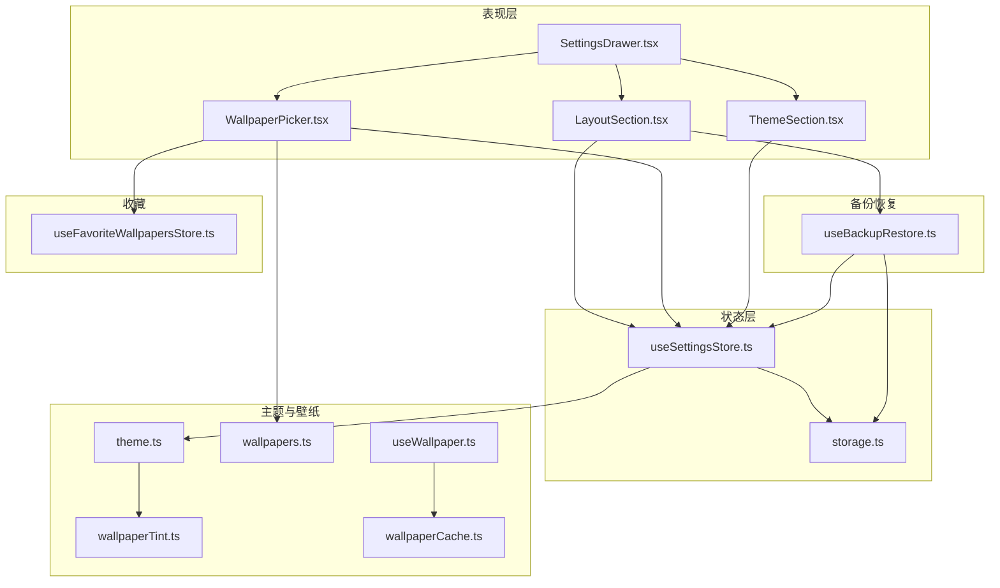
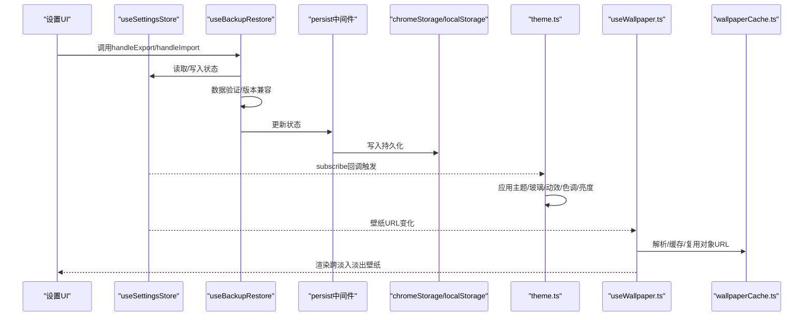
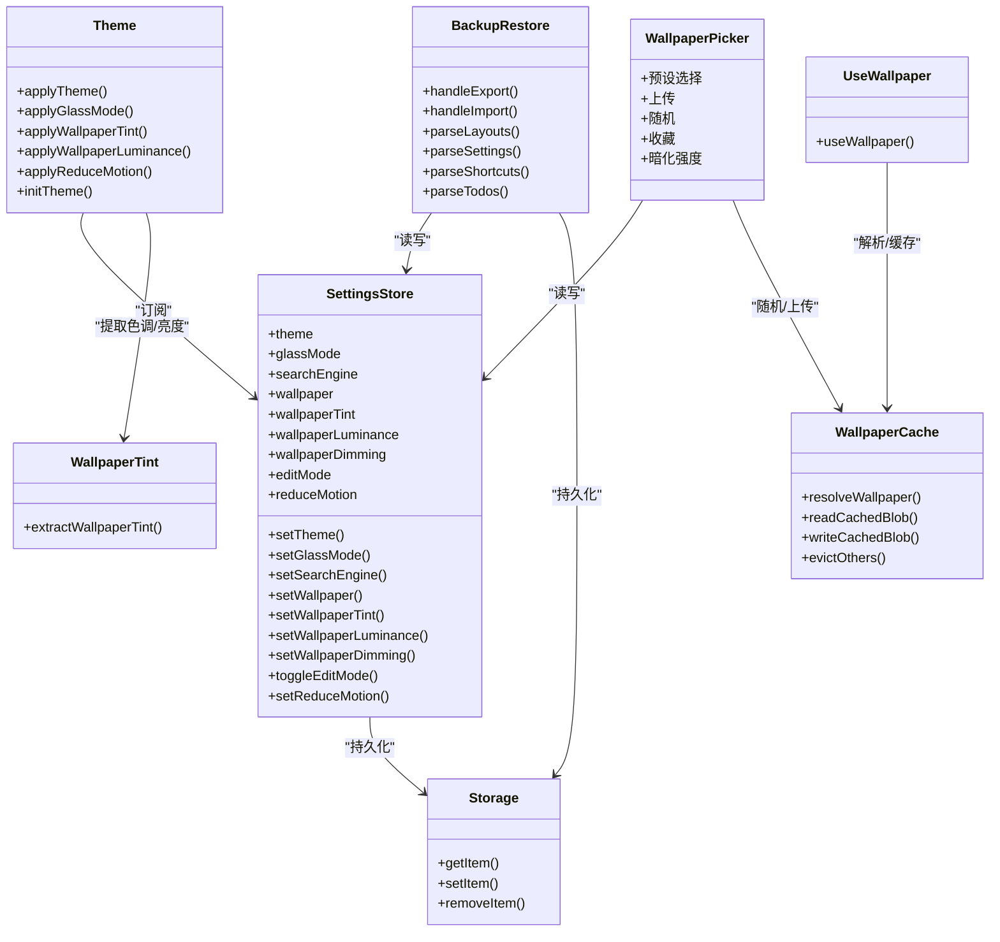
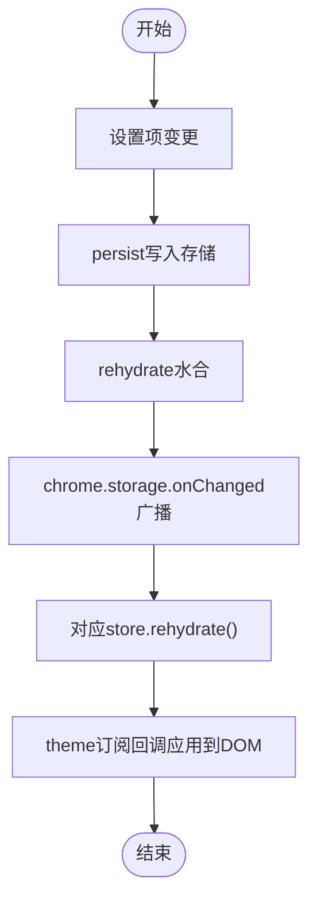

# 设置状态管理

<cite>
**本文引用的文件**
- [useSettingsStore.ts](file://src/store/useSettingsStore.ts)
- [storage.ts](file://src/store/storage.ts)
- [theme.ts](file://src/lib/theme.ts)
- [wallpapers.ts](file://src/lib/wallpapers.ts)
- [wallpaperTint.ts](file://src/lib/wallpaperTint.ts)
- [useWallpaper.ts](file://src/lib/useWallpaper.ts)
- [wallpaperCache.ts](file://src/lib/wallpaperCache.ts)
- [SettingsDrawer.tsx](file://src/components/settings/SettingsDrawer.tsx)
- [ThemeSection.tsx](file://src/components/settings/ThemeSection.tsx)
- [WallpaperPicker.tsx](file://src/components/settings/WallpaperPicker.tsx)
- [LayoutSection.tsx](file://src/components/settings/LayoutSection.tsx)
- [useBackupRestore.ts](file://src/components/settings/useBackupRestore.ts)
- [useBackupRestore.test.ts](file://src/components/settings/useBackupRestore.test.ts)
- [useSettingsStore.test.ts](file://src/store/useSettingsStore.test.ts)
- [useFavoriteWallpapersStore.ts](file://src/store/useFavoriteWallpapersStore.ts)
</cite>

## 更新摘要

**变更内容**

- 新增useBackupRestore hook的详细分析，反映备份恢复功能的重构
- 更新备份恢复架构图，展示新的hook集成方式
- 新增useBackupRestore hook的API说明和使用指南
- 更新故障排除指南，包含备份恢复相关的调试方法

## 目录

1. [简介](#简介)
2. [项目结构](#项目结构)
3. [核心组件](#核心组件)
4. [架构总览](#架构总览)
5. [详细组件分析](#详细组件分析)
6. [依赖关系分析](#依赖关系分析)
7. [性能考量](#性能考量)
8. [故障排除指南](#故障排除指南)
9. [结论](#结论)
10. [附录](#附录)

## 简介

本文件聚焦于设置状态管理，系统性解析 useSettingsStore 的实现架构、数据结构、默认值与迁移策略、状态变更响应与同步机制，并深入说明主题切换、壁纸设置、收藏与导入导出的实现原理。特别关注备份恢复功能从独立组件重构到useBackupRestore hook的统一状态管理接口。同时提供调试工具与故障排除建议，以及扩展新设置项的实践指南。

## 项目结构

围绕设置状态管理的关键模块分布如下：

- 状态层：useSettingsStore（Zustand + 持久化）、storage（Chrome/LocalStorage 存储适配）
- 表现层：ThemeSection、WallpaperPicker、LayoutSection（设置抽屉中的各设置区）
- 备份恢复：useBackupRestore（统一的备份恢复hook）
- 主题与壁纸应用：theme（主题/玻璃/动效/壁纸色调与亮度应用）、wallpapers（默认壁纸与预设）、wallpaperTint（动态提取壁纸主色调与亮度）、useWallpaper（壁纸加载与跨淡入淡出渲染）
- 收藏与缓存：useFavoriteWallpapersStore（收藏壁纸）、wallpaperCache（IndexedDB 缓存）

**图表来源**

- [useSettingsStore.ts:1-89](file://src/store/useSettingsStore.ts#L1-L89)
- [storage.ts:1-63](file://src/store/storage.ts#L1-L63)
- [ThemeSection.tsx:1-109](file://src/components/settings/ThemeSection.tsx#L1-L109)
- [WallpaperPicker.tsx:1-234](file://src/components/settings/WallpaperPicker.tsx#L1-L234)
- [LayoutSection.tsx:1-71](file://src/components/settings/LayoutSection.tsx#L1-L71)
- [useBackupRestore.ts:1-221](file://src/components/settings/useBackupRestore.ts#L1-L221)
- [theme.ts:1-123](file://src/lib/theme.ts#L1-L123)
- [wallpapers.ts:1-69](file://src/lib/wallpapers.ts#L1-L69)
- [wallpaperTint.ts:1-163](file://src/lib/wallpaperTint.ts#L1-L163)
- [useWallpaper.ts:1-110](file://src/lib/useWallpaper.ts#L1-L110)
- [wallpaperCache.ts:1-94](file://src/lib/wallpaperCache.ts#L1-L94)
- [useFavoriteWallpapersStore.ts:1-51](file://src/store/useFavoriteWallpapersStore.ts#L1-L51)

**章节来源**

- [useSettingsStore.ts:1-89](file://src/store/useSettingsStore.ts#L1-L89)
- [storage.ts:1-63](file://src/store/storage.ts#L1-L63)
- [theme.ts:1-123](file://src/lib/theme.ts#L1-L123)
- [wallpapers.ts:1-69](file://src/lib/wallpapers.ts#L1-L69)
- [wallpaperTint.ts:1-163](file://src/lib/wallpaperTint.ts#L1-L163)
- [useWallpaper.ts:1-110](file://src/lib/useWallpaper.ts#L1-L110)
- [wallpaperCache.ts:1-94](file://src/lib/wallpaperCache.ts#L1-L94)
- [SettingsDrawer.tsx:1-22](file://src/components/settings/SettingsDrawer.tsx#L1-L22)
- [ThemeSection.tsx:1-109](file://src/components/settings/ThemeSection.tsx#L1-L109)
- [WallpaperPicker.tsx:1-234](file://src/components/settings/WallpaperPicker.tsx#L1-L234)
- [LayoutSection.tsx:1-71](file://src/components/settings/LayoutSection.tsx#L1-L71)
- [useBackupRestore.ts:1-221](file://src/components/settings/useBackupRestore.ts#L1-L221)
- [useFavoriteWallpapersStore.ts:1-51](file://src/store/useFavoriteWallpapersStore.ts#L1-L51)

## 核心组件

- useSettingsStore：定义设置项类型、默认值、动作函数与持久化配置；内置版本迁移逻辑；注册水合与远程同步回调。
- storage：统一 Chrome Extension 与浏览器环境下的存储接口，提供注册水合与远程同步监听的能力。
- useBackupRestore：统一的备份恢复hook，提供导入导出功能的完整实现，包括数据验证、版本兼容性和错误处理。
- theme：将设置应用到 DOM（主题、玻璃模式、动效、壁纸色调与亮度），并订阅设置变化进行即时响应。
- wallpapers：默认壁纸与预设列表。
- wallpaperTint：从壁纸图像提取主色调与相对亮度，支持缓存与去重请求。
- useWallpaper：负责壁纸对象 URL 生命周期与跨淡入淡出渲染，避免内存泄漏。
- wallpaperCache：IndexedDB 缓存壁纸二进制，支持命中返回、后台刷新与仅保留当前壁纸清理。
- SettingsDrawer/ThemeSection/WallpaperPicker/LayoutSection：设置抽屉与各设置区 UI，驱动设置项变更。
- useFavoriteWallpapersStore：收藏壁纸列表，支持去重、上限与持久化。

**章节来源**

- [useSettingsStore.ts:10-31](file://src/store/useSettingsStore.ts#L10-L31)
- [useSettingsStore.ts:35-89](file://src/store/useSettingsStore.ts#L35-L89)
- [storage.ts:6-32](file://src/store/storage.ts#L6-L32)
- [useBackupRestore.ts:148-221](file://src/components/settings/useBackupRestore.ts#L148-L221)
- [theme.ts:5-45](file://src/lib/theme.ts#L5-L45)
- [wallpapers.ts:11-68](file://src/lib/wallpapers.ts#L11-L68)
- [wallpaperTint.ts:43-163](file://src/lib/wallpaperTint.ts#L43-L163)
- [useWallpaper.ts:11-110](file://src/lib/useWallpaper.ts#L11-L110)
- [wallpaperCache.ts:5-94](file://src/lib/wallpaperCache.ts#L5-L94)
- [SettingsDrawer.tsx:11-21](file://src/components/settings/SettingsDrawer.tsx#L11-L21)
- [ThemeSection.tsx:16-108](file://src/components/settings/ThemeSection.tsx#L16-L108)
- [WallpaperPicker.tsx:41-233](file://src/components/settings/WallpaperPicker.tsx#L41-L233)
- [LayoutSection.tsx:100-208](file://src/components/settings/LayoutSection.tsx#L100-L208)
- [useFavoriteWallpapersStore.ts:24-51](file://src/store/useFavoriteWallpapersStore.ts#L24-L51)

## 架构总览

useSettingsStore 采用 Zustand + persist 中间件，使用自定义 JSON Storage（优先 Chrome Extension storage，否则回退到 localStorage）。通过 registerHydration 与 registerRemoteSync 实现：

- 水合：启动时从存储恢复状态，避免"闪烁"。
- 远程同步：监听 chrome.storage.onChanged，多标签页保持一致。

备份恢复功能通过 useBackupRestore hook 提供统一接口，该hook内部集成了完整的导入导出逻辑，包括数据验证、版本兼容性和错误处理。主题与壁纸应用通过 theme.ts 订阅设置变化，即时更新 DOM 类名与 CSS 变量；壁纸加载由 useWallpaper 结合 wallpaperCache 实现跨淡入淡出与缓存复用。

**图表来源**

- [useSettingsStore.ts:35-89](file://src/store/useSettingsStore.ts#L35-L89)
- [useBackupRestore.ts:153-221](file://src/components/settings/useBackupRestore.ts#L153-L221)
- [storage.ts:6-32](file://src/store/storage.ts#L6-L32)
- [theme.ts:97-122](file://src/lib/theme.ts#L97-L122)
- [useWallpaper.ts:21-98](file://src/lib/useWallpaper.ts#L21-L98)
- [wallpaperCache.ts:75-94](file://src/lib/wallpaperCache.ts#L75-L94)

## 详细组件分析

### useSettingsStore：设置状态与持久化

- 数据结构与默认值
  - 主题：'system'（跟随系统）
  - 玻璃模式：'sequoia'
  - 搜索引擎：'google'
  - 壁纸：DEFAULT_WALLPAPER（来自 wallpapers）
  - 壁纸色调：null
  - 壁纸亮度：null（相对亮度，WCAG）
  - 壁纸暗化：0.25（0~0.6）
  - 编辑模式：false
  - 减少动效：false
- 动作函数
  - setTheme/glassMode/searchEngine/wallpaper/tint/luminance/dimming/reduceMotion
  - toggleEditMode
  - setWallpaperDimming 对输入进行 0~0.6 夹紧
- 持久化与迁移
  - 存储键：'tab:settings'
  - 存储适配：createJSONStorage(() => chromeStorage)
  - 版本：4
  - 迁移规则
    - v1→v2：新增 wallpaperDimming 默认 0.25
    - v2→v3：引入 wallpaperIsDark（null 表示未知，需初始化提取）
    - v3→v4：将二值壁纸亮度替换为连续值（true→0.3，false→0.7，null→null）
- 水合与远程同步
  - skipHydration: true，避免初次渲染闪烁
  - 注册 rehydrate 回调与远程同步处理器

**章节来源**

- [useSettingsStore.ts:10-31](file://src/store/useSettingsStore.ts#L10-L31)
- [useSettingsStore.ts:35-89](file://src/store/useSettingsStore.ts#L35-L89)
- [wallpapers.ts:11](file://src/lib/wallpapers.ts#L11)

### storage：存储适配与远程同步

- 统一接口：getItem/setItem/removeItem
- 环境检测：在扩展环境中使用 chrome.storage.local，否则回退 localStorage
- 错误处理：写入/删除失败时记录错误
- 水合与远程同步
  - registerHydration：注册多个 store 的 rehydrate 回调
  - registerRemoteSync：按存储键注册回调
  - initRemoteSync：监听 chrome.storage.onChanged，触发对应回调

**章节来源**

- [storage.ts:6-32](file://src/store/storage.ts#L6-L32)
- [storage.ts:37-62](file://src/store/storage.ts#L37-L62)

### useBackupRestore：统一备份恢复hook

- API接口
  - handleExport：导出当前设置、布局、快捷方式和待办事项到JSON文件
  - handleImport：从JSON文件导入备份数据，支持版本兼容和数据验证
- 数据结构
  - 导出：包含版本号、布局信息、启用组件、设置项、快捷方式、待办事项
  - 支持版本：1-4，包含向后兼容性
- 数据验证与类型守卫
  - isStr/isNum/isBool/isObj：基础类型验证
  - parseLayouts：验证布局数组格式和坐标
  - parseEnabled：验证启用组件ID数组
  - parseSettings：验证设置项并处理版本迁移
  - parseShortcuts：验证快捷方式数组
  - parseTodos：验证待办事项数组
- 错误处理
  - 文件大小限制：5MB
  - 版本验证：仅支持1-4版本
  - 数据格式验证：详细的错误消息
  - 用户反馈：通过toast显示导入失败原因

**章节来源**

- [useBackupRestore.ts:148-221](file://src/components/settings/useBackupRestore.ts#L148-L221)
- [useBackupRestore.ts:25-118](file://src/components/settings/useBackupRestore.ts#L25-L118)
- [useBackupRestore.ts:129-142](file://src/components/settings/useBackupRestore.ts#L129-L142)

### theme：主题/玻璃/动效/壁纸色调与亮度应用

- 主题：根据 'light'/'dark'/'system' 切换 documentElement 的 'dark' 类
- 玻璃：切换 'glass-mode' 类以启用 Tahoe 风格
- 动效：根据 reduceMotion 添加 'reduce-motion' 类
- 壁纸色调：设置 --wallpaper-tint 与 --accent；为空则移除变量
- 壁纸亮度：分类为 'wallpaper-dark'/'wallpaper-mid'/'wallpaper-light' 并设置 --wallpaper-luminance
- 初始化：立即应用缓存值，必要时异步重新提取壁纸色调与亮度
- 订阅：对主题、玻璃、动效、色调、亮度、壁纸 URL 的变化进行响应式更新
- 系统偏好：监听 prefers-color-scheme 与 prefers-reduced-motion，自动同步用户未显式覆盖的设置

**章节来源**

- [theme.ts:5-45](file://src/lib/theme.ts#L5-L45)
- [theme.ts:68-122](file://src/lib/theme.ts#L68-L122)

### wallpapers 与 WallpaperPicker：壁纸选择与收藏

- 默认壁纸与预设：DEFAULT_WALLPAPER 与 PRESETS 数组
- WallpaperPicker
  - 预设选择：点击预设设置壁纸
  - 收藏：基于 lastResult 与收藏 store 添加/去重
  - 上传：限制大小，转为 data URL 后设置壁纸
  - 随机：从 wallhaven 获取，支持策略切换与超时处理
  - 暗化强度：范围 0~0.6，实时更新壁纸暗化
- 收藏：useFavoriteWallpapersStore，最多 24 项，去重并按添加时间排序

**章节来源**

- [wallpapers.ts:11-68](file://src/lib/wallpapers.ts#L11-L68)
- [WallpaperPicker.tsx:41-233](file://src/components/settings/WallpaperPicker.tsx#L41-L233)
- [useFavoriteWallpapersStore.ts:24-51](file://src/store/useFavoriteWallpapersStore.ts#L24-L51)

### wallpaperTint：动态提取壁纸主色调与亮度

- 输入：壁纸 URL 或 data URL
- 流程：先查缓存，再查去重中的 pending 请求；若无缓存则下载/解码，采样 64×64 像素，聚类统计，计算加权平均亮度与主色调
- 输出：rgb/rgba/hex、是否偏暗、相对亮度（0~1）
- 缓存：Map 缓存结果；Pending 去重；IndexedDB 缓存原始二进制用于后续解码

**章节来源**

- [wallpaperTint.ts:43-163](file://src/lib/wallpaperTint.ts#L43-L163)

### useWallpaper：壁纸加载与跨淡入淡出

- 状态：loadedUrl、prevUrl、visible
- 生命周期：当壁纸变化时，先清空 loadedUrl 触发下层显示旧壁纸，再异步解析对象 URL，成功后在下一帧设置 loadedUrl 并显示新壁纸；失败则回滚到上一张
- 对象 URL 管理：跟踪 owned 对象 URL，组件卸载时统一回收，防止内存泄漏
- 缓存清理：仅保留当前壁纸在 IndexedDB

**章节来源**

- [useWallpaper.ts:11-110](file://src/lib/useWallpaper.ts#L11-L110)

### LayoutSection：导入/导出与设置校验

- 导入/导出：通过 useBackupRestore hook 提供统一接口
- 导出：收集当前布局、启用组件、设置项（含壁纸相关字段）与快捷方式、待办，生成 JSON 文件
- 导入：限制最大 5MB，校验版本（1~4），逐项解析并更新对应 store
- 设置校验：对主题、玻璃、搜索引擎、壁纸、色调、亮度、暗化、动效等字段进行类型与取值范围检查；向下兼容 v3 的 wallpaperIsDark 到 v4 的 wallpaperLuminance

**章节来源**

- [LayoutSection.tsx:1-71](file://src/components/settings/LayoutSection.tsx#L1-L71)

### SettingsDrawer：设置抽屉入口

- 组合 ThemeSection、WallpaperPicker、LayoutSection，提供统一的设置面板

**章节来源**

- [SettingsDrawer.tsx:11-21](file://src/components/settings/SettingsDrawer.tsx#L11-L21)

## 依赖关系分析

**图表来源**

- [useSettingsStore.ts:35-89](file://src/store/useSettingsStore.ts#L35-L89)
- [storage.ts:6-32](file://src/store/storage.ts#L6-L32)
- [useBackupRestore.ts:153-221](file://src/components/settings/useBackupRestore.ts#L153-L221)
- [theme.ts:47-122](file://src/lib/theme.ts#L47-L122)
- [WallpaperPicker.tsx:41-233](file://src/components/settings/WallpaperPicker.tsx#L41-L233)
- [wallpaperTint.ts:43-163](file://src/lib/wallpaperTint.ts#L43-L163)
- [useWallpaper.ts:11-110](file://src/lib/useWallpaper.ts#L11-L110)
- [wallpaperCache.ts:75-94](file://src/lib/wallpaperCache.ts#L75-L94)

## 性能考量

- 壁纸色调提取去抖：在壁纸切换时延迟执行，避免快速切换导致的多次解码
- IndexedDB 缓存：命中直接返回对象 URL，后台刷新缓存，减少网络与解码开销
- 对象 URL 管理：组件卸载时统一回收，避免内存泄漏
- 水合与远程同步：skipHydration 避免初次闪烁；远程同步确保多标签页一致性
- 壁纸暗化：0~0.6 的范围夹紧，保证 UI 与视觉效果稳定
- 备份恢复：useBackupRestore hook 将导入导出逻辑集中处理，减少重复代码和提高可维护性

**章节来源**

- [theme.ts:87-95](file://src/lib/theme.ts#L87-L95)
- [wallpaperCache.ts:75-94](file://src/lib/wallpaperCache.ts#L75-L94)
- [useWallpaper.ts:95-106](file://src/lib/useWallpaper.ts#L95-L106)
- [useSettingsStore.ts:33](file://src/store/useSettingsStore.ts#L33)
- [useBackupRestore.ts:153-221](file://src/components/settings/useBackupRestore.ts#L153-L221)

## 故障排除指南

- 壁纸无法显示或闪烁
  - 检查壁纸 URL 是否有效；确认 useWallpaper 的 onload/onerror 分支是否被触发
  - 若为 data URL/blob URL，直接使用，无需缓存
  - 查看对象 URL 是否被正确回收
  - 参考路径：[useWallpaper.ts:21-98](file://src/lib/useWallpaper.ts#L21-L98)
- 壁纸色调/亮度异常
  - 确认壁纸存在且可访问；查看 wallpaperTint 的缓存与 pending 去重逻辑
  - 检查 theme.applyWallpaperTint/applyWallpaperLuminance 是否被调用
  - 参考路径：[wallpaperTint.ts:43-163](file://src/lib/wallpaperTint.ts#L43-L163)、[theme.ts:15-41](file://src/lib/theme.ts#L15-L41)
- 设置不同步或多标签页不一致
  - 确认 chrome.storage.onChanged 是否可用；检查 registerRemoteSync 的键名与回调
  - 参考路径：[storage.ts:53-62](file://src/store/storage.ts#L53-L62)
- 备份恢复失败
  - 检查JSON文件格式和版本；确认文件大小不超过5MB
  - 查看控制台错误信息，确认数据格式验证是否通过
  - 检查useBackupRestore的错误处理逻辑
  - 参考路径：[useBackupRestore.ts:191-217](file://src/components/settings/useBackupRestore.ts#L191-L217)、[useBackupRestore.test.ts:527-663](file://src/components/settings/useBackupRestore.test.ts#L527-L663)
- 导入/导出功能异常
  - 确认LayoutSection正确使用useBackupRestore hook
  - 检查文件输入事件处理和状态更新
  - 参考路径：[LayoutSection.tsx:14](file://src/components/settings/LayoutSection.tsx#L14)
- 减少动效无效
  - 确认系统偏好与用户设置冲突；检查 reduceMotion 的订阅逻辑
  - 参考路径：[theme.ts:113-121](file://src/lib/theme.ts#L113-L121)

**章节来源**

- [useWallpaper.ts:21-98](file://src/lib/useWallpaper.ts#L21-L98)
- [wallpaperTint.ts:43-163](file://src/lib/wallpaperTint.ts#L43-L163)
- [theme.ts:15-41](file://src/lib/theme.ts#L15-L41)
- [storage.ts:53-62](file://src/store/storage.ts#L53-L62)
- [useBackupRestore.ts:191-217](file://src/components/settings/useBackupRestore.ts#L191-L217)
- [useBackupRestore.test.ts:527-663](file://src/components/settings/useBackupRestore.test.ts#L527-L663)
- [LayoutSection.tsx:14](file://src/components/settings/LayoutSection.tsx#L14)
- [theme.ts:113-121](file://src/lib/theme.ts#L113-L121)

## 结论

useSettingsStore 通过轻量、可维护的状态模型与完善的持久化/迁移/同步机制，实现了主题、壁纸、布局等设置的可靠管理。备份恢复功能通过useBackupRestore hook得到统一重构，提供了更加模块化的导入导出接口。配合 theme 与 useWallpaper 的响应式应用与缓存优化，以及useBackupRestore的完整数据验证和错误处理，提供了流畅且可靠的用户体验。

## 附录

### 设置项数据结构与默认值

- 主题：'light' | 'dark' | 'system'
- 玻璃模式：'sequoia' | 'tahoe'
- 搜索引擎：'google' | 'bing' | 'baidu' | 'duckduckgo'
- 壁纸：字符串 URL 或 data URL
- 壁纸色调：字符串 RGB 或 null
- 壁纸亮度：数值 0~1 或 null
- 壁纸暗化：数值 0~0.6
- 编辑模式：布尔
- 减少动效：布尔

**章节来源**

- [useSettingsStore.ts:6-21](file://src/store/useSettingsStore.ts#L6-L21)
- [useSettingsStore.ts:33](file://src/store/useSettingsStore.ts#L33)

### useBackupRestore Hook API

- handleExport：导出当前设置状态到JSON文件
  - 返回：void
  - 功能：收集所有相关store的状态，生成备份文件
- handleImport：从JSON文件导入备份数据
  - 参数：React.ChangeEvent<HTMLInputElement>
  - 返回：Promise<void>
  - 功能：验证文件格式，解析数据，更新对应store状态
- 数据验证函数
  - parseLayouts：验证布局数组格式
  - parseEnabled：验证启用组件ID数组
  - parseSettings：验证设置项并处理版本迁移
  - parseShortcuts：验证快捷方式数组
  - parseTodos：验证待办事项数组

**章节来源**

- [useBackupRestore.ts:148-221](file://src/components/settings/useBackupRestore.ts#L148-L221)
- [useBackupRestore.ts:42-142](file://src/components/settings/useBackupRestore.ts#L42-L142)

### 设置变更响应与状态同步流程

**图表来源**

- [useSettingsStore.ts:87-89](file://src/store/useSettingsStore.ts#L87-L89)
- [storage.ts:37-62](file://src/store/storage.ts#L37-L62)
- [theme.ts:97-106](file://src/lib/theme.ts#L97-L106)

### 扩展新设置项指南

- 定义类型与默认值
  - 在 SettingsState 接口中新增字段与 setter
  - 在 persist 初始化中设置默认值
  - 参考路径：[useSettingsStore.ts:10-31](file://src/store/useSettingsStore.ts#L10-L31)、[useSettingsStore.ts:35-56](file://src/store/useSettingsStore.ts#L35-L56)
- UI 展示与交互
  - 在 ThemeSection/WallpaperPicker/LayoutSection 中添加控件
  - 使用 useSettingsStore 的 selector 读取与 setter 写入
  - 参考路径：[ThemeSection.tsx:16-108](file://src/components/settings/ThemeSection.tsx#L16-L108)、[WallpaperPicker.tsx:41-233](file://src/components/settings/WallpaperPicker.tsx#L41-L233)、[LayoutSection.tsx:100-208](file://src/components/settings/LayoutSection.tsx#L100-L208)
- 持久化与迁移
  - 在 persist 配置中设置 name、version 与 migrate
  - 迁移逻辑中处理旧字段到新字段的转换
  - 参考路径：[useSettingsStore.ts:57-84](file://src/store/useSettingsStore.ts#L57-L84)
- 应用到主题/样式
  - 在 theme.ts 中添加对应的 apply 函数并在 subscribe 中调用
  - 参考路径：[theme.ts:5-45](file://src/lib/theme.ts#L5-L45)、[theme.ts:97-106](file://src/lib/theme.ts#L97-L106)
- 备份恢复集成
  - 在 useBackupRestore 中添加相应的数据验证和解析逻辑
  - 确保新设置项包含在导出/导入流程中
  - 参考路径：[useBackupRestore.ts:164-181](file://src/components/settings/useBackupRestore.ts#L164-L181)
- 测试与验证
  - 在 useSettingsStore.test.ts 中补充断言
  - 在 useBackupRestore.test.ts 中添加对应的单元测试
  - 参考路径：[useSettingsStore.test.ts:21-90](file://src/store/useSettingsStore.test.ts#L21-L90)、[useBackupRestore.test.ts:74-663](file://src/components/settings/useBackupRestore.test.ts#L74-L663)
