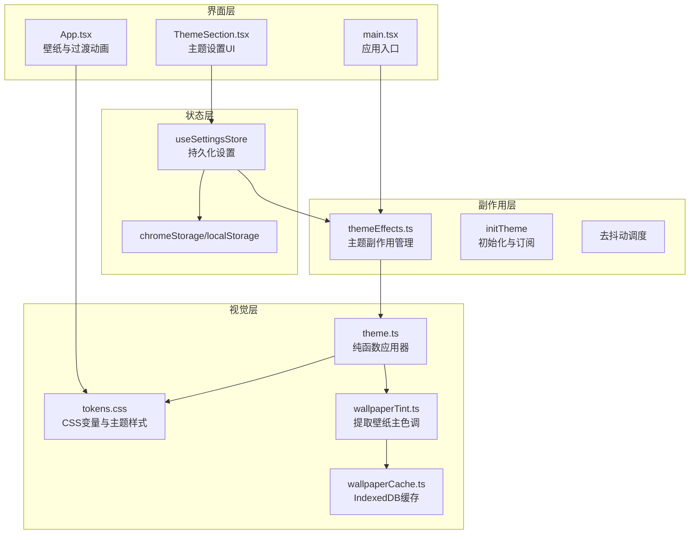
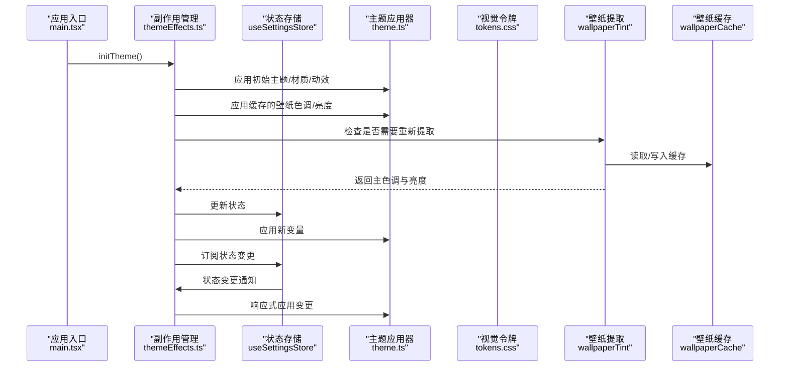
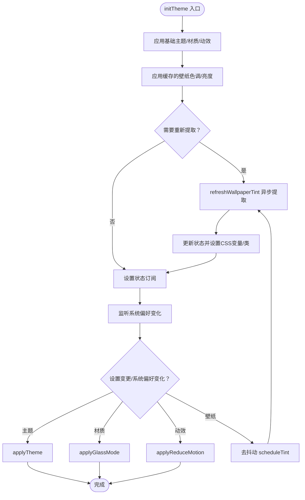
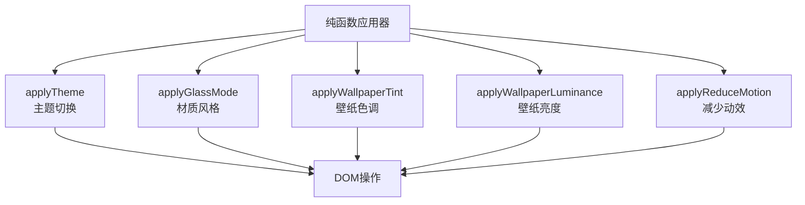
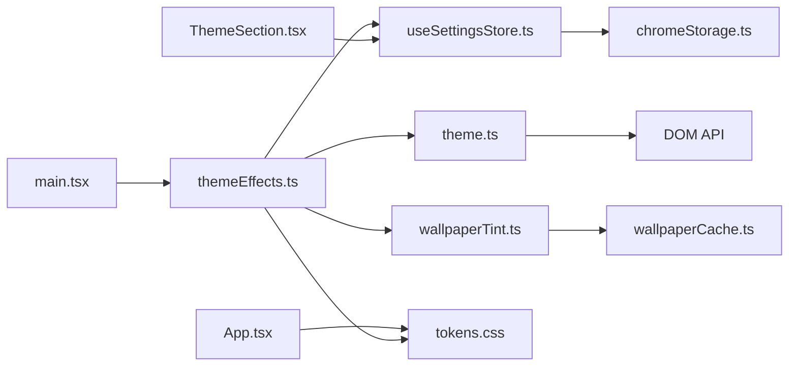

# 主题配置模块

<cite>
**本文档引用的文件**
- [src/lib/theme.ts](file://src/lib/theme.ts)
- [src/lib/themeEffects.ts](file://src/lib/themeEffects.ts)
- [src/lib/theme.test.ts](file://src/lib/theme.test.ts)
- [src/components/settings/ThemeSection.tsx](file://src/components/settings/ThemeSection.tsx)
- [src/store/useSettingsStore.ts](file://src/store/useSettingsStore.ts)
- [src/store/storage.ts](file://src/store/storage.ts)
- [src/styles/tokens.css](file://src/styles/tokens.css)
- [src/lib/wallpaperTint.ts](file://src/lib/wallpaperTint.ts)
- [src/lib/wallpaperCache.ts](file://src/lib/wallpaperCache.ts)
- [src/lib/wallpapers.ts](file://src/lib/wallpapers.ts)
- [src/newtab/App.tsx](file://src/newtab/App.tsx)
- [src/newtab/main.tsx](file://src/newtab/main.tsx)
- [src/lib/logger.ts](file://src/lib/logger.ts)
</cite>

## 更新摘要

**变更内容**

- 主题管理架构重大重构：从直接DOM操作的theme.ts迁移到side-effects分离的themeEffects.ts
- 改善了架构清晰度和可维护性，分离纯函数与副作用
- 增强了主题初始化流程和订阅机制
- 优化了壁纸色调提取与缓存策略

## 目录

1. [简介](#简介)
2. [项目结构](#项目结构)
3. [核心组件](#核心组件)
4. [架构总览](#架构总览)
5. [详细组件分析](#详细组件分析)
6. [依赖关系分析](#依赖关系分析)
7. [性能考量](#性能考量)
8. [故障排查指南](#故障排查指南)
9. [结论](#结论)
10. [附录](#附录)

## 简介

本文件系统性梳理主题配置模块的设计与实现，覆盖主题系统架构、主题切换机制、内置主题颜色方案与视觉效果、主题数据存储与持久化策略、主题配置的用户界面与交互逻辑、主题扩展与自定义方法、兼容性检查与回退机制、主题切换动画与性能优化、主题配置验证规则与错误处理，以及具体示例与最佳实践。

**更新** 主题管理架构已完成重大重构：从直接DOM操作的theme.ts迁移到side-effects分离的themeEffects.ts，显著改善了架构清晰度和可维护性。

## 项目结构

主题配置模块围绕"状态管理 + 视觉样式 + 动画过渡"三层组织，现已采用side-effects分离的架构模式：

- 状态层：使用 Zustand 管理主题、材质风格、壁纸、动效等设置，并通过 Chrome Storage 或本地存储进行持久化。
- 视觉层：通过 CSS 自定义属性与类名组合，实现浅色/深色、Sequoia/Tahoe 毛玻璃风格、壁纸亮度感知与文本对比度调整。
- 动画层：在壁纸切换与主题变化中提供平滑过渡与可选的"减少动效"。
- **更新** 副作用层：通过独立的themeEffects.ts管理DOM操作和系统偏好监听，实现纯函数与副作用的清晰分离。

**图表来源**

- [src/store/useSettingsStore.ts:35-85](file://src/store/useSettingsStore.ts#L35-L85)
- [src/lib/themeEffects.ts:34-117](file://src/lib/themeEffects.ts#L34-L117)
- [src/lib/theme.ts:1-49](file://src/lib/theme.ts#L1-L49)
- [src/styles/tokens.css:1-263](file://src/styles/tokens.css#L1-L263)
- [src/lib/wallpaperTint.ts:105-229](file://src/lib/wallpaperTint.ts#L105-L229)
- [src/lib/wallpaperCache.ts:5-96](file://src/lib/wallpaperCache.ts#L5-L96)
- [src/components/settings/ThemeSection.tsx:16-109](file://src/components/settings/ThemeSection.tsx#L16-L109)
- [src/newtab/App.tsx:10-111](file://src/newtab/App.tsx#L10-L111)
- [src/newtab/main.tsx:11-29](file://src/newtab/main.tsx#L11-L29)

## 核心组件

- **主题副作用管理器（themeEffects.ts）**：**更新** 独立的副作用管理模块，负责主题初始化、状态订阅、系统偏好监听和壁纸色调提取的去抖动调度。包含initTheme、refreshWallpaperTint、scheduleTint等核心函数。
- 主题应用器（theme.ts）：纯函数形式的主题应用器，提供applyTheme、applyGlassMode、applyWallpaperTint、applyWallpaperLuminance、applyReduceMotion等函数，专门处理DOM操作。
- 设置存储（useSettingsStore.ts）：Zustand 状态，持久化到 Chrome Storage 或 localStorage，包含主题模式、材质风格、壁纸、壁纸色调、亮度、暗化遮罩、编辑模式、减少动效等字段。
- 视觉令牌（tokens.css）：定义主题变量（表面、文字、边框、阴影、噪声纹理、模糊、饱和度等），并按浅色/深色、材质风格、壁纸亮度分类进行覆盖。
- 壁纸色调提取（wallpaperTint.ts）：基于 Canvas 的颜色量化与加权平均，计算主色调与相对亮度，支持缓存与并发去重。
- 壁纸缓存（wallpaperCache.ts）：IndexedDB 缓存壁纸二进制，加速加载并降低网络压力。
- 设置界面（ThemeSection.tsx）：提供主题、材质风格与减少动效的可视化控制。
- 应用入口（App.tsx）：负责壁纸层叠与淡入淡出过渡，受减少动效影响。
- **更新** 应用初始化（main.tsx）：负责在应用启动时初始化主题副作用管理器。

**章节来源**

- [src/lib/themeEffects.ts:1-118](file://src/lib/themeEffects.ts#L1-L118)
- [src/lib/theme.ts:1-49](file://src/lib/theme.ts#L1-L49)
- [src/store/useSettingsStore.ts:10-31](file://src/store/useSettingsStore.ts#L10-L31)
- [src/styles/tokens.css:11-263](file://src/styles/tokens.css#L11-L263)
- [src/lib/wallpaperTint.ts:1-230](file://src/lib/wallpaperTint.ts#L1-L230)
- [src/lib/wallpaperCache.ts:1-96](file://src/lib/wallpaperCache.ts#L1-L96)
- [src/components/settings/ThemeSection.tsx:16-109](file://src/components/settings/ThemeSection.tsx#L16-L109)
- [src/newtab/App.tsx:10-111](file://src/newtab/App.tsx#L10-L111)
- [src/newtab/main.tsx:11-29](file://src/newtab/main.tsx#L11-L29)

## 架构总览

主题系统采用"声明式 CSS 变量 + 类名切换"的轻量渲染策略，结合 Zustand 状态与 Chrome Storage 持久化，形成响应迅速且可维护的主题体系。**更新** 现已实现纯函数与副作用的清晰分离，提高代码可测试性和可维护性。

**图表来源**

- [src/newtab/main.tsx:11-29](file://src/newtab/main.tsx#L11-L29)
- [src/lib/themeEffects.ts:34-117](file://src/lib/themeEffects.ts#L34-L117)
- [src/store/useSettingsStore.ts:35-85](file://src/store/useSettingsStore.ts#L35-L85)
- [src/lib/theme.ts:1-49](file://src/lib/theme.ts#L1-L49)
- [src/styles/tokens.css:11-263](file://src/styles/tokens.css#L11-L263)
- [src/lib/wallpaperTint.ts:105-229](file://src/lib/wallpaperTint.ts#L105-L229)
- [src/lib/wallpaperCache.ts:75-96](file://src/lib/wallpaperCache.ts#L75-L96)

## 详细组件分析

### 主题副作用管理器（themeEffects.ts）

**更新** 作为架构重构的核心组件，完全替代了之前的直接DOM操作模式。

职责与流程

- **主题初始化**：应用初始设置，立即使用缓存值避免闪烁，必要时异步刷新壁纸色调；监听系统主题与动效偏好变化。
- **状态订阅**：监听useSettingsStore的状态变更，实时响应主题、材质、动效、壁纸等设置变化。
- **去抖动调度**：对壁纸切换时的色调提取进行150ms去抖动，避免频繁解码导致性能问题。
- **系统偏好监听**：监听系统主题偏好变化和减少动效偏好变化，自动应用相应设置。
- **纯函数协调**：调用纯函数形式的theme.ts中的应用器函数，实现副作用与纯逻辑的分离。

**更新** 关键改进：

- 将DOM操作完全分离到独立模块，提高代码可测试性
- 实现了完整的初始化流程，包括缓存应用和异步提取
- 增强了错误处理和日志记录机制
- 优化了系统偏好监听的响应性

**图表来源**

- [src/lib/themeEffects.ts:34-117](file://src/lib/themeEffects.ts#L34-L117)

**章节来源**

- [src/lib/themeEffects.ts:1-118](file://src/lib/themeEffects.ts#L1-L118)

### 主题应用器（theme.ts）

**更新** 作为纯函数模块，专注于提供无副作用的主题应用能力。

职责与流程

- **主题切换**：根据用户选择与系统偏好，为根元素添加/移除"dark"类，驱动浅色/深色样式。
- **材质风格**：切换"glass-mode"类以启用 Tahoe 液态玻璃风格。
- **壁纸色调**：设置 CSS 变量"--wallpaper-tint"和"--accent"，用于组件色彩一致性。
- **壁纸亮度**：设置 CSS 类"wallpaper-dark/mid/light"与变量"--wallpaper-luminance"，驱动文本对比度与阴影策略。
- **减少动效**：设置"reduce-motion"类，影响过渡动画时长。
- **纯函数特性**：所有函数都是纯函数，不直接操作DOM，便于测试和复用。

**更新** 强调色计算现在考虑主题差异：

- 深色主题：使用 `color-mix(in srgb, ${tint} 85%, white)` 创建浅色强调色
- 浅色主题：使用 `color-mix(in srgb, ${tint} 85%, black)` 创建深色强调色

**图表来源**

- [src/lib/theme.ts:1-49](file://src/lib/theme.ts#L1-L49)

**章节来源**

- [src/lib/theme.ts:1-49](file://src/lib/theme.ts#L1-L49)

### 设置存储（useSettingsStore.ts）

数据模型与持久化

- 字段：主题模式、材质风格、搜索引擎、壁纸、壁纸色调、壁纸亮度、壁纸暗化、编辑模式、减少动效。
- 默认值：系统主题、Sequoia 材质、默认壁纸、无色调/亮度、适度暗化、关闭编辑模式、关闭减少动效。
- 持久化：使用 persist 中间件与 JSON 存储，名称为"tab:settings"，版本迁移至 v4。
- 迁移策略：v1→v2 新增壁纸暗化；v2→v3 引入二元壁纸暗/亮标记；v3→v4 替换为连续亮度值并兼容旧数据。
- 同步：注册水合与远程同步回调，确保多标签页一致。

**章节来源**

- [src/store/useSettingsStore.ts:10-31](file://src/store/useSettingsStore.ts#L10-L31)
- [src/store/useSettingsStore.ts:35-85](file://src/store/useSettingsStore.ts#L35-L85)
- [src/store/storage.ts:34-62](file://src/store/storage.ts#L34-L62)

### 视觉令牌（tokens.css）

颜色方案与视觉效果

- 形状系统：卡片圆角、按钮圆角、胶囊形。
- 运动参数：常规与慢速过渡时长。
- Sequoia 浅色/深色：定义表面、文字、边框、阴影、高光、覆盖层、噪声纹理等变量。
- Tahoe 液态玻璃：更强透明度、更高饱和度、更柔和的边缘与扩散阴影。
- 壁纸感知：针对壁纸暗/中/亮三档，分别覆盖表面、文字、边框、阴影与文本阴影，保证可读性。
- 深色 Tahoe：进一步降低表面透明度与增强阴影，营造更深的折射感。

**章节来源**

- [src/styles/tokens.css:11-263](file://src/styles/tokens.css#L11-L263)

### 壁纸色调提取（wallpaperTint.ts）

算法与缓存

- 输入：壁纸 URL 或 Blob。
- 处理：Canvas 下采样至 64×64，颜色量化聚类，计算加权平均亮度，优选中性但不过于灰的主色调。
- 输出：RGB/RGBA/HEX、是否偏暗、相对亮度（0..1）。
- 缓存：内存 Map 缓存结果；对同一 URL 并发请求去重；失败时记录警告。
- 依赖：IndexedDB 缓存壁纸二进制以加速加载。

**更新** 加权平均亮度计算改进：

- 使用所有颜色簇的权重和亮度计算整体平均值
- 避免单一主导色对整体亮度判断的影响
- 提供更准确的壁纸亮度评估

**章节来源**

- [src/lib/wallpaperTint.ts:1-230](file://src/lib/wallpaperTint.ts#L1-L230)
- [src/lib/wallpaperCache.ts:1-96](file://src/lib/wallpaperCache.ts#L1-L96)

### 设置界面（ThemeSection.tsx）

交互与视觉反馈

- 主题选项：浅色/深色/跟随系统，带图标与选中态高亮。
- 材质风格：Sequoia 经典毛玻璃与 Tahoe 液态玻璃，含描述说明。
- 减少动效：开关按钮，随状态改变背景与滑块位置。
- 数据绑定：直接调用 store 的 setter 更新状态。

**章节来源**

- [src/components/settings/ThemeSection.tsx:16-109](file://src/components/settings/ThemeSection.tsx#L16-L109)

### 应用入口（App.tsx）

动画与过渡

- 壁纸层叠：前后两张壁纸图层，切换时先清空上层再加载新图，避免闪烁。
- 淡入淡出：通过透明度与缩放变换实现，时长受"减少动效"影响。
- 背景覆盖：使用 CSS 变量"--overlay"与手动暗化遮罩叠加，提升可读性。
- 键盘快捷键：编辑布局、打开设置、快捷键帮助。

**章节来源**

- [src/newtab/App.tsx:25-62](file://src/newtab/App.tsx#L25-L62)

### 应用初始化（main.tsx）

**更新** 新增的应用入口文件，负责初始化主题副作用管理器。

职责与流程

- **状态水合**：从持久化存储恢复状态，确保应用启动时的正确状态。
- **远程同步**：初始化跨标签页状态同步机制。
- **主题初始化**：调用initTheme()启动主题副作用管理器。
- **应用渲染**：创建React根节点并渲染应用组件树。

**章节来源**

- [src/newtab/main.tsx:11-29](file://src/newtab/main.tsx#L11-L29)

## 依赖关系分析

**更新** 依赖关系已重构，实现纯函数与副作用的清晰分离。

- themeEffects.ts 依赖 useSettingsStore 获取状态，依赖 theme.ts 提供纯函数应用器，依赖 wallpaperTint 提取色调，依赖 logger 记录警告。
- theme.ts 仅依赖 DOM API，提供纯函数形式的主题应用能力。
- useSettingsStore 依赖 chromeStorage/localStorage 实现持久化。
- tokens.css 依赖类名"dark/glass-mode/wallpaper-xxx"与 CSS 变量"--wallpaper-tint/--wallpaper-luminance/--overlay"。
- wallpaperTint 依赖 wallpaperCache 与 Canvas API。
- App.tsx 依赖 tokens.css 的变量与 useSettingsStore 的壁纸暗化设置。
- main.tsx 依赖 themeEffects.ts 进行应用初始化。

**图表来源**

- [src/lib/themeEffects.ts:1-118](file://src/lib/themeEffects.ts#L1-L118)
- [src/lib/theme.ts:1-49](file://src/lib/theme.ts#L1-L49)
- [src/store/useSettingsStore.ts:1-89](file://src/store/useSettingsStore.ts#L1-L89)
- [src/lib/wallpaperTint.ts:1-230](file://src/lib/wallpaperTint.ts#L1-L230)
- [src/lib/wallpaperCache.ts:1-96](file://src/lib/wallpaperCache.ts#L1-L96)
- [src/newtab/App.tsx:1-111](file://src/newtab/App.tsx#L1-L111)
- [src/styles/tokens.css:1-263](file://src/styles/tokens.css#L1-L263)
- [src/components/settings/ThemeSection.tsx:1-109](file://src/components/settings/ThemeSection.tsx#L1-L109)
- [src/newtab/main.tsx:1-29](file://src/newtab/main.tsx#L1-L29)

**章节来源**

- [src/lib/themeEffects.ts:1-118](file://src/lib/themeEffects.ts#L1-L118)
- [src/lib/theme.ts:1-49](file://src/lib/theme.ts#L1-L49)
- [src/store/useSettingsStore.ts:1-89](file://src/store/useSettingsStore.ts#L1-L89)
- [src/lib/wallpaperTint.ts:1-230](file://src/lib/wallpaperTint.ts#L1-L230)
- [src/lib/wallpaperCache.ts:1-96](file://src/lib/wallpaperCache.ts#L1-L96)
- [src/newtab/App.tsx:1-111](file://src/newtab/App.tsx#L1-L111)
- [src/styles/tokens.css:1-263](file://src/styles/tokens.css#L1-L263)
- [src/components/settings/ThemeSection.tsx:1-109](file://src/components/settings/ThemeSection.tsx#L1-L109)
- [src/newtab/main.tsx:1-29](file://src/newtab/main.tsx#L1-L29)

## 性能考量

**更新** 性能优化策略已得到增强和改进。

- **去抖动提取**：壁纸切换时 150ms 去抖动，避免快速预览导致的大量 Canvas 解码。
- **缓存策略**：内存 Map + IndexedDB 双层缓存，优先命中减少网络与解码成本。
- **下采样与量化**：Canvas 仅处理 64×64 像素，降低计算复杂度。
- **动画节流**：减少动效时将过渡时长降为 0，避免不必要的重绘。
- **对象 URL 管理**：切换壁纸时及时撤销旧的 blob URL，防止内存泄漏。
- **纯函数优化**：theme.ts 中的纯函数避免了重复的DOM查询和操作。
- **副作用分离**：themeEffects.ts 中的去抖动和订阅机制提高了响应效率。

**章节来源**

- [src/lib/themeEffects.ts:65-81](file://src/lib/themeEffects.ts#L65-L81)
- [src/lib/wallpaperTint.ts:17-19](file://src/lib/wallpaperTint.ts#L17-L19)
- [src/lib/wallpaperCache.ts:75-96](file://src/lib/wallpaperCache.ts#L75-L96)
- [src/newtab/App.tsx:18-19](file://src/newtab/App.tsx#L18-L19)

## 故障排查指南

**更新** 故障排查指南已更新以反映新的架构模式。

常见问题与处理

- **主题未生效**
  - 检查根元素是否正确添加/移除"dark"类。
  - 确认系统主题偏好变化事件已监听。
  - **更新** 检查themeEffects.ts是否正确初始化，确认initTheme()已被调用。
- **材质风格不显示**
  - 确认"glass-mode"类切换逻辑与 Tahoe 选项对应。
  - **更新** 验证themeEffects.ts中的状态订阅是否正常工作。
- **壁纸色调无效**
  - 检查壁纸 URL 是否为空；确认提取函数返回结果；查看 IndexedDB 缓存是否可用。
  - **更新** 检查refreshWallpaperTint函数的调用和Promise处理。
- **强调色不一致**
  - 检查 "--accent" 和 "--accent-hover" 变量是否正确设置；确认主题切换时变量更新。
  - **更新** 验证themeEffects.ts中的主题变更订阅是否触发壁纸色调重新应用。
- **动画异常**
  - 检查"reduce-motion"类是否被意外开启；确认过渡时长是否为 0。
- **日志与错误**
  - 使用 warn/error 记录提取失败等异常，便于定位问题。
  - **更新** 检查themeEffects.ts中的错误处理和日志记录机制。

**章节来源**

- [src/lib/theme.ts:5-9](file://src/lib/theme.ts#L5-L9)
- [src/lib/theme.ts:11-13](file://src/lib/theme.ts#L11-L13)
- [src/lib/theme.ts:47-66](file://src/lib/theme.ts#L47-L66)
- [src/lib/theme.ts:108-121](file://src/lib/theme.ts#L108-L121)
- [src/lib/logger.ts:20-35](file://src/lib/logger.ts#L20-L35)
- [src/lib/themeEffects.ts:83-97](file://src/lib/themeEffects.ts#L83-L97)

## 结论

**更新** 该主题配置模块通过重大架构重构，实现了更清晰的代码结构和更高的可维护性。

该主题配置模块通过"状态 + 样式 + 动画 + 副作用"的清晰分层，实现了高性能、可扩展且易维护的主题系统。其核心优势在于：

- **纯函数与副作用分离**：通过themeEffects.ts实现副作用管理，theme.ts提供纯函数应用器，提高代码可测试性和可维护性。
- 基于 CSS 变量与类名的声明式样式切换，无需重绘整个页面。
- 壁纸色调提取与缓存机制保障了动态主题的流畅体验。
- 去抖动与对象 URL 管理有效控制了性能风险。
- 完整的持久化与版本迁移策略确保跨版本兼容与数据安全。
- **更新** 正确的强调色计算确保了浅色和深色主题之间的一致配色方案。
- **更新** 清晰的初始化流程和状态订阅机制确保了主题系统的稳定运行。

## 附录

### 主题数据存储结构与持久化策略

- 存储介质：Chrome Storage（扩展环境）或 localStorage（网页环境）。
- 存储键：统一为"tab:settings"。
- 版本迁移：v1→v2（新增壁纸暗化）、v2→v3（引入二元壁纸暗/亮标记）、v3→v4（替换为连续亮度值）。
- 水合与同步：启动时水合，监听远程变更以保持多标签页一致。

**章节来源**

- [src/store/storage.ts:6-32](file://src/store/storage.ts#L6-L32)
- [src/store/useSettingsStore.ts:57-85](file://src/store/useSettingsStore.ts#L57-L85)

### 主题配置验证规则与错误处理

- 验证范围：主题模式、材质风格、搜索引擎、壁纸 URL、壁纸色调/亮度、壁纸暗化、减少动效。
- 规则要点：枚举值校验、数值范围限制（暗化 0..0.6）、类型检查（字符串/布尔/数字）。
- 兼容性：从旧版"壁纸暗/亮"标记自动迁移到连续亮度值。
- 错误处理：抛出明确错误信息，便于上层捕获与提示。

**章节来源**

- [src/store/useSettingsStore.ts:62-82](file://src/store/useSettingsStore.ts#L62-L82)
- [src/components/settings/LayoutSection.tsx:41-77](file://src/components/settings/LayoutSection.tsx#L41-L77)

### 主题切换动画效果与性能优化

- 切换动画：壁纸层叠与淡入淡出，使用透明度与缩放变换，时长受"减少动效"影响。
- 性能优化：去抖动提取、缓存命中、下采样、撤销对象 URL。
- 用户体验：减少动效时禁用过渡，避免干扰。

**章节来源**

- [src/newtab/App.tsx:35-62](file://src/newtab/App.tsx#L35-L62)
- [src/lib/themeEffects.ts:65-81](file://src/lib/themeEffects.ts#L65-L81)

### 主题扩展与自定义指南

- 扩展材质风格
  - 在 tokens.css 中新增变量覆盖与类名组合，参考 Tahoe 的实现方式。
  - 在 theme.ts 中增加材质风格切换逻辑，确保类名与变量正确设置。
  - **更新** 在themeEffects.ts中添加相应的状态订阅和系统偏好监听。
- 自定义颜色方案
  - 通过 CSS 变量覆盖表面、文字、边框、阴影、噪声纹理等，适配不同品牌或视觉需求。
  - 注意与壁纸亮度感知的配合，确保文本可读性。
- 自定义壁纸预设
  - 在壁纸列表中添加新的预设项，遵循接口规范并提供缩略图。
  - 确保 URL 支持跨域访问与缓存策略。

**章节来源**

- [src/styles/tokens.css:76-124](file://src/styles/tokens.css#L76-L124)
- [src/lib/theme.ts:11-13](file://src/lib/theme.ts#L11-L13)
- [src/lib/wallpapers.ts:13-68](file://src/lib/wallpapers.ts#L13-L68)

### 主题兼容性检查与回退机制

- 回退策略
  - 当壁纸为空或提取失败时，清除色调与亮度变量，避免错误样式污染。
  - 当壁纸亮度未知时，移除壁纸亮度类与变量，保持默认样式。
- 兼容性
  - 通过类名"wallpaper-dark/mid/light"与 CSS 变量"--wallpaper-luminance"实现向后兼容。
  - 系统主题偏好变化时自动应用"system"模式。

**章节来源**

- [src/lib/theme.ts:47-66](file://src/lib/theme.ts#L47-L66)
- [src/lib/theme.ts:26-41](file://src/lib/theme.ts#L26-L41)
- [src/lib/theme.ts:108-111](file://src/lib/theme.ts#L108-L111)

### 主题配置示例与最佳实践

- 示例：在设置界面中选择"深色"主题与"Tahoe"材质风格，同时启用"减少动效"以获得更快的切换体验。
- 最佳实践
  - 优先使用 CSS 变量与类名组合，避免内联样式破坏主题一致性。
  - 控制壁纸亮度阈值与文本阴影策略，确保在不同壁纸下均具备良好可读性。
  - 对频繁切换的壁纸操作使用去抖动，避免性能抖动。
  - 为壁纸 URL 提供缩略图与缓存，提升首次加载速度。
- **更新** 强调色一致性
  - 确保浅色和深色主题使用相同的强调色计算逻辑
  - 验证强调色在不同主题下的可读性和对比度
- **更新** 架构最佳实践
  - 将DOM操作集中在themeEffects.ts中，保持纯函数的纯净性
  - 使用状态订阅机制实现响应式主题更新
  - 实现适当的错误处理和日志记录

**章节来源**

- [src/components/settings/ThemeSection.tsx:16-109](file://src/components/settings/ThemeSection.tsx#L16-L109)
- [src/lib/themeEffects.ts:83-97](file://src/lib/themeEffects.ts#L83-L97)
- [src/styles/tokens.css:126-248](file://src/styles/tokens.css#L126-L248)
