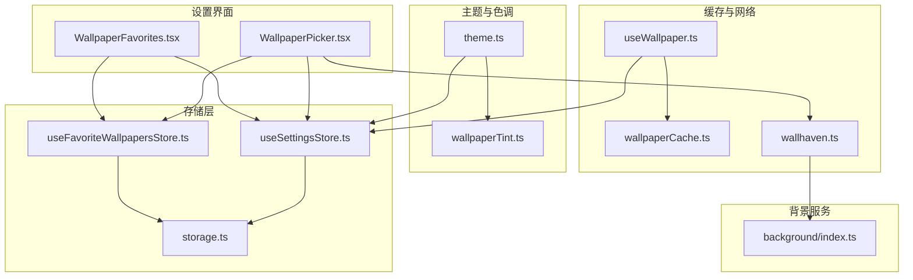
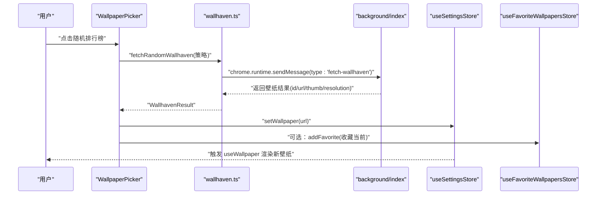
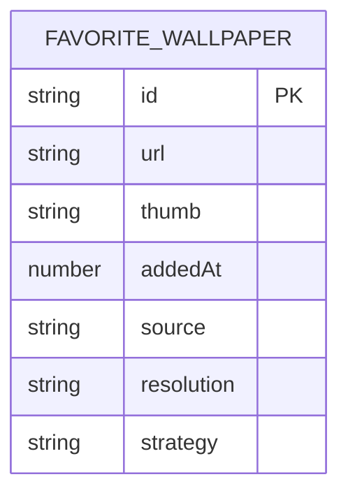
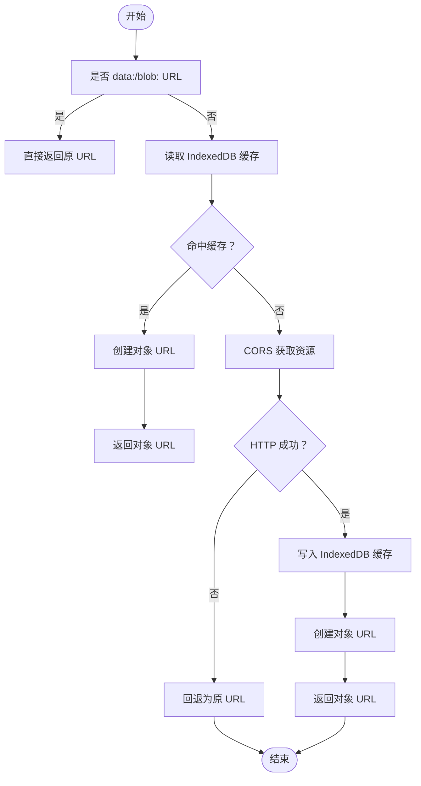
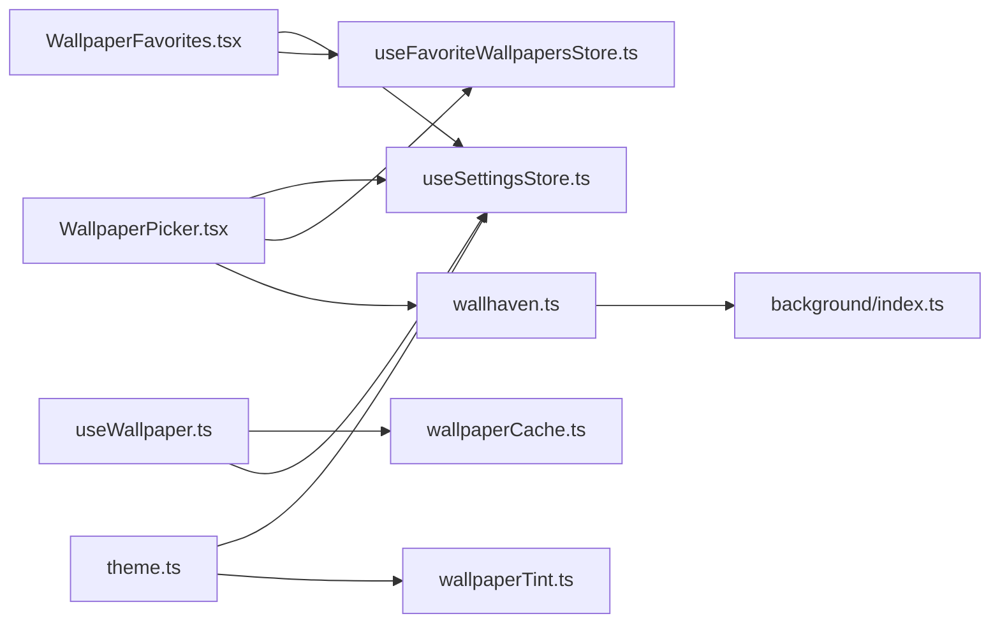

# 壁纸配置模块

<cite>
**本文引用的文件**
- [src/lib/useWallpaper.ts](file://src/lib/useWallpaper.ts)
- [src/lib/wallpapers.ts](file://src/lib/wallpapers.ts)
- [src/lib/wallpaperCache.ts](file://src/lib/wallpaperCache.ts)
- [src/lib/wallhaven.ts](file://src/lib/wallhaven.ts)
- [src/lib/wallpaperTint.ts](file://src/lib/wallpaperTint.ts)
- [src/lib/theme.ts](file://src/lib/theme.ts)
- [src/components/settings/WallpaperPicker.tsx](file://src/components/settings/WallpaperPicker.tsx)
- [src/components/settings/WallpaperFavorites.tsx](file://src/components/settings/WallpaperFavorites.tsx)
- [src/store/useSettingsStore.ts](file://src/store/useSettingsStore.ts)
- [src/store/useFavoriteWallpapersStore.ts](file://src/store/useFavoriteWallpapersStore.ts)
- [src/store/storage.ts](file://src/store/storage.ts)
- [src/background/index.ts](file://src/background/index.ts)
</cite>

## 目录

1. [简介](#简介)
2. [项目结构](#项目结构)
3. [核心组件](#核心组件)
4. [架构总览](#架构总览)
5. [详细组件分析](#详细组件分析)
6. [依赖关系分析](#依赖关系分析)
7. [性能考量](#性能考量)
8. [故障排除指南](#故障排除指南)
9. [结论](#结论)
10. [附录](#附录)

## 简介

本文件系统性梳理“壁纸配置模块”的实现架构与使用方式，覆盖以下主题：

- 壁纸选择器的用户界面与交互流程
- 收藏功能的数据结构与持久化机制
- 预览、上传与删除的技术实现
- 缓存策略与性能优化
- 壁纸源扩展方法与自定义壁纸服务集成
- 质量控制与格式兼容性处理
- 渐变过渡效果的实现原理
- 备份与恢复配置的建议
- 具体配置示例与常见问题排查

## 项目结构

壁纸配置模块由“设置界面 + 存储层 + 主题与色调提取 + 缓存与网络 + 背景服务”构成，采用分层设计：

- 设置界面：WallpaperPicker（选择器）、WallpaperFavorites（收藏）
- 存储层：useSettingsStore（全局设置）、useFavoriteWallpapersStore（收藏列表）
- 主题与色调：wallpaperTint（提取主色调与亮度）、theme（应用主题、玻璃模式、动效等）
- 缓存与网络：wallpaperCache（IndexedDB 缓存）、useWallpaper（跨淡入淡出渲染）
- 背景服务：background/index（Wallhaven 随机壁纸抓取）



图表来源

- [src/components/settings/WallpaperPicker.tsx:1-234](file://src/components/settings/WallpaperPicker.tsx#L1-L234)
- [src/components/settings/WallpaperFavorites.tsx:1-64](file://src/components/settings/WallpaperFavorites.tsx#L1-L64)
- [src/store/useSettingsStore.ts:1-89](file://src/store/useSettingsStore.ts#L1-L89)
- [src/store/useFavoriteWallpapersStore.ts:1-51](file://src/store/useFavoriteWallpapersStore.ts#L1-L51)
- [src/store/storage.ts:1-63](file://src/store/storage.ts#L1-L63)
- [src/lib/theme.ts:1-123](file://src/lib/theme.ts#L1-L123)
- [src/lib/wallpaperTint.ts:1-163](file://src/lib/wallpaperTint.ts#L1-L163)
- [src/lib/useWallpaper.ts:1-110](file://src/lib/useWallpaper.ts#L1-L110)
- [src/lib/wallpaperCache.ts:1-94](file://src/lib/wallpaperCache.ts#L1-L94)
- [src/lib/wallhaven.ts:1-43](file://src/lib/wallhaven.ts#L1-L43)
- [src/background/index.ts:1-174](file://src/background/index.ts#L1-L174)

章节来源

- [src/components/settings/WallpaperPicker.tsx:1-234](file://src/components/settings/WallpaperPicker.tsx#L1-L234)
- [src/components/settings/WallpaperFavorites.tsx:1-64](file://src/components/settings/WallpaperFavorites.tsx#L1-L64)
- [src/store/useSettingsStore.ts:1-89](file://src/store/useSettingsStore.ts#L1-L89)
- [src/store/useFavoriteWallpapersStore.ts:1-51](file://src/store/useFavoriteWallpapersStore.ts#L1-L51)
- [src/store/storage.ts:1-63](file://src/store/storage.ts#L1-L63)
- [src/lib/theme.ts:1-123](file://src/lib/theme.ts#L1-L123)
- [src/lib/wallpaperTint.ts:1-163](file://src/lib/wallpaperTint.ts#L1-L163)
- [src/lib/useWallpaper.ts:1-110](file://src/lib/useWallpaper.ts#L1-L110)
- [src/lib/wallpaperCache.ts:1-94](file://src/lib/wallpaperCache.ts#L1-L94)
- [src/lib/wallhaven.ts:1-43](file://src/lib/wallhaven.ts#L1-L43)
- [src/background/index.ts:1-174](file://src/background/index.ts#L1-L174)

## 核心组件

- 壁纸选择器（WallpaperPicker）：提供预设、收藏、上传、随机墙纸、收藏当前、暗化调节等功能入口。
- 收藏组件（WallpaperFavorites）：展示与管理收藏项，支持移除与快速应用。
- 设置存储（useSettingsStore）：集中管理壁纸 URL、色调、亮度、暗化强度等全局状态，并持久化到 chrome.storage/localStorage。
- 收藏存储（useFavoriteWallpapersStore）：管理收藏列表，限制最大数量，持久化并支持多标签页同步。
- 主题与色调（theme + wallpaperTint）：根据壁纸动态计算主色调与相对亮度，驱动 CSS 变量与对比度。
- 缓存与网络（wallpaperCache + useWallpaper）：IndexedDB 缓存与对象 URL 管理，实现跨淡入淡出预览与内存安全。
- 背景服务（background/index）：Wallhaven 随机壁纸抓取，提供稳定接口给前台调用。

章节来源

- [src/components/settings/WallpaperPicker.tsx:1-234](file://src/components/settings/WallpaperPicker.tsx#L1-L234)
- [src/components/settings/WallpaperFavorites.tsx:1-64](file://src/components/settings/WallpaperFavorites.tsx#L1-L64)
- [src/store/useSettingsStore.ts:1-89](file://src/store/useSettingsStore.ts#L1-L89)
- [src/store/useFavoriteWallpapersStore.ts:1-51](file://src/store/useFavoriteWallpapersStore.ts#L1-L51)
- [src/lib/theme.ts:1-123](file://src/lib/theme.ts#L1-L123)
- [src/lib/wallpaperTint.ts:1-163](file://src/lib/wallpaperTint.ts#L1-L163)
- [src/lib/useWallpaper.ts:1-110](file://src/lib/useWallpaper.ts#L1-L110)
- [src/lib/wallpaperCache.ts:1-94](file://src/lib/wallpaperCache.ts#L1-L94)
- [src/lib/wallhaven.ts:1-43](file://src/lib/wallhaven.ts#L1-L43)
- [src/background/index.ts:1-174](file://src/background/index.ts#L1-L174)

## 架构总览

壁纸配置模块遵循“前台 UI + 后台服务 + 持久化存储 + 缓存与网络”的分层架构。前台负责交互与渲染，后台服务处理第三方 API 请求，存储层保证跨会话一致性，缓存层降低网络与解码成本。



图表来源

- [src/components/settings/WallpaperPicker.tsx:79-102](file://src/components/settings/WallpaperPicker.tsx#L79-L102)
- [src/lib/wallhaven.ts:14-42](file://src/lib/wallhaven.ts#L14-L42)
- [src/background/index.ts:132-173](file://src/background/index.ts#L132-L173)
- [src/store/useSettingsStore.ts:50-50](file://src/store/useSettingsStore.ts#L50-L50)
- [src/store/useFavoriteWallpapersStore.ts:28-32](file://src/store/useFavoriteWallpapersStore.ts#L28-L32)

## 详细组件分析

### 壁纸选择器（UI 与逻辑）

- 功能要点
  - 预设壁纸网格：点击即应用；当前选中项显示选中标记。
  - 收藏区域：展示收藏项，支持移除与一键应用。
  - 随机排行榜：按策略（日/周/月/年）从 Wallhaven 获取随机壁纸，支持超时与降级策略。
  - 上传本地图片：限制大小，转为 data URL 应用。
  - 收藏当前：当 lastResult 与当前壁纸匹配时启用。
  - 壁纸暗化滑杆：实时调整遮罩强度，范围 0–60%，写入设置存储。
- 关键交互
  - 通过 useSettingsStore 控制壁纸 URL 与暗化强度。
  - 通过 useFavoriteWallpapersStore 管理收藏列表。
  - 通过 wallhaven.ts 与 background/index.ts 协作完成远程壁纸抓取。

章节来源

- [src/components/settings/WallpaperPicker.tsx:1-234](file://src/components/settings/WallpaperPicker.tsx#L1-L234)
- [src/store/useSettingsStore.ts:1-89](file://src/store/useSettingsStore.ts#L1-L89)
- [src/store/useFavoriteWallpapersStore.ts:1-51](file://src/store/useFavoriteWallpapersStore.ts#L1-L51)
- [src/lib/wallhaven.ts:1-43](file://src/lib/wallhaven.ts#L1-L43)
- [src/background/index.ts:1-174](file://src/background/index.ts#L1-L174)

### 收藏功能（数据结构与管理）

- 数据模型
  - 收藏条目包含：id、url、thumb、addedAt、source、resolution、strategy。
  - 最大容量：24 条，超出自动截断。
- 存储与同步
  - 使用 zustand + persist + JSONStorage 包装的 chromeStorage/localStorage。
  - 支持水合（hydrate）与远程变更监听（registerRemoteSync），确保多标签页一致。
- UI 行为
  - 展示收藏缩略图网格，支持移除单个条目。
  - 当前应用的收藏项显示选中标记。



图表来源

- [src/store/useFavoriteWallpapersStore.ts:5-13](file://src/store/useFavoriteWallpapersStore.ts#L5-L13)

章节来源

- [src/store/useFavoriteWallpapersStore.ts:1-51](file://src/store/useFavoriteWallpapersStore.ts#L1-L51)
- [src/store/storage.ts:1-63](file://src/store/storage.ts#L1-L63)
- [src/components/settings/WallpaperFavorites.tsx:1-64](file://src/components/settings/WallpaperFavorites.tsx#L1-L64)

### 预览、上传与删除

- 预览与跨淡入淡出
  - useWallpaper 在壁纸切换时先清空 loadedUrl，再异步解析对象 URL，成功后在下一帧显示，形成淡入；失败则回退至上一张。
  - 对 blob URL 进行所有权跟踪并在卸载时回收，避免内存泄漏。
- 上传本地图片
  - 限制最大 5MB；读取为 data URL 并直接应用。
- 删除收藏
  - 点击卡片右上角“×”移除对应收藏项。

章节来源

- [src/lib/useWallpaper.ts:1-110](file://src/lib/useWallpaper.ts#L1-L110)
- [src/lib/wallpaperCache.ts:1-94](file://src/lib/wallpaperCache.ts#L1-L94)
- [src/components/settings/WallpaperPicker.tsx:61-77](file://src/components/settings/WallpaperPicker.tsx#L61-L77)
- [src/components/settings/WallpaperFavorites.tsx:46-56](file://src/components/settings/WallpaperFavorites.tsx#L46-L56)

### 缓存策略与性能优化

- IndexedDB 缓存
  - wallpaperCache 使用 IndexedDB 存储壁纸二进制，仅保留当前壁纸的缓存条目（evictOthers），减少占用。
  - resolveWallpaper 优先命中缓存，未命中则异步刷新缓存。
- 对象 URL 生命周期
  - useWallpaper 维护 ownedObjectUrls 集合并统一回收，避免泄漏。
- 主题与亮度提取
  - wallpaperTint 对采样尺寸进行下采样（64×64），并缓存/去重并发请求，降低 Canvas 解码成本。
- 主题应用与节流
  - theme 中对壁纸亮度提取进行去抖（约 150ms），避免频繁重绘与解码。



图表来源

- [src/lib/wallpaperCache.ts:75-93](file://src/lib/wallpaperCache.ts#L75-L93)
- [src/lib/useWallpaper.ts:54-90](file://src/lib/useWallpaper.ts#L54-L90)

章节来源

- [src/lib/wallpaperCache.ts:1-94](file://src/lib/wallpaperCache.ts#L1-L94)
- [src/lib/useWallpaper.ts:1-110](file://src/lib/useWallpaper.ts#L1-L110)
- [src/lib/wallpaperTint.ts:1-163](file://src/lib/wallpaperTint.ts#L1-L163)
- [src/lib/theme.ts:87-95](file://src/lib/theme.ts#L87-L95)

### 渐变过渡效果的实现原理

- 切换流程
  - 清空 loadedUrl，使旧壁纸作为底层可见；
  - 异步解析新壁纸对象 URL；
  - onload 后在下一帧设置 loadedUrl 并显示新壁纸；
  - onerror 时回退到 prevUrl 或保持旧壁纸。
- 内存安全
  - 对 owned 的 blob URL 在卸载时统一 revoke。

```mermaid
sequenceDiagram
participant C as "组件"
participant U as "useWallpaper"
participant R as "resolveWallpaper"
participant IMG as "Image"
C->>U : "watch(wallpaper)"
U->>U : "setState(prev -> {loadedUrl : null,visible : false})"
U->>R : "resolveWallpaper(wallpaper)"
R-->>U : "{objectUrl}"
U->>IMG : "new Image(); src=objectUrl"
IMG-->>U : "onload"
U->>U : "requestAnimationFrame -> setState({loadedUrl,visible : true})"
IMG-->>U : "onerror"
U->>U : "回退 prevUrl 或保持旧壁纸"
```

图表来源

- [src/lib/useWallpaper.ts:21-98](file://src/lib/useWallpaper.ts#L21-L98)
- [src/lib/wallpaperCache.ts:75-93](file://src/lib/wallpaperCache.ts#L75-L93)

章节来源

- [src/lib/useWallpaper.ts:1-110](file://src/lib/useWallpaper.ts#L1-L110)

### 壁纸源扩展与自定义服务集成

- 扩展思路
  - 在 WallpaperPicker 中新增源入口（如上传、自定义 API）。
  - 将结果转换为统一的 WallpaperPreset/WallhavenResult 结构，调用 setWallpaper 应用。
- 自定义壁纸服务
  - 若需跨域或鉴权，可在 background 注册消息处理器，前台通过 chrome.runtime.sendMessage 调用。
  - 返回字段建议包含 id、url、thumb、resolution、requestedStrategy、actualStrategy，便于 UI 与日志追踪。

章节来源

- [src/components/settings/WallpaperPicker.tsx:1-234](file://src/components/settings/WallpaperPicker.tsx#L1-L234)
- [src/lib/wallhaven.ts:1-43](file://src/lib/wallhaven.ts#L1-L43)
- [src/background/index.ts:123-173](file://src/background/index.ts#L123-L173)

### 质量控制与格式兼容性

- 质量控制
  - 预设与 Wallhaven 返回的分辨率信息可用于提示用户当前壁纸尺寸。
  - 上传限制为 5MB，避免过大资源影响性能。
- 格式兼容性
  - 通过浏览器 Image 对象加载，支持常见图片格式。
  - 对于跨域图片，wallpaperTint 显式设置 crossOrigin='anonymous'，避免污染画布导致无法提取。

章节来源

- [src/components/settings/WallpaperPicker.tsx:16-16](file://src/components/settings/WallpaperPicker.tsx#L16-L16)
- [src/lib/wallpaperTint.ts:66-66](file://src/lib/wallpaperTint.ts#L66-L66)

### 主题与色调联动

- 动态主色调
  - wallpaperTint 提取主色与相对亮度，写入 CSS 变量 --wallpaper-tint 与 --wallpaper-luminance。
- 主题应用
  - theme 初始化时应用缓存值，随后订阅设置变化并即时生效。
- 对比度与可读性
  - wallpaperDimming 提供遮罩强度调节，提升前景文本可读性。

章节来源

- [src/lib/wallpaperTint.ts:1-163](file://src/lib/wallpaperTint.ts#L1-L163)
- [src/lib/theme.ts:1-123](file://src/lib/theme.ts#L1-L123)
- [src/store/useSettingsStore.ts:1-89](file://src/store/useSettingsStore.ts#L1-L89)

## 依赖关系分析

- 组件耦合
  - WallpaperPicker 依赖设置存储、收藏存储、Wallhaven 客户端与 UI 工具。
  - WallpaperFavorites 仅依赖设置存储与收藏存储。
  - useWallpaper 依赖设置存储与缓存模块。
- 外部依赖
  - IndexedDB（wallpaperCache）
  - chrome.storage/localStorage（zustand persist）
  - chrome.runtime（Wallhaven 消息通道）



图表来源

- [src/components/settings/WallpaperPicker.tsx:1-234](file://src/components/settings/WallpaperPicker.tsx#L1-L234)
- [src/components/settings/WallpaperFavorites.tsx:1-64](file://src/components/settings/WallpaperFavorites.tsx#L1-L64)
- [src/lib/useWallpaper.ts:1-110](file://src/lib/useWallpaper.ts#L1-L110)
- [src/lib/wallpaperCache.ts:1-94](file://src/lib/wallpaperCache.ts#L1-L94)
- [src/lib/wallhaven.ts:1-43](file://src/lib/wallhaven.ts#L1-L43)
- [src/lib/theme.ts:1-123](file://src/lib/theme.ts#L1-L123)
- [src/lib/wallpaperTint.ts:1-163](file://src/lib/wallpaperTint.ts#L1-L163)
- [src/store/useSettingsStore.ts:1-89](file://src/store/useSettingsStore.ts#L1-L89)
- [src/store/useFavoriteWallpapersStore.ts:1-51](file://src/store/useFavoriteWallpapersStore.ts#L1-L51)
- [src/background/index.ts:1-174](file://src/background/index.ts#L1-L174)

章节来源

- [src/components/settings/WallpaperPicker.tsx:1-234](file://src/components/settings/WallpaperPicker.tsx#L1-L234)
- [src/components/settings/WallpaperFavorites.tsx:1-64](file://src/components/settings/WallpaperFavorites.tsx#L1-L64)
- [src/lib/useWallpaper.ts:1-110](file://src/lib/useWallpaper.ts#L1-L110)
- [src/lib/wallpaperCache.ts:1-94](file://src/lib/wallpaperCache.ts#L1-L94)
- [src/lib/wallhaven.ts:1-43](file://src/lib/wallhaven.ts#L1-L43)
- [src/lib/theme.ts:1-123](file://src/lib/theme.ts#L1-L123)
- [src/lib/wallpaperTint.ts:1-163](file://src/lib/wallpaperTint.ts#L1-L163)
- [src/store/useSettingsStore.ts:1-89](file://src/store/useSettingsStore.ts#L1-L89)
- [src/store/useFavoriteWallpapersStore.ts:1-51](file://src/store/useFavoriteWallpapersStore.ts#L1-L51)
- [src/background/index.ts:1-174](file://src/background/index.ts#L1-L174)

## 性能考量

- 缓存优先：resolveWallpaper 优先命中 IndexedDB，未命中才发起网络请求。
- 对象 URL 回收：useWallpaper 统一维护 ownedObjectUrls，在组件卸载时批量 revoke。
- 采样与去抖：wallpaperTint 下采样与去重并发，theme 中对亮度提取进行去抖。
- 资源体积：上传限制与预设尺寸适配，避免大体积资源影响首屏与渲染。
- 跨域与画布：显式设置 crossOrigin，避免因污染画布导致提取失败。

章节来源

- [src/lib/wallpaperCache.ts:1-94](file://src/lib/wallpaperCache.ts#L1-L94)
- [src/lib/useWallpaper.ts:1-110](file://src/lib/useWallpaper.ts#L1-L110)
- [src/lib/wallpaperTint.ts:1-163](file://src/lib/wallpaperTint.ts#L1-L163)
- [src/lib/theme.ts:87-95](file://src/lib/theme.ts#L87-L95)

## 故障排除指南

- 随机壁纸获取失败
  - 检查网络与超时（前台设置了 15 秒竞速超时）。
  - 查看后台错误日志与友好错误映射（如限流、超时）。
- 壁纸不显示或闪烁
  - 确认 resolveWallpaper 是否正确创建对象 URL。
  - 检查 useWallpaper 的 onload/onerror 分支是否被触发。
- 主题色调未更新
  - 确认壁纸亮度提取是否返回有效值。
  - 检查 CSS 变量是否被正确设置。
- 收藏无法同步
  - 确认 chrome.storage.onChanged 是否注册成功。
  - 检查 registerRemoteSync 的回调是否执行。

章节来源

- [src/components/settings/WallpaperPicker.tsx:83-101](file://src/components/settings/WallpaperPicker.tsx#L83-L101)
- [src/background/index.ts:113-121](file://src/background/index.ts#L113-L121)
- [src/lib/useWallpaper.ts:73-85](file://src/lib/useWallpaper.ts#L73-L85)
- [src/lib/theme.ts:47-66](file://src/lib/theme.ts#L47-L66)
- [src/store/storage.ts:53-62](file://src/store/storage.ts#L53-L62)

## 结论

壁纸配置模块以清晰的分层设计实现了“所见即所得”的壁纸体验：前台提供直观的交互入口，后台服务保障第三方资源的稳定获取，存储与缓存兼顾一致性与性能，主题与色调系统进一步提升了可读性与美观度。通过可扩展的源接入与完善的错误处理，该模块具备良好的可维护性与可扩展性。

## 附录

### 配置示例（路径指引）

- 设置默认壁纸与暗化强度
  - 默认壁纸：参考 [DEFAULT_WALLPAPER:11-11](file://src/lib/wallpapers.ts#L11-L11)
  - 暗化强度范围：0–60%，参考 [wallpaperDimming:19-19](file://src/store/useSettingsStore.ts#L19-L19)
- 收藏上限与字段
  - 最大收藏数：24，参考 [MAX_FAVORITES:15-15](file://src/store/useFavoriteWallpapersStore.ts#L15-L15)
  - 收藏字段：id/url/thumb/addedAt/source/resolution/strategy，参考 [FavoriteWallpaper:5-13](file://src/store/useFavoriteWallpapersStore.ts#L5-L13)
- 预设壁纸列表
  - 预设数组与缩略图尺寸，参考 [PRESETS:13-68](file://src/lib/wallpapers.ts#L13-L68)

### 备份与恢复建议

- 备份
  - 通过 chrome.storage.local 导出键名：tab:settings、tab:favorite-wallpapers。
- 恢复
  - 在新环境导入相同键值，或通过 hydrateStores 触发水合。
- 注意
  - 若使用 localStorage（非扩展环境），备份 localStorage 中对应键值。

章节来源

- [src/store/storage.ts:6-32](file://src/store/storage.ts#L6-L32)
- [src/store/useSettingsStore.ts:57-84](file://src/store/useSettingsStore.ts#L57-L84)
- [src/store/useFavoriteWallpapersStore.ts:24-44](file://src/store/useFavoriteWallpapersStore.ts#L24-L44)
