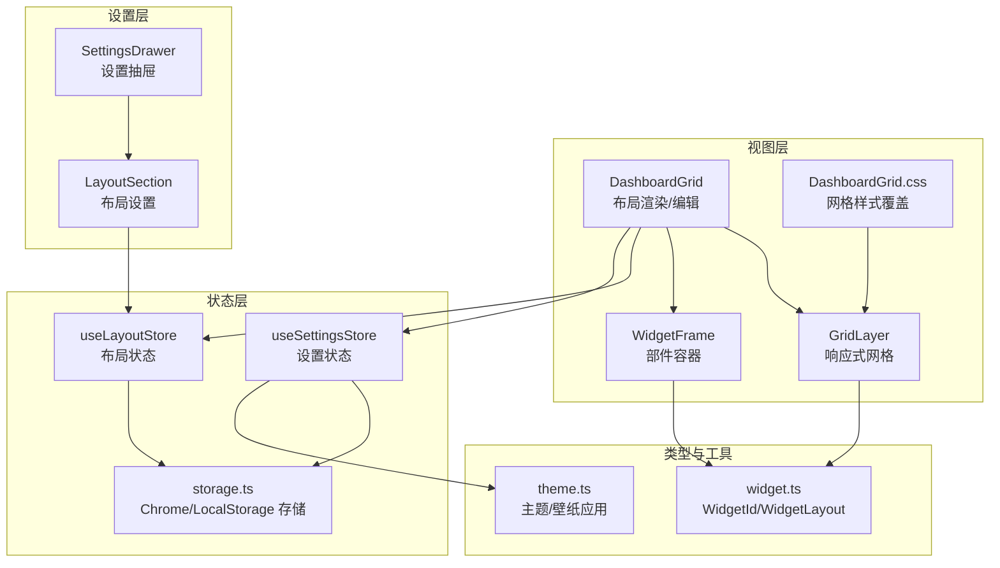
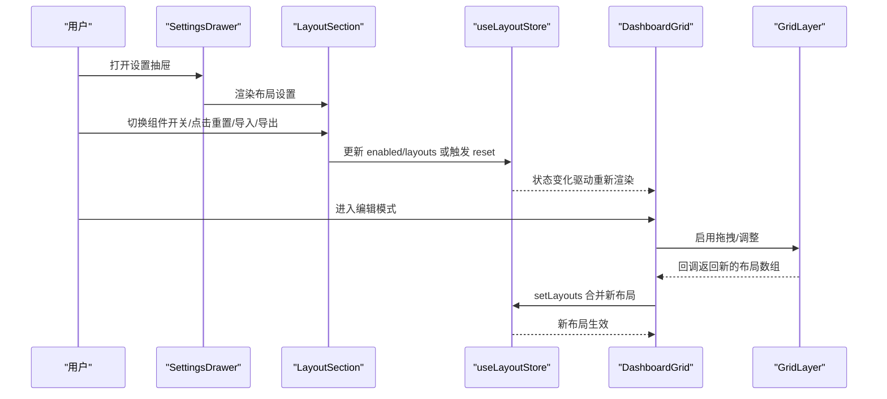
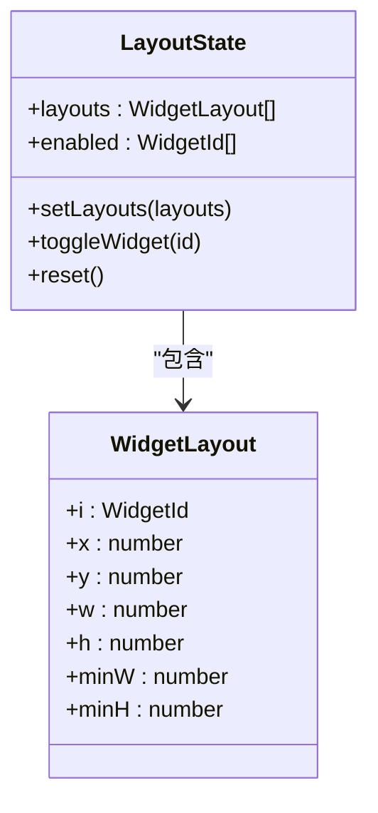
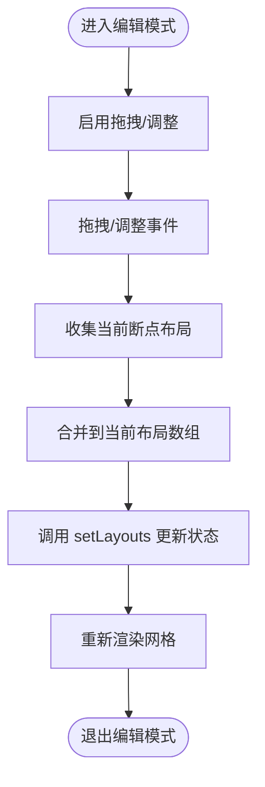
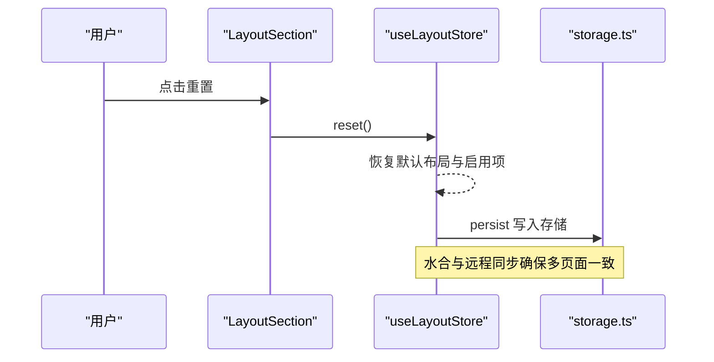
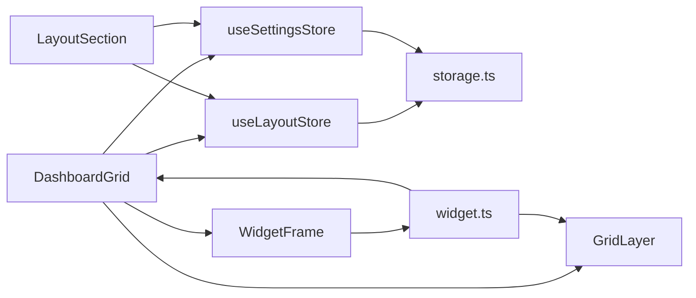

# 布局配置模块

<cite>
**本文档引用的文件**
- [src/store/useLayoutStore.ts](file://src/store/useLayoutStore.ts)
- [src/store/storage.ts](file://src/store/storage.ts)
- [src/components/layout/DashboardGrid.tsx](file://src/components/layout/DashboardGrid.tsx)
- [src/components/layout/GridLayer.tsx](file://src/components/layout/GridLayer.tsx)
- [src/components/layout/WidgetFrame.tsx](file://src/components/layout/WidgetFrame.tsx)
- [src/components/layout/DashboardGrid.css](file://src/components/layout/DashboardGrid.css)
- [src/components/settings/LayoutSection.tsx](file://src/components/settings/LayoutSection.tsx)
- [src/components/settings/SettingsDrawer.tsx](file://src/components/settings/SettingsDrawer.tsx)
- [src/store/useSettingsStore.ts](file://src/store/useSettingsStore.ts)
- [src/types/widget.ts](file://src/types/widget.ts)
- [src/store/useLayoutStore.test.ts](file://src/store/useLayoutStore.test.ts)
- [src/store/useSettingsStore.test.ts](file://src/store/useSettingsStore.test.ts)
- [src/lib/theme.ts](file://src/lib/theme.ts)
- [src/components/widgets/SearchBar/SearchBar.tsx](file://src/components/widgets/SearchBar/SearchBar.tsx)
- [src/components/widgets/Shortcuts/ShortcutsGrid.tsx](file://src/components/widgets/Shortcuts/ShortcutsGrid.tsx)
</cite>

## 目录

1. [简介](#简介)
2. [项目结构](#项目结构)
3. [核心组件](#核心组件)
4. [架构总览](#架构总览)
5. [详细组件分析](#详细组件分析)
6. [依赖关系分析](#依赖关系分析)
7. [性能考量](#性能考量)
8. [故障排查指南](#故障排查指南)
9. [结论](#结论)
10. [附录](#附录)

## 简介

本模块围绕“布局配置”展开，涵盖布局设置的用户界面设计与交互逻辑、布局重置/保存/恢复机制、数据结构与存储策略、编辑模式切换与状态管理、验证规则与约束、兼容性检查与版本迁移、批量操作与更新机制、以及导入/导出功能与格式规范。目标是帮助开发者与使用者全面理解布局系统的设计与实现，并提供可操作的最佳实践。

## 项目结构

布局配置模块由以下层次构成：

- 状态层：使用 Zustand 管理布局与设置状态，持久化到浏览器存储（扩展环境使用 Chrome Storage，否则回退到本地存储）。
- 视图层：DashboardGrid 负责渲染与编辑；GridLayer 提供响应式网格拖拽与调整；WidgetFrame 包裹每个小部件并根据编辑态显示拖拽手柄与高亮。
- 设置层：SettingsDrawer 汇聚主题、壁纸与布局等设置入口；LayoutSection 提供组件开关、重置、导入/导出。
- 类型层：定义 WidgetId 与 WidgetLayout 的数据模型。
- 工具层：主题应用与壁纸色调提取，确保布局与整体主题一致。

图表来源

- [src/store/useLayoutStore.ts:1-58](file://src/store/useLayoutStore.ts#L1-L58)
- [src/store/storage.ts:1-63](file://src/store/storage.ts#L1-L63)
- [src/components/layout/DashboardGrid.tsx:1-110](file://src/components/layout/DashboardGrid.tsx#L1-L110)
- [src/components/layout/GridLayer.tsx:1-50](file://src/components/layout/GridLayer.tsx#L1-L50)
- [src/components/layout/WidgetFrame.tsx:1-31](file://src/components/layout/WidgetFrame.tsx#L1-L31)
- [src/components/layout/DashboardGrid.css:1-66](file://src/components/layout/DashboardGrid.css#L1-L66)
- [src/components/settings/SettingsDrawer.tsx:1-22](file://src/components/settings/SettingsDrawer.tsx#L1-L22)
- [src/components/settings/LayoutSection.tsx:1-209](file://src/components/settings/LayoutSection.tsx#L1-L209)
- [src/store/useSettingsStore.ts:1-89](file://src/store/useSettingsStore.ts#L1-L89)
- [src/types/widget.ts:1-34](file://src/types/widget.ts#L1-L34)
- [src/lib/theme.ts:1-135](file://src/lib/theme.ts#L1-L135)

章节来源

- [src/store/useLayoutStore.ts:1-58](file://src/store/useLayoutStore.ts#L1-L58)
- [src/store/storage.ts:1-63](file://src/store/storage.ts#L1-L63)
- [src/components/layout/DashboardGrid.tsx:1-110](file://src/components/layout/DashboardGrid.tsx#L1-L110)
- [src/components/layout/GridLayer.tsx:1-50](file://src/components/layout/GridLayer.tsx#L1-L50)
- [src/components/layout/WidgetFrame.tsx:1-31](file://src/components/layout/WidgetFrame.tsx#L1-L31)
- [src/components/layout/DashboardGrid.css:1-66](file://src/components/layout/DashboardGrid.css#L1-L66)
- [src/components/settings/SettingsDrawer.tsx:1-22](file://src/components/settings/SettingsDrawer.tsx#L1-L22)
- [src/components/settings/LayoutSection.tsx:1-209](file://src/components/settings/LayoutSection.tsx#L1-L209)
- [src/store/useSettingsStore.ts:1-89](file://src/store/useSettingsStore.ts#L1-L89)
- [src/types/widget.ts:1-34](file://src/types/widget.ts#L1-L34)
- [src/lib/theme.ts:1-135](file://src/lib/theme.ts#L1-L135)

## 核心组件

- 布局状态管理（useLayoutStore）
  - 状态字段：layouts（WidgetLayout 数组）、enabled（WidgetId 数组）。
  - 动作：setLayouts、toggleWidget、reset。
  - 默认值：内置默认布局与默认启用列表。
  - 持久化：使用 persist 中间件，存储键名 tab:layout，JSON 序列化，版本 1，迁移函数保留原值。
  - 水合与远程同步：注册水合与远程同步回调，确保多标签页一致性。
- 设置状态管理（useSettingsStore）
  - 状态字段：主题、玻璃模式、搜索引擎、壁纸、壁纸色调、壁纸亮度、编辑模式、减少动画等。
  - 动作：设置器与 toggleEditMode。
  - 持久化：存储键名 tab:settings，版本 4，迁移从 v1→v2→v3→v4，含壁纸亮度连续化迁移。
- 布局渲染与编辑（DashboardGrid/GridLayer/WidgetFrame）
  - DashboardGrid：聚合可见布局、生成移动端 xs 布局、处理网格变更回调、控制编辑态与拖拽/调整。
  - GridLayer：基于 react-grid-layout 提供响应式断点、拖拽/调整、手柄与样式。
  - WidgetFrame：包裹部件，编辑态下显示拖拽手柄与高亮边框。
- 设置界面（SettingsDrawer/LayoutSection）
  - SettingsDrawer：组合主题、壁纸与布局设置。
  - LayoutSection：组件开关、重置、导入/导出；包含导入导出解析与校验、版本兼容性检查。

章节来源

- [src/store/useLayoutStore.ts:1-58](file://src/store/useLayoutStore.ts#L1-L58)
- [src/store/useSettingsStore.ts:1-89](file://src/store/useSettingsStore.ts#L1-L89)
- [src/components/layout/DashboardGrid.tsx:1-110](file://src/components/layout/DashboardGrid.tsx#L1-L110)
- [src/components/layout/GridLayer.tsx:1-50](file://src/components/layout/GridLayer.tsx#L1-L50)
- [src/components/layout/WidgetFrame.tsx:1-31](file://src/components/layout/WidgetFrame.tsx#L1-L31)
- [src/components/settings/SettingsDrawer.tsx:1-22](file://src/components/settings/SettingsDrawer.tsx#L1-L22)
- [src/components/settings/LayoutSection.tsx:1-209](file://src/components/settings/LayoutSection.tsx#L1-L209)

## 架构总览

布局配置模块采用分层架构：

- 状态层通过 Zustand + persist 实现本地持久化与跨标签页同步。
- 视图层以组件化方式组织，编辑态与非编辑态通过设置状态切换。
- 设置层提供统一入口，导入/导出与版本兼容在设置层完成。
- 类型层保证布局数据结构的一致性与可维护性。

图表来源

- [src/components/settings/SettingsDrawer.tsx:1-22](file://src/components/settings/SettingsDrawer.tsx#L1-L22)
- [src/components/settings/LayoutSection.tsx:1-209](file://src/components/settings/LayoutSection.tsx#L1-L209)
- [src/store/useLayoutStore.ts:1-58](file://src/store/useLayoutStore.ts#L1-L58)
- [src/components/layout/DashboardGrid.tsx:1-110](file://src/components/layout/DashboardGrid.tsx#L1-L110)
- [src/components/layout/GridLayer.tsx:1-50](file://src/components/layout/GridLayer.tsx#L1-L50)

## 详细组件分析

### 布局状态与数据模型

- 数据结构
  - WidgetId：限定的小部件标识集合。
  - WidgetLayout：包含位置与尺寸信息，支持最小宽高约束。
- 默认布局与启用项
  - 内置默认布局与默认启用列表，作为初始状态。
- 状态动作
  - setLayouts：替换整个布局数组。
  - toggleWidget：切换某个小部件的启用状态。
  - reset：恢复为默认布局与默认启用项。
- 持久化与版本
  - 使用 persist 中间件，存储键名为 tab:layout，版本 1，迁移函数保留原值。
  - 注册水合与远程同步，确保多页面一致性。

图表来源

- [src/store/useLayoutStore.ts:6-12](file://src/store/useLayoutStore.ts#L6-L12)
- [src/types/widget.ts:25-33](file://src/types/widget.ts#L25-L33)

章节来源

- [src/store/useLayoutStore.ts:1-58](file://src/store/useLayoutStore.ts#L1-L58)
- [src/types/widget.ts:1-34](file://src/types/widget.ts#L1-L34)

### 编辑模式与交互逻辑

- 编辑态切换
  - 通过 useSettingsStore 的 editMode 控制，切换后 DashboardGrid 为网格容器添加 is-editing 类，显示拖拽手柄与调整手柄。
- 拖拽与调整
  - GridLayer 在编辑态启用拖拽与调整，仅在桌面端生效；拖拽句柄为 .widget-drag-handle。
- 响应式布局
  - 多断点（lg/md/sm/xs），不同断点下的布局数组不同；xs 布局按单列堆叠生成。
- 可见性与最小高度
  - 根据 enabled 过滤可见布局；部分小部件的最小高度在渲染前动态调整。

图表来源

- [src/components/layout/DashboardGrid.tsx:60-75](file://src/components/layout/DashboardGrid.tsx#L60-L75)
- [src/components/layout/GridLayer.tsx:30-44](file://src/components/layout/GridLayer.tsx#L30-L44)
- [src/components/layout/WidgetFrame.tsx:11-26](file://src/components/layout/WidgetFrame.tsx#L11-L26)

章节来源

- [src/components/layout/DashboardGrid.tsx:1-110](file://src/components/layout/DashboardGrid.tsx#L1-L110)
- [src/components/layout/GridLayer.tsx:1-50](file://src/components/layout/GridLayer.tsx#L1-L50)
- [src/components/layout/WidgetFrame.tsx:1-31](file://src/components/layout/WidgetFrame.tsx#L1-L31)
- [src/components/layout/DashboardGrid.css:1-66](file://src/components/layout/DashboardGrid.css#L1-L66)

### 重置、保存与恢复机制

- 重置
  - LayoutSection 提供重置按钮，调用 useLayoutStore.reset 将布局与启用项恢复默认。
- 保存与恢复
  - 通过 persist 中间件自动保存到存储；水合与远程同步确保初始化与跨标签页同步。
- 存储策略
  - 优先使用 Chrome Storage（扩展环境），否则回退到 localStorage；读写均做错误处理与日志记录。

图表来源

- [src/components/settings/LayoutSection.tsx:190-194](file://src/components/settings/LayoutSection.tsx#L190-L194)
- [src/store/useLayoutStore.ts:44-44](file://src/store/useLayoutStore.ts#L44-L44)
- [src/store/storage.ts:6-32](file://src/store/storage.ts#L6-L32)

章节来源

- [src/components/settings/LayoutSection.tsx:1-209](file://src/components/settings/LayoutSection.tsx#L1-L209)
- [src/store/useLayoutStore.ts:1-58](file://src/store/useLayoutStore.ts#L1-L58)
- [src/store/storage.ts:1-63](file://src/store/storage.ts#L1-L63)

### 验证规则与约束条件

- 导入/导出解析
  - layouts：必须为数组，元素需包含有效 WidgetId 与数值型坐标。
  - enabled：必须为数组，元素为有效 WidgetId。
  - settings：包含主题、玻璃模式、搜索引擎、壁纸、色调、亮度、调光、减少动画等字段，进行类型与取值范围校验。
  - shortcuts/todos：条目结构校验。
- 版本兼容
  - 支持版本 1~4；当版本缺失或不在支持范围内时拒绝导入。
  - settings 的迁移：v1→v2 引入壁纸调光默认值；v2→v3 引入壁纸亮度标记；v3→v4 将二元亮度映射为连续值。
- 文件大小限制
  - 导入文件最大 5MB。

章节来源

- [src/components/settings/LayoutSection.tsx:23-95](file://src/components/settings/LayoutSection.tsx#L23-L95)
- [src/store/useSettingsStore.ts:62-82](file://src/store/useSettingsStore.ts#L62-L82)

### 兼容性检查与版本迁移

- 布局存储版本：1（迁移函数保留原值）。
- 设置存储版本：4（v1→v2→v3→v4 迁移链路完整）。
- 导入时版本校验与解析，失败则提示错误并清空输入框。

章节来源

- [src/store/useLayoutStore.ts:50-51](file://src/store/useLayoutStore.ts#L50-L51)
- [src/store/useSettingsStore.ts:61-82](file://src/store/useSettingsStore.ts#L61-L82)
- [src/components/settings/LayoutSection.tsx:97-132](file://src/components/settings/LayoutSection.tsx#L97-L132)

### 批量操作与批量更新机制

- 批量开关组件
  - LayoutSection 提供组件开关列表，逐项切换 enabled。
- 批量更新布局
  - GridLayer 的 onLayoutChange 回调在断点为 lg/md 时合并所有断点布局，一次性 setLayouts 更新。
- 批量导入/导出
  - 导出：一次性打包布局、启用项、设置、快捷方式与待办事项。
  - 导入：按需选择性覆盖，未提供的字段保持不变。

章节来源

- [src/components/settings/LayoutSection.tsx:158-205](file://src/components/settings/LayoutSection.tsx#L158-L205)
- [src/components/layout/DashboardGrid.tsx:60-75](file://src/components/layout/DashboardGrid.tsx#L60-L75)

### 导入/导出功能与格式规范

- 导出格式
  - 字段：version（当前版本 4）、layouts、enabled、settings、shortcuts、todos。
  - 文件类型：application/json，文件名包含日期。
- 导入格式
  - 必填：version（1~4）。
  - 可选：layouts/enabled/settings/shortcuts/todos，缺省字段跳过更新。
- 错误处理
  - 文件过大、非 JSON 对象、版本不支持、字段格式错误均抛出明确错误信息。

章节来源

- [src/components/settings/LayoutSection.tsx:105-150](file://src/components/settings/LayoutSection.tsx#L105-L150)

### 示例与最佳实践

- 示例
  - 默认布局包含时钟、搜索、快捷方式、天气、待办、书签，分别设定初始位置与尺寸。
  - xs 布局将可见部件按单列堆叠，保证移动端体验。
- 最佳实践
  - 在编辑态仅在桌面端启用拖拽/调整，避免移动端误触。
  - 导入前先备份当前布局，导入后核对版本与字段。
  - 使用 reset 恢复默认布局，便于问题排查与重新开始。

章节来源

- [src/store/useLayoutStore.ts:14-30](file://src/store/useLayoutStore.ts#L14-L30)
- [src/components/layout/DashboardGrid.tsx:33-58](file://src/components/layout/DashboardGrid.tsx#L33-L58)

## 依赖关系分析

- 组件耦合
  - DashboardGrid 依赖 useLayoutStore 与 useSettingsStore，负责渲染与编辑。
  - GridLayer 依赖 WidgetLayout 类型与断点配置，提供拖拽/调整能力。
  - WidgetFrame 依赖编辑态标志，控制样式与手柄显示。
  - LayoutSection 依赖 useLayoutStore 与 useSettingsStore，提供 UI 与导入/导出。
- 外部依赖
  - react-grid-layout：提供响应式网格与拖拽/调整。
  - Chrome Storage/localStorage：持久化存储。
- 循环依赖
  - 无直接循环依赖，状态与视图通过 hooks 解耦。

图表来源

- [src/components/layout/DashboardGrid.tsx:1-110](file://src/components/layout/DashboardGrid.tsx#L1-L110)
- [src/components/layout/GridLayer.tsx:1-50](file://src/components/layout/GridLayer.tsx#L1-L50)
- [src/components/layout/WidgetFrame.tsx:1-31](file://src/components/layout/WidgetFrame.tsx#L1-L31)
- [src/components/settings/LayoutSection.tsx:1-209](file://src/components/settings/LayoutSection.tsx#L1-L209)
- [src/store/useLayoutStore.ts:1-58](file://src/store/useLayoutStore.ts#L1-L58)
- [src/store/storage.ts:1-63](file://src/store/storage.ts#L1-L63)
- [src/types/widget.ts:1-34](file://src/types/widget.ts#L1-L34)

章节来源

- [src/components/layout/DashboardGrid.tsx:1-110](file://src/components/layout/DashboardGrid.tsx#L1-L110)
- [src/components/layout/GridLayer.tsx:1-50](file://src/components/layout/GridLayer.tsx#L1-L50)
- [src/components/layout/WidgetFrame.tsx:1-31](file://src/components/layout/WidgetFrame.tsx#L1-L31)
- [src/components/settings/LayoutSection.tsx:1-209](file://src/components/settings/LayoutSection.tsx#L1-L209)
- [src/store/useLayoutStore.ts:1-58](file://src/store/useLayoutStore.ts#L1-L58)
- [src/store/storage.ts:1-63](file://src/store/storage.ts#L1-L63)
- [src/types/widget.ts:1-34](file://src/types/widget.ts#L1-L34)

## 性能考量

- 懒加载网格库
  - GridLayer 通过动态导入延迟加载，首屏不阻塞，编辑态进入即时可用。
- 断点与布局计算
  - xs 布局按可见部件顺序堆叠，避免复杂计算；桌面端仅在 lg/md 断点合并布局。
- 存储与同步
  - 使用 Chrome Storage 时进行错误处理与日志记录；注册远程同步避免多标签页不同步。
- 主题与壁纸
  - 壁纸色调提取带去抖，避免频繁切换壁纸导致的重复解码。

章节来源

- [src/components/layout/DashboardGrid.tsx:17-22](file://src/components/layout/DashboardGrid.tsx#L17-L22)
- [src/store/storage.ts:18-30](file://src/store/storage.ts#L18-L30)
- [src/lib/theme.ts:99-107](file://src/lib/theme.ts#L99-L107)

## 故障排查指南

- 导入失败
  - 检查文件是否为合法 JSON 对象、版本号是否受支持、字段格式是否正确。
  - 导入后若出现异常，尝试重置布局并逐步恢复。
- 布局不生效
  - 确认处于编辑态且断点为 lg/md；桌面端才允许拖拽/调整。
  - 检查 enabled 列表中对应小部件是否被禁用。
- 多标签页不同步
  - 确认已注册远程同步；刷新页面或重新打开新标签页。
- 壁纸色调异常
  - 检查壁纸是否为空；若为空则清除缓存色调与亮度；等待去抖后重新提取。

章节来源

- [src/components/settings/LayoutSection.tsx:124-150](file://src/components/settings/LayoutSection.tsx#L124-L150)
- [src/components/layout/DashboardGrid.tsx:60-75](file://src/components/layout/DashboardGrid.tsx#L60-L75)
- [src/store/storage.ts:53-62](file://src/store/storage.ts#L53-L62)
- [src/lib/theme.ts:59-78](file://src/lib/theme.ts#L59-L78)

## 结论

布局配置模块通过清晰的状态分层、完善的导入/导出与版本兼容、可靠的编辑态交互与持久化策略，提供了稳定且易用的布局管理能力。遵循本文档的验证规则、最佳实践与故障排查建议，可有效提升布局配置的可靠性与用户体验。

## 附录

- 测试参考
  - 布局状态测试：默认值、setLayouts 替换、toggleWidget 开关、reset 恢复。
  - 设置状态测试：默认值、主题/引擎/壁纸/编辑态/减少动画等设置器与边界值。
- 相关组件
  - 搜索栏与快捷方式网格展示了编辑态下可交互的部件示例。

章节来源

- [src/store/useLayoutStore.test.ts:1-57](file://src/store/useLayoutStore.test.ts#L1-L57)
- [src/store/useSettingsStore.test.ts:1-90](file://src/store/useSettingsStore.test.ts#L1-L90)
- [src/components/widgets/SearchBar/SearchBar.tsx:1-116](file://src/components/widgets/SearchBar/SearchBar.tsx#L1-L116)
- [src/components/widgets/Shortcuts/ShortcutsGrid.tsx:1-38](file://src/components/widgets/Shortcuts/ShortcutsGrid.tsx#L1-L38)
