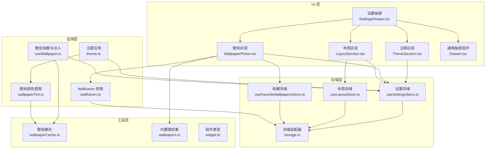
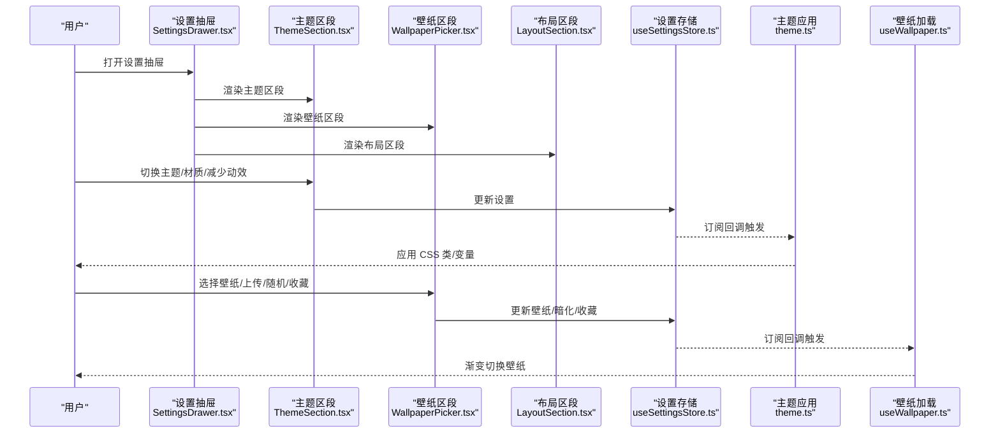
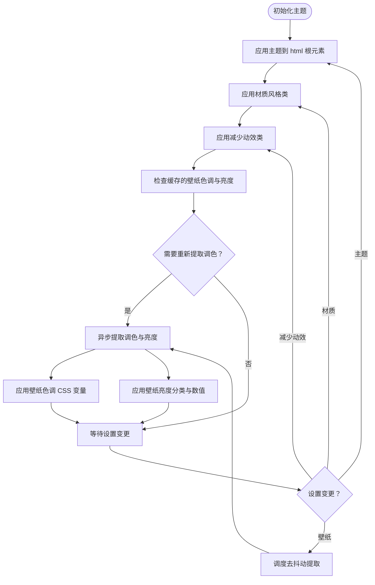
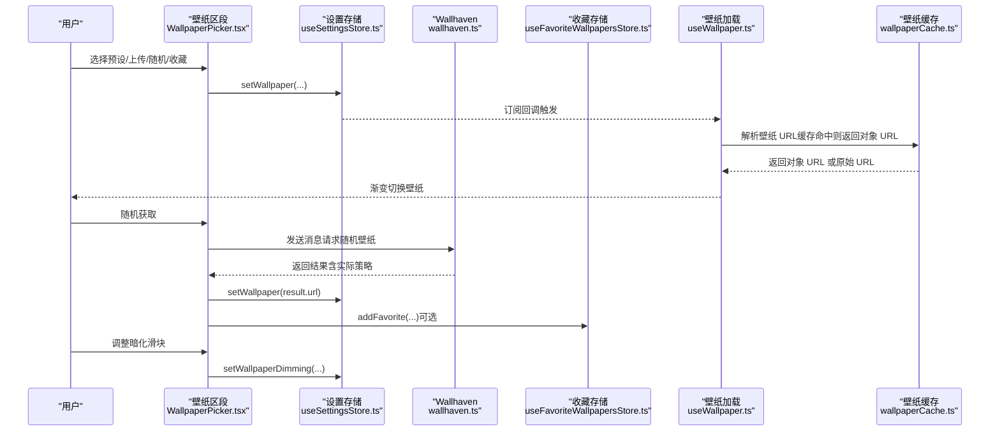
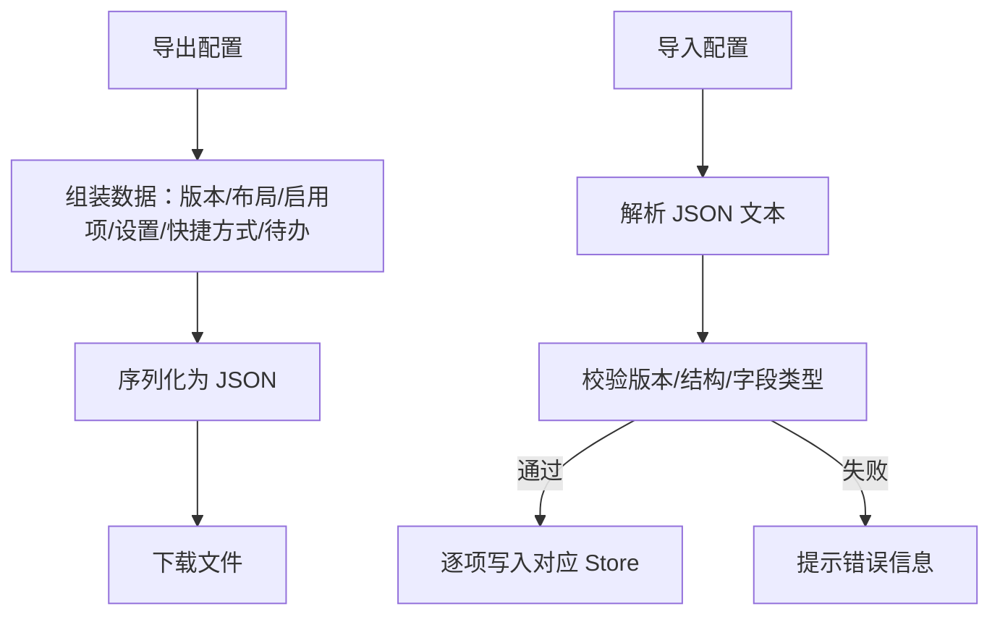
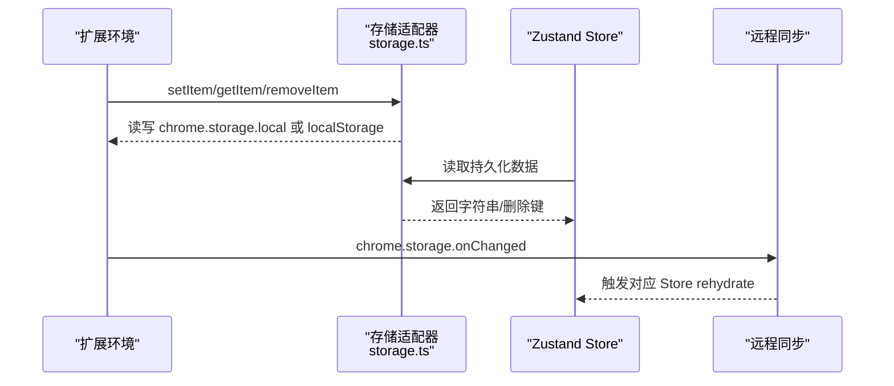
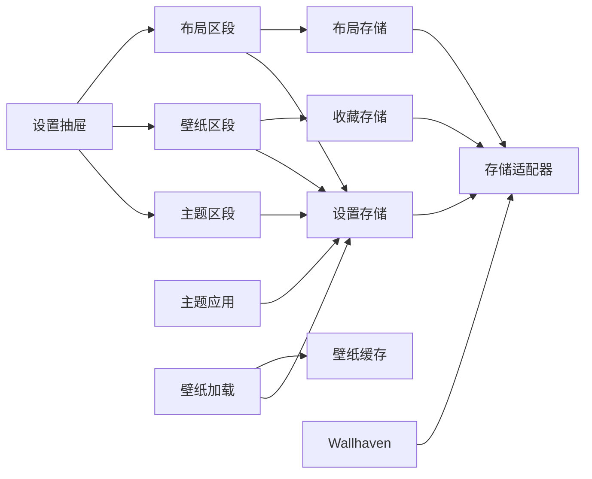

# 设置与配置系统

<cite>
**本文引用的文件**
- [SettingsDrawer.tsx](file://src/components/settings/SettingsDrawer.tsx)
- [ThemeSection.tsx](file://src/components/settings/ThemeSection.tsx)
- [WallpaperPicker.tsx](file://src/components/settings/WallpaperPicker.tsx)
- [LayoutSection.tsx](file://src/components/settings/LayoutSection.tsx)
- [Drawer.tsx](file://src/components/ui/Drawer.tsx)
- [useSettingsStore.ts](file://src/store/useSettingsStore.ts)
- [storage.ts](file://src/store/storage.ts)
- [useLayoutStore.ts](file://src/store/useLayoutStore.ts)
- [useFavoriteWallpapersStore.ts](file://src/store/useFavoriteWallpapersStore.ts)
- [theme.ts](file://src/lib/theme.ts)
- [wallpapers.ts](file://src/lib/wallpapers.ts)
- [wallpaperTint.ts](file://src/lib/wallpaperTint.ts)
- [useWallpaper.ts](file://src/lib/useWallpaper.ts)
- [wallpaperCache.ts](file://src/lib/wallpaperCache.ts)
- [wallhaven.ts](file://src/lib/wallhaven.ts)
- [widget.ts](file://src/types/widget.ts)
- [README.md](file://README.md)
</cite>

## 目录

1. [简介](#简介)
2. [项目结构](#项目结构)
3. [核心组件](#核心组件)
4. [架构总览](#架构总览)
5. [详细组件分析](#详细组件分析)
6. [依赖关系分析](#依赖关系分析)
7. [性能考量](#性能考量)
8. [故障排除指南](#故障排除指南)
9. [结论](#结论)
10. [附录](#附录)

## 简介

本文件系统性梳理 Tab 项目的“设置与配置系统”，覆盖设置抽屉的架构与 UI 设计、主题与材质风格、壁纸选择与收藏、布局与组件管理、导入导出与 JSON 规范、存储与同步机制、设置变更的响应与界面更新策略、扩展接口与自定义配置项添加方法、验证与默认值处理、兼容性迁移、以及常见问题排查。目标是帮助开发者与高级用户全面理解并高效使用该系统。

## 项目结构

设置系统围绕“设置抽屉 + 多个设置区段 + 全局状态存储 + 主题与壁纸应用层”组织，采用分层模块化设计：

- UI 层：设置抽屉容器与三个设置区段（主题、壁纸、布局）
- 应用层：主题与壁纸的即时应用逻辑
- 存储层：基于 Zustand 的持久化存储与跨页面同步
- 工具层：壁纸缓存、调色提取、Wallhaven 集成等

图表来源

- [SettingsDrawer.tsx:11-21](file://src/components/settings/SettingsDrawer.tsx#L11-L21)
- [ThemeSection.tsx:16-108](file://src/components/settings/ThemeSection.tsx#L16-L108)
- [WallpaperPicker.tsx:41-233](file://src/components/settings/WallpaperPicker.tsx#L41-L233)
- [LayoutSection.tsx:100-208](file://src/components/settings/LayoutSection.tsx#L100-L208)
- [Drawer.tsx:13-61](file://src/components/ui/Drawer.tsx#L13-L61)
- [useSettingsStore.ts:35-88](file://src/store/useSettingsStore.ts#L35-L88)
- [useLayoutStore.ts:32-57](file://src/store/useLayoutStore.ts#L32-L57)
- [useFavoriteWallpapersStore.ts:24-50](file://src/store/useFavoriteWallpapersStore.ts#L24-L50)
- [storage.ts:6-32](file://src/store/storage.ts#L6-L32)
- [theme.ts:5-122](file://src/lib/theme.ts#L5-L122)
- [wallpaperTint.ts:43-162](file://src/lib/wallpaperTint.ts#L43-L162)
- [useWallpaper.ts:11-109](file://src/lib/useWallpaper.ts#L11-L109)
- [wallhaven.ts:14-42](file://src/lib/wallhaven.ts#L14-L42)
- [wallpaperCache.ts:75-93](file://src/lib/wallpaperCache.ts#L75-L93)
- [wallpapers.ts:11-68](file://src/lib/wallpapers.ts#L11-L68)
- [widget.ts:8-33](file://src/types/widget.ts#L8-L33)

章节来源

- [README.md:54-68](file://README.md#L54-L68)

## 核心组件

- 设置抽屉容器：聚合主题、壁纸、布局三大区段，提供统一入口与键盘焦点陷阱。
- 主题区段：切换浅色/深色/跟随系统、材质风格（Sequoia/Tahoe）、减少动效。
- 壁纸区段：内置预设、上传自定义、随机墙绘（Wallhaven）、收藏管理、壁纸暗化滑块。
- 布局区段：启用/禁用组件、重置布局、导入/导出完整配置（含版本控制）。
- 存储与同步：Zustand 持久化 + 自定义 Storage 适配（Chrome Extension 或本地），跨标签页同步。
- 主题与壁纸应用：订阅设置变化，动态切换 CSS 类与变量；壁纸调色提取与缓存。

章节来源

- [SettingsDrawer.tsx:11-21](file://src/components/settings/SettingsDrawer.tsx#L11-L21)
- [ThemeSection.tsx:16-108](file://src/components/settings/ThemeSection.tsx#L16-L108)
- [WallpaperPicker.tsx:41-233](file://src/components/settings/WallpaperPicker.tsx#L41-L233)
- [LayoutSection.tsx:100-208](file://src/components/settings/LayoutSection.tsx#L100-L208)
- [useSettingsStore.ts:35-88](file://src/store/useSettingsStore.ts#L35-L88)
- [theme.ts:5-122](file://src/lib/theme.ts#L5-L122)
- [wallpaperTint.ts:43-162](file://src/lib/wallpaperTint.ts#L43-L162)
- [useWallpaper.ts:11-109](file://src/lib/useWallpaper.ts#L11-L109)

## 架构总览

设置系统采用“状态驱动 UI + 主题/壁纸应用层”的模式：

- 状态层：设置、布局、收藏三类 Store，均使用持久化中间件与自定义 Storage。
- 应用层：主题与壁纸应用函数监听 Store 变化，即时更新 DOM/CSS 变量。
- 同步层：注册远程同步回调，监听 chrome.storage.onChanged，多新标签页保持一致。
- UI 层：抽屉组件负责键盘交互、焦点陷阱与内容渲染。

图表来源

- [SettingsDrawer.tsx:11-21](file://src/components/settings/SettingsDrawer.tsx#L11-L21)
- [ThemeSection.tsx:16-108](file://src/components/settings/ThemeSection.tsx#L16-L108)
- [WallpaperPicker.tsx:41-233](file://src/components/settings/WallpaperPicker.tsx#L41-L233)
- [LayoutSection.tsx:100-208](file://src/components/settings/LayoutSection.tsx#L100-L208)
- [useSettingsStore.ts:97-106](file://src/store/useSettingsStore.ts#L97-L106)
- [theme.ts:97-106](file://src/lib/theme.ts#L97-L106)
- [useWallpaper.ts:21-98](file://src/lib/useWallpaper.ts#L21-L98)

## 详细组件分析

### 设置抽屉与 UI 交互

- 负责承载三大设置区段，提供标题、遮罩层、键盘 Esc 关闭、焦点陷阱与滚动区域。
- 作为全局设置入口，避免在页面中分散配置点。

章节来源

- [Drawer.tsx:13-61](file://src/components/ui/Drawer.tsx#L13-L61)
- [SettingsDrawer.tsx:11-21](file://src/components/settings/SettingsDrawer.tsx#L11-L21)

### 主题与材质风格

- 支持三种主题模式：浅色、深色、跟随系统；材质风格两种：Sequoia（经典毛玻璃）、Tahoe（液态玻璃）。
- 提供“减少动效”开关，尊重系统偏好。
- 初始化时应用缓存值，避免闪烁；订阅设置变化以实时生效；监听系统颜色方案变化自动切换。

图表来源

- [theme.ts:68-122](file://src/lib/theme.ts#L68-L122)
- [useSettingsStore.ts:97-106](file://src/store/useSettingsStore.ts#L97-L106)

章节来源

- [ThemeSection.tsx:16-108](file://src/components/settings/ThemeSection.tsx#L16-L108)
- [theme.ts:5-122](file://src/lib/theme.ts#L5-L122)

### 壁纸选择与收藏

- 内置预设：从 Unsplash 获取高质量图片缩略图与原图。
- 上传自定义：限制最大文件大小，转为 Data URL 并写入设置。
- 随机墙绘：通过 Wallhaven 策略（日/周/月/年）随机获取，带超时与降级提示。
- 收藏管理：最多 24 项，支持去重、排序与清空。
- 壁纸暗化：0–60% 调节，防止过亮/过花影响前景可读性。
- 缓存与渐变切换：IndexedDB 缓存壁纸，使用对象 URL 加载，渐变淡入；错误回退旧图。

图表来源

- [WallpaperPicker.tsx:41-233](file://src/components/settings/WallpaperPicker.tsx#L41-L233)
- [wallhaven.ts:14-42](file://src/lib/wallhaven.ts#L14-L42)
- [useFavoriteWallpapersStore.ts:24-50](file://src/store/useFavoriteWallpapersStore.ts#L24-L50)
- [useWallpaper.ts:11-109](file://src/lib/useWallpaper.ts#L11-L109)
- [wallpaperCache.ts:75-93](file://src/lib/wallpaperCache.ts#L75-L93)
- [wallpapers.ts:11-68](file://src/lib/wallpapers.ts#L11-L68)

章节来源

- [WallpaperPicker.tsx:41-233](file://src/components/settings/WallpaperPicker.tsx#L41-L233)
- [wallhaven.ts:14-42](file://src/lib/wallhaven.ts#L14-L42)
- [useFavoriteWallpapersStore.ts:24-50](file://src/store/useFavoriteWallpapersStore.ts#L24-L50)
- [useWallpaper.ts:11-109](file://src/lib/useWallpaper.ts#L11-L109)
- [wallpaperCache.ts:1-94](file://src/lib/wallpaperCache.ts#L1-L94)
- [wallpapers.ts:1-69](file://src/lib/wallpapers.ts#L1-L69)

### 布局与组件管理

- 组件启用/禁用：通过切换按钮控制各部件显示。
- 重置布局：恢复默认网格布局与启用列表。
- 导入/导出：生成包含版本号、布局、启用项、设置、快捷方式、待办事项的 JSON 文件；导入时进行严格校验与版本兼容处理。

图表来源

- [LayoutSection.tsx:105-122](file://src/components/settings/LayoutSection.tsx#L105-L122)
- [LayoutSection.tsx:124-150](file://src/components/settings/LayoutSection.tsx#L124-L150)
- [widget.ts:8-33](file://src/types/widget.ts#L8-L33)

章节来源

- [LayoutSection.tsx:100-208](file://src/components/settings/LayoutSection.tsx#L100-L208)
- [useLayoutStore.ts:32-57](file://src/store/useLayoutStore.ts#L32-L57)
- [widget.ts:8-33](file://src/types/widget.ts#L8-L33)

### 存储机制与同步策略

- 存储适配：优先使用 Chrome Extension Storage，否则回退到浏览器本地存储；封装 getItem/setItem/removeItem。
- 水合与迁移：Zustand 持久化中间件 + 版本迁移；注册水合回调在应用启动时恢复状态。
- 远程同步：监听 chrome.storage.onChanged，按键名分发给对应 Store 的 rehydrate 回调，确保多新标签页一致。

图表来源

- [storage.ts:6-32](file://src/store/storage.ts#L6-L32)
- [storage.ts:49-62](file://src/store/storage.ts#L49-L62)
- [useSettingsStore.ts:57-88](file://src/store/useSettingsStore.ts#L57-L88)
- [useLayoutStore.ts:46-57](file://src/store/useLayoutStore.ts#L46-L57)
- [useFavoriteWallpapersStore.ts:37-50](file://src/store/useFavoriteWallpapersStore.ts#L37-L50)

章节来源

- [storage.ts:1-63](file://src/store/storage.ts#L1-L63)
- [useSettingsStore.ts:35-88](file://src/store/useSettingsStore.ts#L35-L88)
- [useLayoutStore.ts:32-57](file://src/store/useLayoutStore.ts#L32-L57)
- [useFavoriteWallpapersStore.ts:24-50](file://src/store/useFavoriteWallpapersStore.ts#L24-L50)

### 设置验证、默认值与兼容性

- 默认值：主题、材质风格、搜索引擎、壁纸、暗化强度、编辑模式、减少动效等均有明确初始值。
- 验证规则：导入 JSON 时对版本、数组结构、字段类型、取值范围进行严格校验；对历史字段（如壁纸是否偏暗）做向下兼容转换。
- 迁移策略：Zustand migrate 在版本升级时自动转换字段，保证数据连续性。

章节来源

- [useSettingsStore.ts:35-88](file://src/store/useSettingsStore.ts#L35-L88)
- [LayoutSection.tsx:41-77](file://src/components/settings/LayoutSection.tsx#L41-L77)
- [LayoutSection.tsx:124-150](file://src/components/settings/LayoutSection.tsx#L124-L150)

### 设置变更的响应与界面更新

- 主题与壁纸：通过订阅 Store 变化，立即应用到根元素的 CSS 类与自定义属性，同时触发壁纸调色提取与缓存。
- 布局与组件：启用/禁用直接更新 Store，配合布局存储与组件渲染逻辑即时生效。
- 动效：根据“减少动效”设置切换全局类，影响过渡动画。

章节来源

- [theme.ts:97-106](file://src/lib/theme.ts#L97-L106)
- [useSettingsStore.ts:97-106](file://src/store/useSettingsStore.ts#L97-L106)
- [LayoutSection.tsx:158-186](file://src/components/settings/LayoutSection.tsx#L158-L186)

## 依赖关系分析

- 组件耦合：设置抽屉聚合三个区段；区段仅依赖对应 Store 与工具库；UI 组件不直接操作底层存储。
- 状态耦合：主题与壁纸应用依赖设置 Store；壁纸加载依赖壁纸缓存；随机壁纸依赖 Wallhaven 服务。
- 外部依赖：Chrome Extension Storage、IndexedDB、Canvas 调色算法、Unsplash/Wallhaven 资源。

图表来源

- [SettingsDrawer.tsx:11-21](file://src/components/settings/SettingsDrawer.tsx#L11-L21)
- [ThemeSection.tsx:16-108](file://src/components/settings/ThemeSection.tsx#L16-L108)
- [WallpaperPicker.tsx:41-233](file://src/components/settings/WallpaperPicker.tsx#L41-L233)
- [LayoutSection.tsx:100-208](file://src/components/settings/LayoutSection.tsx#L100-L208)
- [useSettingsStore.ts:35-88](file://src/store/useSettingsStore.ts#L35-L88)
- [useLayoutStore.ts:32-57](file://src/store/useLayoutStore.ts#L32-L57)
- [useFavoriteWallpapersStore.ts:24-50](file://src/store/useFavoriteWallpapersStore.ts#L24-L50)
- [storage.ts:6-32](file://src/store/storage.ts#L6-L32)
- [theme.ts:5-122](file://src/lib/theme.ts#L5-L122)
- [useWallpaper.ts:11-109](file://src/lib/useWallpaper.ts#L11-L109)
- [wallpaperCache.ts:1-94](file://src/lib/wallpaperCache.ts#L1-L94)
- [wallhaven.ts:14-42](file://src/lib/wallhaven.ts#L14-L42)

## 性能考量

- 去抖动与缓存：壁纸调色提取使用去抖动与缓存，避免频繁解码 Canvas；壁纸加载使用 IndexedDB 缓存与对象 URL，提升重复访问速度。
- 渐进式渲染：壁纸切换采用渐变淡入，避免闪烁；主题应用优先应用缓存值，再异步补全。
- 资源限制：上传图片大小限制、收藏数量上限、随机请求超时保护。
- 存储效率：仅保留当前壁纸缓存，定期清理其他条目。

章节来源

- [theme.ts:87-95](file://src/lib/theme.ts#L87-L95)
- [wallpaperTint.ts:17-19](file://src/lib/wallpaperTint.ts#L17-L19)
- [wallpaperCache.ts:49-68](file://src/lib/wallpaperCache.ts#L49-L68)
- [useWallpaper.ts:21-98](file://src/lib/useWallpaper.ts#L21-L98)
- [WallpaperPicker.tsx:16](file://src/components/settings/WallpaperPicker.tsx#L16)

## 故障排除指南

- 壁纸无法加载或闪烁
  - 检查网络与资源可用性；确认未超过上传大小限制；查看缓存是否被清理。
  - 参考路径：[useWallpaper.ts:21-98](file://src/lib/useWallpaper.ts#L21-L98)，[wallpaperCache.ts:75-93](file://src/lib/wallpaperCache.ts#L75-L93)
- 随机壁纸失败
  - 查看超时与错误提示；确认扩展消息通道正常；检查 Wallhaven 返回数据格式。
  - 参考路径：[WallpaperPicker.tsx:79-102](file://src/components/settings/WallpaperPicker.tsx#L79-L102)，[wallhaven.ts:14-42](file://src/lib/wallhaven.ts#L14-L42)
- 设置不同步
  - 确认扩展环境与 chrome.storage.onChanged 是否可用；检查注册的同步回调是否生效。
  - 参考路径：[storage.ts:53-62](file://src/store/storage.ts#L53-L62)，[useSettingsStore.ts:87-88](file://src/store/useSettingsStore.ts#L87-L88)
- 导入失败
  - 检查 JSON 结构、版本号、字段类型与取值范围；关注错误提示中的具体原因。
  - 参考路径：[LayoutSection.tsx:124-150](file://src/components/settings/LayoutSection.tsx#L124-L150)
- 调色提取失败
  - 检查图片跨域与像素数据；查看日志警告；确认 Canvas 上下文可用。
  - 参考路径：[wallpaperTint.ts:65-80](file://src/lib/wallpaperTint.ts#L65-L80)

## 结论

设置与配置系统以 Zustand 为核心，结合自定义存储适配与远程同步，实现了主题、壁纸、布局与组件的完整配置闭环。通过严格的导入导出验证、版本迁移与缓存策略，兼顾易用性与稳定性。UI 层采用抽屉与区段化设计，使复杂设置清晰有序；应用层通过订阅与去抖动机制保障响应与性能。

## 附录

### JSON 导入/导出规范（版本 4）

- 字段说明
  - version: 数字，当前为 4
  - layouts: 数组，每项包含 i（组件 id）、x、y、w、h 等
  - enabled: 数组，启用的组件 id 列表
  - settings: 对象，包含 theme、glassMode、searchEngine、wallpaper、wallpaperTint、wallpaperLuminance、wallpaperDimming、reduceMotion
  - shortcuts: 数组，快捷方式条目
  - todos: 数组，待办事项条目
- 版本兼容
  - 支持版本 1/2/3/4；导入时会进行字段迁移（如壁纸偏暗字段到亮度字段）
- 错误处理
  - 超过 5MB 的文件拒绝导入
  - 不支持的版本号抛出错误
  - 结构或类型不符时抛出具体错误信息

章节来源

- [LayoutSection.tsx:97-98](file://src/components/settings/LayoutSection.tsx#L97-L98)
- [LayoutSection.tsx:124-150](file://src/components/settings/LayoutSection.tsx#L124-L150)
- [LayoutSection.tsx:41-77](file://src/components/settings/LayoutSection.tsx#L41-L77)

### 扩展接口与自定义配置项

- 新增设置项步骤
  - 在设置 Store 中新增字段与 setter 方法
  - 在主题应用层增加对应的订阅与应用函数
  - 在设置抽屉区段中添加 UI 控件
  - 如需持久化，确保使用 persist 中间件并设置版本与迁移
  - 如需跨标签页同步，注册远程同步回调
- 示例参考路径
  - 设置 Store 定义与持久化：[useSettingsStore.ts:10-31](file://src/store/useSettingsStore.ts#L10-L31)，[useSettingsStore.ts:57-88](file://src/store/useSettingsStore.ts#L57-L88)
  - 主题应用订阅：[theme.ts:97-106](file://src/lib/theme.ts#L97-L106)
  - 抽屉区段集成：[SettingsDrawer.tsx:11-21](file://src/components/settings/SettingsDrawer.tsx#L11-L21)
