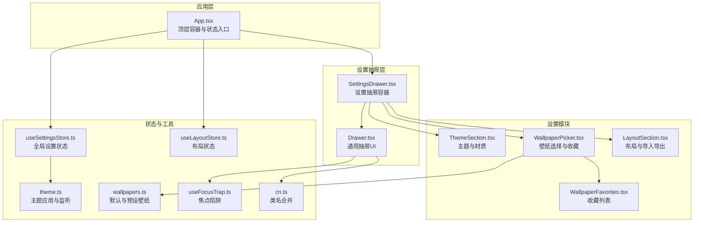
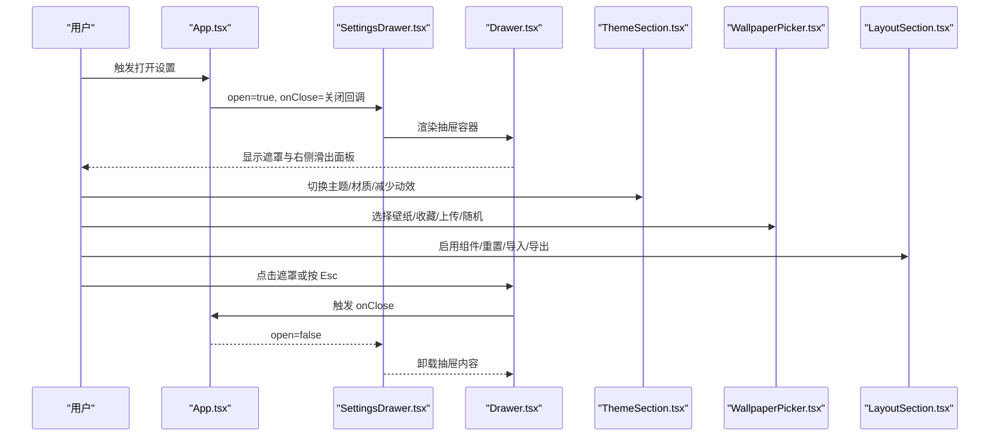
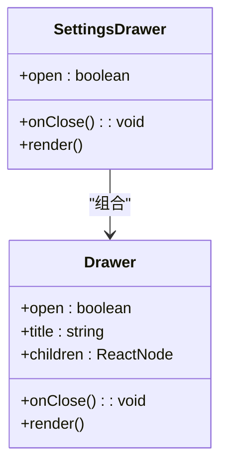
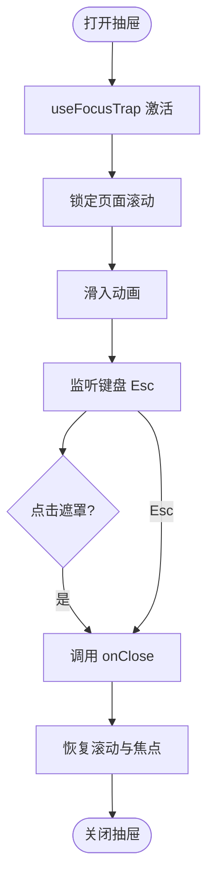
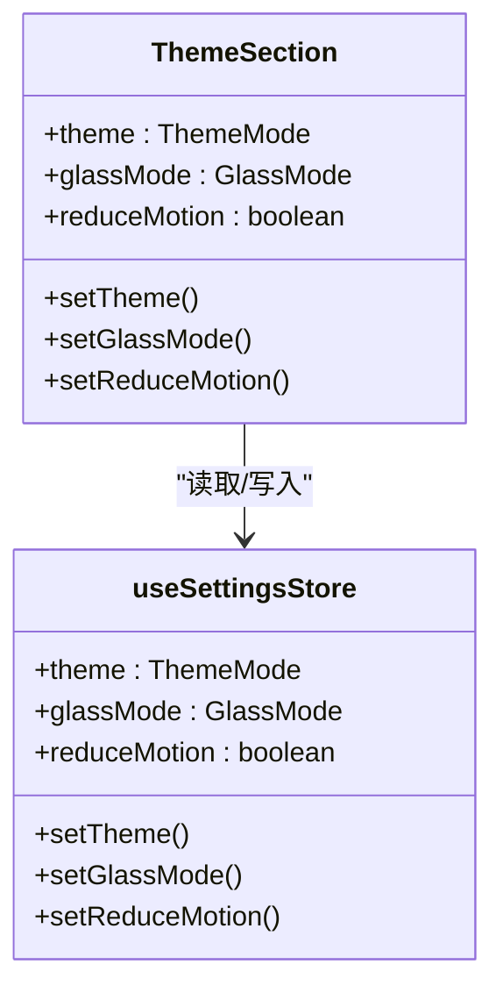
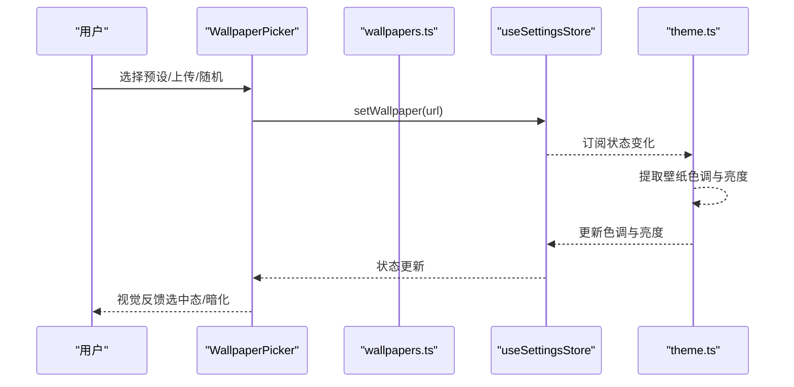
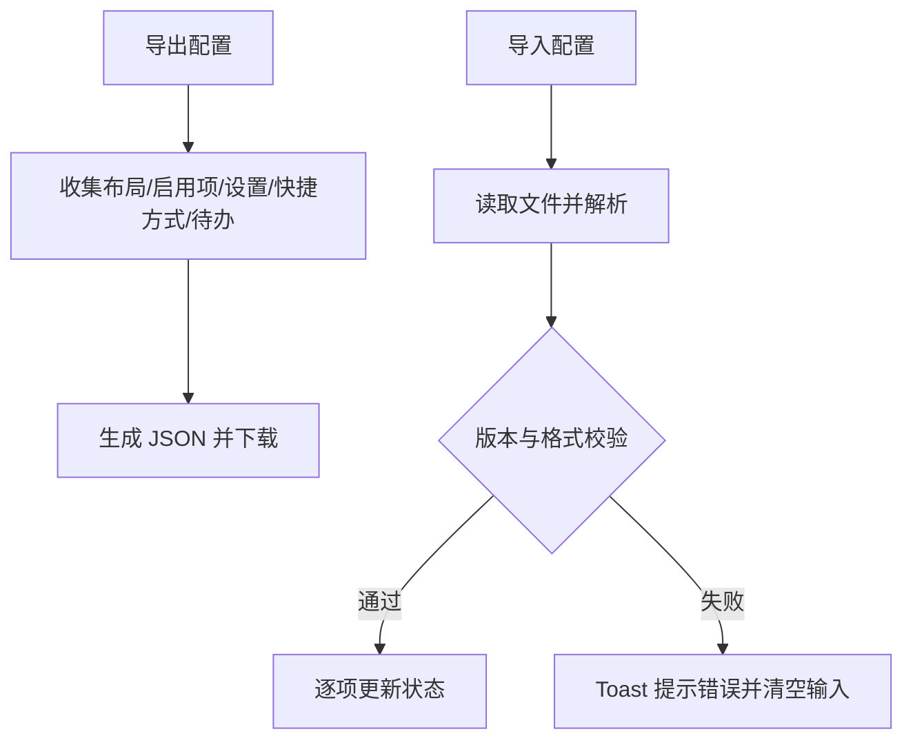
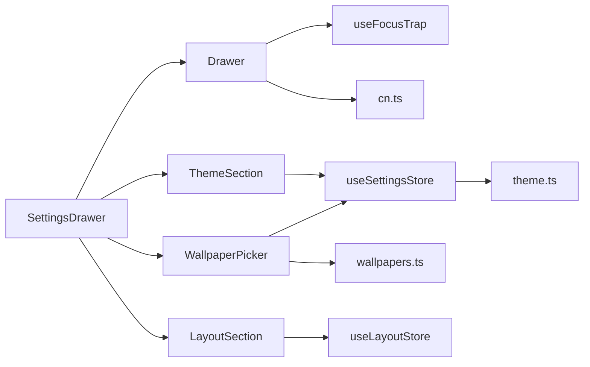

# 设置抽屉组件

<cite>
**本文引用的文件**
- [SettingsDrawer.tsx](file://src/components/settings/SettingsDrawer.tsx)
- [Drawer.tsx](file://src/components/ui/Drawer.tsx)
- [App.tsx](file://src/newtab/App.tsx)
- [useSettingsStore.ts](file://src/store/useSettingsStore.ts)
- [useFocusTrap.ts](file://src/lib/useFocusTrap.ts)
- [ThemeSection.tsx](file://src/components/settings/ThemeSection.tsx)
- [WallpaperPicker.tsx](file://src/components/settings/WallpaperPicker.tsx)
- [LayoutSection.tsx](file://src/components/settings/LayoutSection.tsx)
- [WallpaperFavorites.tsx](file://src/components/settings/WallpaperFavorites.tsx)
- [theme.ts](file://src/lib/theme.ts)
- [wallpapers.ts](file://src/lib/wallpapers.ts)
- [useLayoutStore.ts](file://src/store/useLayoutStore.ts)
- [widget.ts](file://src/types/widget.ts)
- [globals.css](file://src/styles/globals.css)
- [cn.ts](file://src/lib/cn.ts)
</cite>

## 目录

1. [简介](#简介)
2. [项目结构](#项目结构)
3. [核心组件](#核心组件)
4. [架构总览](#架构总览)
5. [详细组件分析](#详细组件分析)
6. [依赖关系分析](#依赖关系分析)
7. [性能考量](#性能考量)
8. [故障排查指南](#故障排查指南)
9. [结论](#结论)
10. [附录](#附录)

## 简介

本文件系统性地解析“设置抽屉”组件的设计与实现，涵盖整体架构、状态管理、事件处理、与主应用的集成、布局与内容组织、样式与响应式设计、可访问性与键盘导航、以及扩展接口与新增设置模块的集成方法。目标是帮助开发者快速理解并高效使用与扩展该组件。

## 项目结构

设置抽屉位于组件层的 settings 子目录，依赖通用 UI 抽屉组件与状态存储，并与主题、壁纸、布局等子模块协同工作。主应用在顶层控制抽屉的打开/关闭状态，并通过快捷键触发。

**图表来源**

- [App.tsx:10-110](file://src/newtab/App.tsx#L10-L110)
- [SettingsDrawer.tsx:11-22](file://src/components/settings/SettingsDrawer.tsx#L11-L22)
- [Drawer.tsx:13-62](file://src/components/ui/Drawer.tsx#L13-L62)
- [ThemeSection.tsx:16-109](file://src/components/settings/ThemeSection.tsx#L16-L109)
- [WallpaperPicker.tsx:41-234](file://src/components/settings/WallpaperPicker.tsx#L41-L234)
- [LayoutSection.tsx:100-209](file://src/components/settings/LayoutSection.tsx#L100-L209)
- [WallpaperFavorites.tsx:6-64](file://src/components/settings/WallpaperFavorites.tsx#L6-L64)
- [useSettingsStore.ts:35-89](file://src/store/useSettingsStore.ts#L35-L89)
- [useLayoutStore.ts:32-58](file://src/store/useLayoutStore.ts#L32-L58)
- [theme.ts:68-123](file://src/lib/theme.ts#L68-L123)
- [wallpapers.ts:13-69](file://src/lib/wallpapers.ts#L13-L69)
- [useFocusTrap.ts:6-71](file://src/lib/useFocusTrap.ts#L6-L71)
- [cn.ts:4-7](file://src/lib/cn.ts#L4-L7)

**章节来源**

- [App.tsx:10-110](file://src/newtab/App.tsx#L10-L110)
- [SettingsDrawer.tsx:11-22](file://src/components/settings/SettingsDrawer.tsx#L11-L22)
- [Drawer.tsx:13-62](file://src/components/ui/Drawer.tsx#L13-L62)

## 核心组件

- 设置抽屉容器：负责聚合主题、壁纸、布局三大设置模块，并通过通用抽屉 UI 渲染。
- 通用抽屉 UI：提供遮罩、侧滑动画、Esc 关闭、焦点陷阱与可访问性属性。
- 设置模块：
  - 主题与材质：切换明暗主题、材质风格、减少动效。
  - 壁纸选择：预设、上传、随机墙河、收藏与暗化调节。
  - 布局与导入导出：启用/禁用组件、重置布局、备份与恢复。
- 状态与工具：Zustand 全局状态、主题应用与监听、焦点陷阱、类名合并工具。

**章节来源**

- [SettingsDrawer.tsx:11-22](file://src/components/settings/SettingsDrawer.tsx#L11-L22)
- [ThemeSection.tsx:16-109](file://src/components/settings/ThemeSection.tsx#L16-L109)
- [WallpaperPicker.tsx:41-234](file://src/components/settings/WallpaperPicker.tsx#L41-L234)
- [LayoutSection.tsx:100-209](file://src/components/settings/LayoutSection.tsx#L100-L209)
- [Drawer.tsx:13-62](file://src/components/ui/Drawer.tsx#L13-L62)
- [useSettingsStore.ts:35-89](file://src/store/useSettingsStore.ts#L35-L89)
- [theme.ts:68-123](file://src/lib/theme.ts#L68-L123)
- [useFocusTrap.ts:6-71](file://src/lib/useFocusTrap.ts#L6-L71)
- [cn.ts:4-7](file://src/lib/cn.ts#L4-L7)

## 架构总览

设置抽屉采用“容器-模块-状态-工具”的分层设计：

- 容器层：SettingsDrawer 聚合各设置模块。
- 模块层：ThemeSection、WallpaperPicker、LayoutSection 各司其职。
- 状态层：useSettingsStore 与 useLayoutStore 提供持久化状态与迁移。
- 工具层：theme.ts 应用主题与壁纸色调；useFocusTrap 确保可访问性；cn 合并类名。
- 集成层：App.tsx 在顶层控制抽屉开关并通过快捷键触发。

**图表来源**

- [App.tsx:15-23](file://src/newtab/App.tsx#L15-L23)
- [SettingsDrawer.tsx:11-22](file://src/components/settings/SettingsDrawer.tsx#L11-L22)
- [Drawer.tsx:16-26](file://src/components/ui/Drawer.tsx#L16-L26)
- [ThemeSection.tsx:17-22](file://src/components/settings/ThemeSection.tsx#L17-L22)
- [WallpaperPicker.tsx:42-48](file://src/components/settings/WallpaperPicker.tsx#L42-L48)
- [LayoutSection.tsx:101-103](file://src/components/settings/LayoutSection.tsx#L101-L103)

## 详细组件分析

### 设置抽屉容器（SettingsDrawer）

- 责任边界：仅作为布局容器，渲染标题与三个设置模块区域。
- 交互契约：接收 open 与 onClose 属性，向 Drawer 传递。
- 结构组织：模块间以垂直间距分隔，保证信息层次清晰。

**图表来源**

- [SettingsDrawer.tsx:6-22](file://src/components/settings/SettingsDrawer.tsx#L6-L22)
- [Drawer.tsx:6-11](file://src/components/ui/Drawer.tsx#L6-L11)

**章节来源**

- [SettingsDrawer.tsx:11-22](file://src/components/settings/SettingsDrawer.tsx#L11-L22)

### 通用抽屉 UI（Drawer）

- 打开/关闭机制：通过 CSS 过渡与 transform 控制滑入滑出；遮罩透明度随 open 变化。
- 键盘事件：监听 Escape 键调用关闭回调；同时临时隐藏页面滚动条。
- 可访问性：对话框角色、模态标记、标题标签、关闭按钮语义化。
- 焦点陷阱：在打开时自动聚焦抽屉内首个可聚焦元素，并在关闭时恢复原焦点。

**图表来源**

- [Drawer.tsx:16-26](file://src/components/ui/Drawer.tsx#L16-L26)
- [useFocusTrap.ts:10-67](file://src/lib/useFocusTrap.ts#L10-L67)

**章节来源**

- [Drawer.tsx:13-62](file://src/components/ui/Drawer.tsx#L13-L62)
- [useFocusTrap.ts:6-71](file://src/lib/useFocusTrap.ts#L6-L71)

### 主题与材质模块（ThemeSection）

- 功能点：明暗主题切换、材质风格选择、减少动效开关。
- 数据绑定：直接读取与写入 useSettingsStore 中的主题、材质与动效状态。
- 交互反馈：选中态视觉区分，滑动切换即时生效。

**图表来源**

- [ThemeSection.tsx:17-22](file://src/components/settings/ThemeSection.tsx#L17-L22)
- [useSettingsStore.ts:10-31](file://src/store/useSettingsStore.ts#L10-L31)

**章节来源**

- [ThemeSection.tsx:16-109](file://src/components/settings/ThemeSection.tsx#L16-L109)
- [useSettingsStore.ts:35-89](file://src/store/useSettingsStore.ts#L35-L89)

### 壁纸选择模块（WallpaperPicker）

- 功能点：预设壁纸、上传本地图片、随机墙河、收藏管理、壁纸暗化强度调节。
- 数据绑定：读取当前壁纸与暗化值，写入设置状态；与收藏存储协作。
- 安全与体验：文件大小限制、超时保护、友好提示；收藏按钮根据当前来源动态可用。
- 依赖：wallpapers.ts 提供默认与预设；theme.ts 提供色调提取与应用。

**图表来源**

- [WallpaperPicker.tsx:42-48](file://src/components/settings/WallpaperPicker.tsx#L42-L48)
- [wallpapers.ts:13-69](file://src/lib/wallpapers.ts#L13-L69)
- [theme.ts:47-106](file://src/lib/theme.ts#L47-L106)
- [useSettingsStore.ts:25-28](file://src/store/useSettingsStore.ts#L25-L28)

**章节来源**

- [WallpaperPicker.tsx:41-234](file://src/components/settings/WallpaperPicker.tsx#L41-L234)
- [wallpapers.ts:1-69](file://src/lib/wallpapers.ts#L1-L69)
- [theme.ts:1-123](file://src/lib/theme.ts#L1-L123)
- [useSettingsStore.ts:10-31](file://src/store/useSettingsStore.ts#L10-L31)

### 布局与导入导出模块（LayoutSection）

- 功能点：启用/禁用组件、重置布局、导出配置为 JSON、从 JSON 导入配置。
- 数据绑定：读取 useLayoutStore 的布局与启用项；写入 useSettingsStore 的设置项。
- 数据校验：对导入数据进行严格类型与范围校验，支持多版本迁移。
- 用户体验：Toast 提示导入结果；输入文件清空避免重复触发。

**图表来源**

- [LayoutSection.tsx:105-122](file://src/components/settings/LayoutSection.tsx#L105-L122)
- [LayoutSection.tsx:124-150](file://src/components/settings/LayoutSection.tsx#L124-L150)
- [LayoutSection.tsx:41-77](file://src/components/settings/LayoutSection.tsx#L41-L77)
- [useLayoutStore.ts:32-58](file://src/store/useLayoutStore.ts#L32-L58)
- [useSettingsStore.ts:35-89](file://src/store/useSettingsStore.ts#L35-L89)

**章节来源**

- [LayoutSection.tsx:100-209](file://src/components/settings/LayoutSection.tsx#L100-L209)
- [useLayoutStore.ts:1-58](file://src/store/useLayoutStore.ts#L1-58)
- [widget.ts:8-34](file://src/types/widget.ts#L8-L34)

### 收藏列表模块（WallpaperFavorites）

- 功能点：展示用户收藏的壁纸缩略图，支持一键使用与移除。
- 交互：悬停显示移除按钮；使用时高亮当前选中态。
- 数据绑定：与收藏存储协作，读取与删除收藏项。

**章节来源**

- [WallpaperFavorites.tsx:6-64](file://src/components/settings/WallpaperFavorites.tsx#L6-L64)

### 主题应用与监听（theme.ts）

- 初始化：应用主题、材质、动效与壁纸色调/亮度。
- 订阅：监听设置状态变化并实时应用到 DOM 类与 CSS 变量。
- 自适应：监听系统配色与减少动效偏好，必要时自动同步用户设置。

**章节来源**

- [theme.ts:68-123](file://src/lib/theme.ts#L68-L123)

### 主应用集成（App.tsx）

- 状态入口：维护 settingsOpen 与 helpOpen 状态，控制抽屉与帮助弹窗。
- 快捷键：'e' 切换编辑模式，',' 打开设置，'?' 打开帮助。
- 壁纸与覆盖层：根据壁纸状态与用户设置渲染多层背景与过渡效果。

**章节来源**

- [App.tsx:10-110](file://src/newtab/App.tsx#L10-L110)

## 依赖关系分析

- 组件耦合：
  - SettingsDrawer 与 Drawer 强耦合（组合关系）。
  - 各设置模块与 useSettingsStore、useLayoutStore 解耦，通过状态读写交互。
- 外部依赖：
  - Zustand 提供状态持久化与跨组件共享。
  - 主题应用依赖浏览器媒体查询与 CSS 变量。
  - 文件上传与墙河随机请求依赖浏览器 API 与网络请求。
- 循环依赖：未发现循环依赖，模块职责清晰。

**图表来源**

- [SettingsDrawer.tsx:11-22](file://src/components/settings/SettingsDrawer.tsx#L11-L22)
- [Drawer.tsx:13-62](file://src/components/ui/Drawer.tsx#L13-L62)
- [ThemeSection.tsx:17-22](file://src/components/settings/ThemeSection.tsx#L17-L22)
- [WallpaperPicker.tsx:42-48](file://src/components/settings/WallpaperPicker.tsx#L42-L48)
- [LayoutSection.tsx:101-103](file://src/components/settings/LayoutSection.tsx#L101-L103)
- [useSettingsStore.ts:35-89](file://src/store/useSettingsStore.ts#L35-L89)
- [useLayoutStore.ts:32-58](file://src/store/useLayoutStore.ts#L32-L58)
- [theme.ts:68-123](file://src/lib/theme.ts#L68-L123)
- [wallpapers.ts:13-69](file://src/lib/wallpapers.ts#L13-L69)
- [useFocusTrap.ts:6-71](file://src/lib/useFocusTrap.ts#L6-L71)
- [cn.ts:4-7](file://src/lib/cn.ts#L4-L7)

**章节来源**

- [useSettingsStore.ts:35-89](file://src/store/useSettingsStore.ts#L35-L89)
- [useLayoutStore.ts:32-58](file://src/store/useLayoutStore.ts#L32-L58)

## 性能考量

- 状态订阅：theme.ts 使用订阅模式在状态变更时增量应用，避免全量重绘。
- 壁纸色调提取：通过防抖与缓存策略降低频繁切换壁纸带来的解码成本。
- 抽屉渲染：抽屉内容在关闭时卸载，减少常驻内存占用。
- 动画与过渡：通过 CSS 变量与类名切换控制动画，减少 JS 计算。

[本节为通用性能讨论，无需具体文件分析]

## 故障排查指南

- 抽屉无法关闭：
  - 检查顶层状态是否正确传入 open 与 onClose。
  - 确认 Esc 键监听与遮罩点击事件未被外部阻止。
- 焦点无法正确捕获：
  - 确认抽屉内存在可聚焦元素或容器具备 tabindex。
  - 检查 useFocusTrap 的激活条件与容器引用。
- 壁纸导入失败：
  - 检查文件大小与 JSON 格式；确认版本兼容性。
  - 查看 Toast 提示的具体错误信息。
- 主题/材质未生效：
  - 确认 theme.ts 是否正确订阅并应用到根节点类与 CSS 变量。

**章节来源**

- [Drawer.tsx:16-26](file://src/components/ui/Drawer.tsx#L16-L26)
- [useFocusTrap.ts:10-67](file://src/lib/useFocusTrap.ts#L10-L67)
- [LayoutSection.tsx:124-150](file://src/components/settings/LayoutSection.tsx#L124-L150)
- [theme.ts:97-106](file://src/lib/theme.ts#L97-L106)

## 结论

设置抽屉通过清晰的分层设计与稳定的交互契约，实现了主题、壁纸、布局等设置的统一管理。配合状态持久化、可访问性与键盘导航支持，以及完善的导入导出能力，为用户提供了良好的个性化体验。其模块化结构也便于后续扩展新的设置项。

[本节为总结性内容，无需具体文件分析]

## 附录

### 使用示例与集成步骤

- 在主应用中添加设置按钮并绑定打开状态：
  - 参考路径：[App.tsx:92-100](file://src/newtab/App.tsx#L92-L100)
- 在顶层容器中渲染设置抽屉并传入 open 与 onClose：
  - 参考路径：[App.tsx:106](file://src/newtab/App.tsx#L106)
- 通过快捷键触发抽屉打开：
  - 参考路径：[App.tsx:22](file://src/newtab/App.tsx#L22)

**章节来源**

- [App.tsx:15-23](file://src/newtab/App.tsx#L15-L23)
- [App.tsx:106](file://src/newtab/App.tsx#L106)

### 自定义配置方法

- 新增设置项：
  - 在对应设置模块中添加 UI 与状态读写逻辑。
  - 在 useSettingsStore 中扩展状态字段与 setter。
  - 如需持久化，确保字段在持久化配置中可序列化。
- 修改抽屉布局：
  - 在 SettingsDrawer 中调整模块顺序与间距。
  - 使用 cn 合并工具统一类名规范。
- 参考路径：
  - [SettingsDrawer.tsx:14-18](file://src/components/settings/SettingsDrawer.tsx#L14-L18)
  - [cn.ts:4-7](file://src/lib/cn.ts#L4-L7)

**章节来源**

- [SettingsDrawer.tsx:11-22](file://src/components/settings/SettingsDrawer.tsx#L11-L22)
- [cn.ts:4-7](file://src/lib/cn.ts#L4-L7)

### 样式定制与响应式设计

- 响应式宽度：抽屉宽度使用固定像素与最大视口百分比结合，适配不同屏幕尺寸。
- 玻璃材质：通过 CSS 变量与类名切换实现两种材质风格。
- 文本对比度：针对壁纸中间亮度场景提供自适应文本阴影。
- 参考路径：
  - [Drawer.tsx:42-45](file://src/components/ui/Drawer.tsx#L42-L45)
  - [globals.css:104-146](file://src/styles/globals.css#L104-L146)

**章节来源**

- [Drawer.tsx:42-45](file://src/components/ui/Drawer.tsx#L42-L45)
- [globals.css:91-146](file://src/styles/globals.css#L91-L146)

### 可访问性与键盘导航

- 角色与标签：抽屉使用对话框角色与标题标签，关闭按钮具备语义化标签。
- 键盘关闭：Esc 键立即关闭抽屉。
- 焦点陷阱：打开时聚焦抽屉内部首个可聚焦元素，关闭时恢复原焦点。
- 参考路径：
  - [Drawer.tsx:39-56](file://src/components/ui/Drawer.tsx#L39-L56)
  - [useFocusTrap.ts:18-67](file://src/lib/useFocusTrap.ts#L18-L67)

**章节来源**

- [Drawer.tsx:39-56](file://src/components/ui/Drawer.tsx#L39-L56)
- [useFocusTrap.ts:6-71](file://src/lib/useFocusTrap.ts#L6-L71)

### 扩展接口与新设置模块集成指南

- 新增设置模块步骤：
  - 创建模块组件并在 SettingsDrawer 中引入。
  - 在 useSettingsStore 中扩展状态与持久化字段。
  - 若涉及布局/组件启用，同步更新 useLayoutStore。
  - 在 LayoutSection 的导入导出逻辑中增加字段映射。
- 数据校验与迁移：
  - 在 LayoutSection 的解析函数中增加字段校验。
  - 如有版本升级，完善迁移逻辑以兼容旧数据。
- 参考路径：
  - [SettingsDrawer.tsx:15-17](file://src/components/settings/SettingsDrawer.tsx#L15-L17)
  - [useSettingsStore.ts:35-89](file://src/store/useSettingsStore.ts#L35-L89)
  - [LayoutSection.tsx:41-77](file://src/components/settings/LayoutSection.tsx#L41-L77)
  - [LayoutSection.tsx:105-150](file://src/components/settings/LayoutSection.tsx#L105-L150)

**章节来源**

- [SettingsDrawer.tsx:11-22](file://src/components/settings/SettingsDrawer.tsx#L11-L22)
- [useSettingsStore.ts:35-89](file://src/store/useSettingsStore.ts#L35-L89)
- [LayoutSection.tsx:100-209](file://src/components/settings/LayoutSection.tsx#L100-L209)
