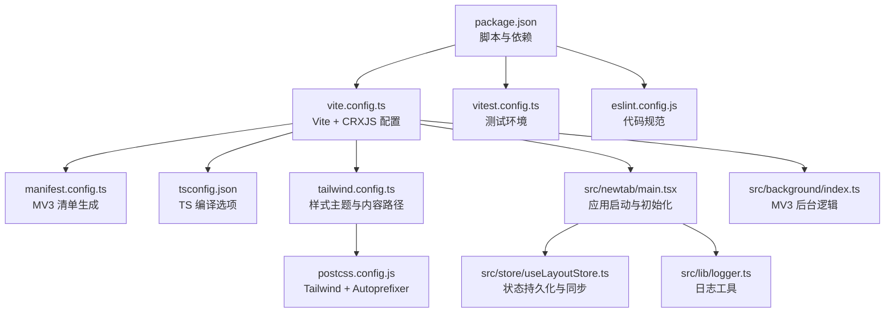
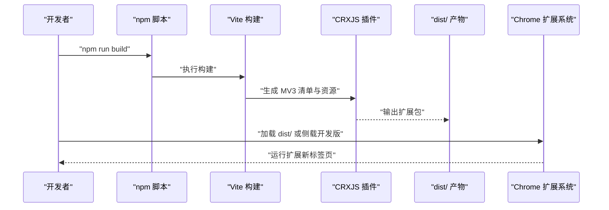
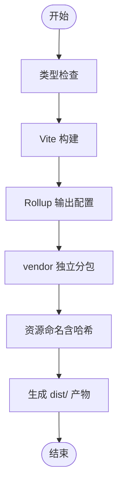
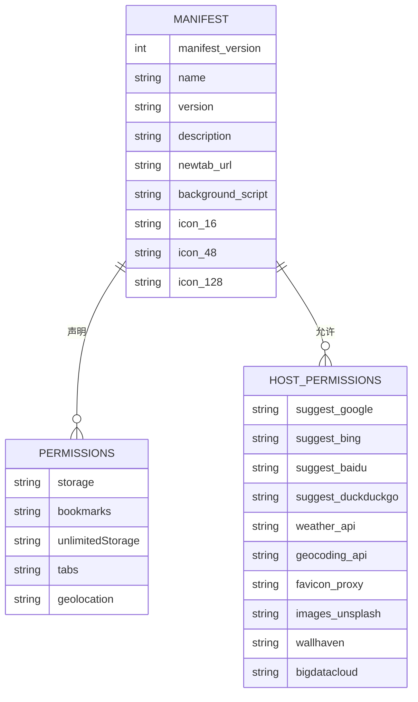
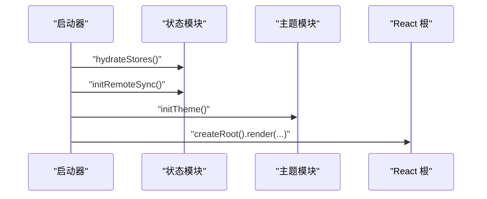
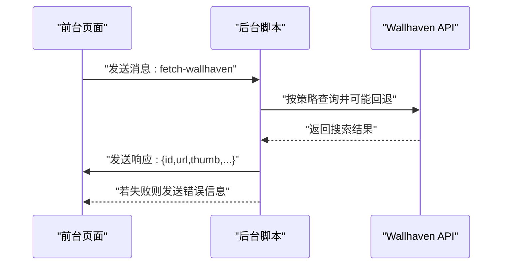
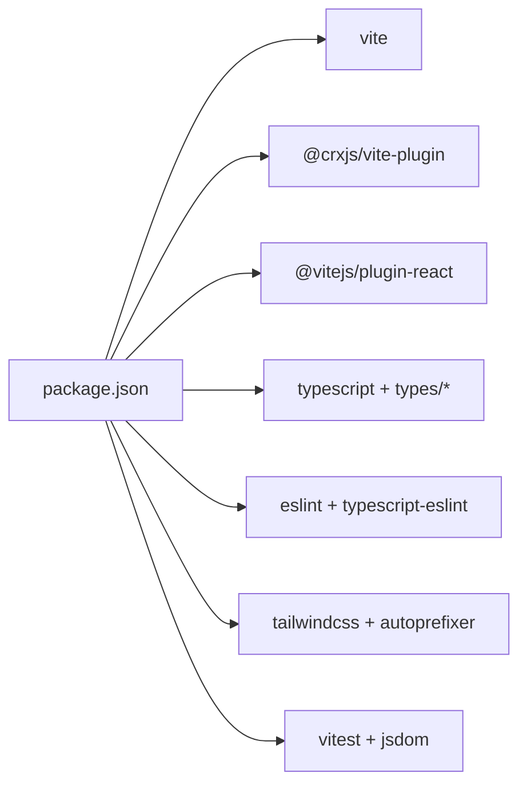

# 部署与发布

<cite>
**本文引用的文件**
- [package.json](file://package.json)
- [vite.config.ts](file://vite.config.ts)
- [manifest.config.ts](file://manifest.config.ts)
- [.github/workflows/ci.yml](file://.github/workflows/ci.yml)
- [tsconfig.json](file://tsconfig.json)
- [tailwind.config.ts](file://tailwind.config.ts)
- [postcss.config.js](file://postcss.config.js)
- [vitest.config.ts](file://vitest.config.ts)
- [eslint.config.js](file://eslint.config.js)
- [src/background/index.ts](file://src/background/index.ts)
- [src/newtab/main.tsx](file://src/newtab/main.tsx)
- [src/store/useLayoutStore.ts](file://src/store/useLayoutStore.ts)
- [src/lib/logger.ts](file://src/lib/logger.ts)
- [src/test-setup.ts](file://src/test-setup.ts)
- [README.md](file://README.md)
</cite>

## 目录

1. [简介](#简介)
2. [项目结构](#项目结构)
3. [核心组件](#核心组件)
4. [架构总览](#架构总览)
5. [详细组件分析](#详细组件分析)
6. [依赖分析](#依赖分析)
7. [性能考虑](#性能考虑)
8. [故障排查指南](#故障排查指南)
9. [结论](#结论)
10. [附录](#附录)

## 简介

本指南面向发布 Tab Chrome 新标签页扩展的工程团队，覆盖从本地开发、CI/CD 自动化、构建优化、资源压缩、到 Chrome Web Store 发布与版本管理的全流程。文档同时提供质量检查清单、回滚策略、性能监控与用户反馈机制建议，以及发布后维护与更新流程。

## 项目结构

- 构建工具链：Vite + CRXJS 插件用于打包 Chrome Extension（MV3），TypeScript 提供类型安全，TailwindCSS + PostCSS 负责样式管线。
- 源码组织：React 组件、Zustand 状态、工具函数、样式与类型定义分层清晰；新标签页入口位于 src/newtab，后台脚本在 src/background。
- 配置文件：构建、类型、样式、测试、Lint 等配置集中于根目录，便于统一管理与 CI 复用。

图表来源

- [package.json:1-56](file://package.json#L1-L56)
- [vite.config.ts:1-46](file://vite.config.ts#L1-L46)
- [manifest.config.ts:1-38](file://manifest.config.ts#L1-L38)
- [tsconfig.json:1-27](file://tsconfig.json#L1-L27)
- [tailwind.config.ts:1-42](file://tailwind.config.ts#L1-L42)
- [postcss.config.js:1-7](file://postcss.config.js#L1-L7)
- [vitest.config.ts:1-16](file://vitest.config.ts#L1-L16)
- [eslint.config.js:1-22](file://eslint.config.js#L1-L22)
- [src/newtab/main.tsx:1-29](file://src/newtab/main.tsx#L1-L29)
- [src/background/index.ts:1-174](file://src/background/index.ts#L1-L174)
- [src/store/useLayoutStore.ts:1-58](file://src/store/useLayoutStore.ts#L1-L58)
- [src/lib/logger.ts:1-35](file://src/lib/logger.ts#L1-L35)

章节来源

- [README.md:1-73](file://README.md#L1-L73)
- [package.json:1-56](file://package.json#L1-L56)

## 核心组件

- 构建与打包
  - 使用 Vite + @crxjs/vite-plugin 打包 MV3 扩展，支持热重载与产物分包。
  - 通过 Rollup 输出命名规则与手动分包策略，将 React、ReactDOM、Zustand 等稳定依赖拆分为独立 vendor chunk，降低应用代码变更导致的缓存失效。
- 清单与权限
  - MV3 清单由 manifest.config.ts 动态生成，读取 package.json 版本号与描述，声明新标签页覆盖、后台脚本、图标与权限列表。
- 类型与样式
  - TypeScript 严格模式，配合 Tailwind 内容扫描与 PostCSS 自动前缀，确保样式按需产出。
- 测试与规范
  - Vitest + jsdom 进行单元测试；ESLint + TypeScript ESLint 规范代码风格与最佳实践。
- 应用启动与状态
  - 新标签页入口异步初始化状态、远端同步与主题，并以 ErrorBoundary + ToastProvider 包裹渲染树，提升稳定性与用户体验。
- 后台服务
  - MV3 Service Worker 中处理墙纸随机抓取等需要同源访问或跨域受限的请求，通过消息通道向前台返回结果。

章节来源

- [vite.config.ts:14-33](file://vite.config.ts#L14-L33)
- [manifest.config.ts:4-37](file://manifest.config.ts#L4-L37)
- [tsconfig.json:2-24](file://tsconfig.json#L2-L24)
- [tailwind.config.ts:3-41](file://tailwind.config.ts#L3-L41)
- [postcss.config.js:1-7](file://postcss.config.js#L1-L7)
- [vitest.config.ts:4-15](file://vitest.config.ts#L4-L15)
- [eslint.config.js:6-21](file://eslint.config.js#L6-L21)
- [src/newtab/main.tsx:11-28](file://src/newtab/main.tsx#L11-L28)
- [src/background/index.ts:132-173](file://src/background/index.ts#L132-L173)

## 架构总览

下图展示从开发者命令到浏览器加载扩展的关键步骤，以及后台脚本与前台页面的消息交互。

图表来源

- [package.json:10-16](file://package.json#L10-L16)
- [vite.config.ts:7-8](file://vite.config.ts#L7-L8)
- [manifest.config.ts:4-7](file://manifest.config.ts#L4-L7)

## 详细组件分析

### 构建与打包流程

- 命令与目标
  - 开发：Vite HMR 服务器绑定 IPv4 地址，保证扩展可稳定访问。
  - 生产：先进行类型检查，再执行 Vite 构建，生成带哈希的资源文件名，利于长期缓存。
- 分包与缓存
  - 通过 manualChunks 将 React、ReactDOM、Zustand 等稳定依赖单独打包为 vendor，减少主包体积变化频率。
- 产物与加载
  - 产物位于 dist/，可通过“加载未打包”方式在开发者模式下安装使用。

图表来源

- [package.json:12-12](file://package.json#L12-L12)
- [vite.config.ts:14-33](file://vite.config.ts#L14-L33)

章节来源

- [package.json:10-16](file://package.json#L10-L16)
- [vite.config.ts:34-44](file://vite.config.ts#L34-L44)

### 清单与权限管理

- 清单生成
  - MV3 清单由 defineManifest 生成，版本、名称、描述来自 package.json，新标签页覆盖指向 src/newtab/index.html，后台脚本指向 src/background/index.ts。
- 权限与主机权限
  - 权限包括 storage、bookmarks、unlimitedStorage、tabs、geolocation；主机权限覆盖搜索建议、天气、图标、图片站点等，确保功能可用性与隐私边界清晰。

图表来源

- [manifest.config.ts:4-37](file://manifest.config.ts#L4-L37)

章节来源

- [manifest.config.ts:4-37](file://manifest.config.ts#L4-L37)

### 应用启动与状态初始化

- 启动流程
  - 异步加载存储数据、初始化远端同步与主题，随后挂载错误边界与全局提示 Provider，最后渲染应用根组件。
- 状态持久化
  - 使用 Zustand + persist 存储布局与启用状态，基于 chrome.storage 实现本地持久化与跨设备同步钩子。

图表来源

- [src/newtab/main.tsx:11-25](file://src/newtab/main.tsx#L11-L25)
- [src/store/useLayoutStore.ts:32-57](file://src/store/useLayoutStore.ts#L32-L57)

章节来源

- [src/newtab/main.tsx:11-28](file://src/newtab/main.tsx#L11-L28)
- [src/store/useLayoutStore.ts:32-57](file://src/store/useLayoutStore.ts#L32-L57)

### 后台脚本与消息通道

- 功能职责
  - 在 MV3 Service Worker 中处理墙纸随机抓取等受限场景请求，通过消息通道向前台返回结果或错误信息。
- 错误与降级
  - 对速率限制、超时等异常进行友好提示，避免前端直接暴露底层错误。

图表来源

- [src/background/index.ts:123-173](file://src/background/index.ts#L123-L173)

章节来源

- [src/background/index.ts:132-173](file://src/background/index.ts#L132-L173)

### 测试与质量保障

- 单元测试
  - Vitest 配置 jsdom 环境，全局引入 @testing-library/jest-dom/vitest，便于 DOM 断言与组件测试。
- Lint 与类型检查
  - ESLint + TypeScript ESLint 统一规则，避免未使用变量、仅导出组件等常见问题。

章节来源

- [vitest.config.ts:10-14](file://vitest.config.ts#L10-L14)
- [src/test-setup.ts:1-2](file://src/test-setup.ts#L1-L2)
- [eslint.config.js:6-21](file://eslint.config.js#L6-L21)

## 依赖分析

- 构建与插件
  - @crxjs/vite-plugin 与 vite 构成 MV3 扩展打包核心；@vitejs/plugin-react 提供 React 支持。
- 运行时依赖
  - React 生态、Tailwind 工具集、状态管理 zustand，以及 clsx、lucide-react 等辅助库。
- 开发依赖
  - TypeScript、ESLint、TailwindCSS、PostCSS、Vitest 等，形成完整的开发与质量保障闭环。

图表来源

- [package.json:32-54](file://package.json#L32-L54)

章节来源

- [package.json:18-26](file://package.json#L18-L26)
- [package.json:32-54](file://package.json#L32-L54)

## 性能考虑

- 产物体积与缓存
  - 使用哈希命名与 vendor 分包，降低主包变动频率，提升浏览器缓存命中率。
- 样式按需产出
  - Tailwind 内容扫描仅包含 src 下文件，避免无用 CSS 进入产物。
- 构建目标
  - ESNext 目标与现代打包策略，结合 Tree-shaking，进一步减小体积。
- 日志与调试
  - logger 工具提供最小级别控制，便于在生产中抑制冗余日志，保留错误级别输出。

章节来源

- [vite.config.ts:18-29](file://vite.config.ts#L18-L29)
- [tailwind.config.ts:4-4](file://tailwind.config.ts#L4-L4)
- [src/lib/logger.ts:14-34](file://src/lib/logger.ts#L14-L34)

## 故障排查指南

- 构建失败
  - 确认 Node 版本满足 engines 要求；先执行类型检查，修复类型错误后再构建。
- 浏览器加载失败
  - 开发模式下确认 Vite 服务器绑定 IPv4；生产模式下检查 dist/ 是否存在且清单字段正确。
- 测试异常
  - 检查 jsdom 环境与测试入口是否正确；关注未使用变量与刷新规则告警。
- 后台脚本报错
  - 关注速率限制与超时错误提示，必要时调整策略或放宽时限。

章节来源

- [package.json:7-9](file://package.json#L7-L9)
- [vite.config.ts:34-44](file://vite.config.ts#L34-L44)
- [vitest.config.ts:10-14](file://vitest.config.ts#L10-L14)
- [eslint.config.js:15-19](file://eslint.config.js#L15-L19)
- [src/background/index.ts:113-121](file://src/background/index.ts#L113-L121)

## 结论

本指南提供了从本地开发到 CI/CD、构建优化、发布准备与版本管理的完整路径。结合现有配置，可快速搭建稳定可靠的发布流水线，并为后续性能监控与用户反馈收集奠定基础。

## 附录

### CI/CD 流程与自动化测试

- 触发条件
  - 推送 main 分支或针对 main 分支发起 Pull Request。
- 步骤概览
  - 安装 Node（指定版本）、安装依赖、执行 Lint、类型检查、测试、最终构建。
- 建议增强
  - 可在 CI 中增加产物校验（如清单完整性、关键资源存在性）、上传制品归档、生成覆盖率报告。

章节来源

- [.github/workflows/ci.yml:1-33](file://.github/workflows/ci.yml#L1-L33)

### 版本管理与语义化版本控制

- 当前策略
  - 版本号位于 package.json，遵循语义化版本（主.次.修订）。建议在发布前统一升级版本并提交标签。
- 发布分支
  - 建议使用 release/\* 分支或标签进行预发布验证，再合并至 main 并打 Tag 推送。

章节来源

- [package.json:4-4](file://package.json#L4-L4)

### Chrome Web Store 发布流程与审核要点

- 准备材料
  - 清单中的 name、version、description、icons、屏幕截图与隐私政策链接。
- 提交与审核
  - 上传最新 dist/ 产物压缩包；填写商店页面信息；等待审核周期。
- 注意事项
  - 权限与主机权限应最小化且与功能一一对应；避免收集用户数据；遵守商店政策。

章节来源

- [manifest.config.ts:6-7](file://manifest.config.ts#L6-L7)
- [manifest.config.ts:21-36](file://manifest.config.ts#L21-L36)

### 生产环境部署配置与监控

- 部署配置
  - 使用 dist/ 作为发布产物；在 CI 中生成并归档制品；在发布分支打 Tag。
- 监控建议
  - 前端：记录错误边界捕获的异常；后台：记录网络请求与超时/限流事件。
  - 用户反馈：提供设置入口或帮助页面收集问题；建立最小可行反馈表单。

章节来源

- [src/newtab/main.tsx:19-23](file://src/newtab/main.tsx#L19-L23)
- [src/background/index.ts:164-165](file://src/background/index.ts#L164-L165)

### 发布前质量检查清单

- 本地自检
  - 依赖安装、类型检查、Lint、测试全部通过；构建产物 dist/ 可用。
- 回归验证
  - 新标签页功能、搜索、快捷方式、天气、待办、书签、壁纸随机等功能逐一验证。
- 权限与隐私
  - 权限与主机权限与功能匹配；无敏感数据采集。
- CI 一致性
  - CI 任务通过，产物一致。

章节来源

- [.github/workflows/ci.yml:20-32](file://.github/workflows/ci.yml#L20-L32)
- [README.md:20-39](file://README.md#L20-L39)

### 回滚策略

- 快速回滚
  - 使用上一个已发布版本的 dist/ 压缩包替换当前版本；回滚至最近一次有效 Tag。
- 渐进式回滚
  - 通过灰度渠道（如 Canary/Canary 分支）先行回滚，观察指标后再全量回滚。
- 降级与修复
  - 若定位到具体功能缺陷，优先修复并重新发布；若影响范围大，采用回滚。

章节来源

- [package.json:4-4](file://package.json#L4-L4)

### 性能监控与用户反馈机制

- 性能监控
  - 记录前台渲染耗时、后台请求耗时与成功率；对超时与限流事件进行统计。
- 用户反馈
  - 在设置中提供“反馈”入口；收集错误日志与复现步骤；定期汇总改进点。

章节来源

- [src/lib/logger.ts:20-34](file://src/lib/logger.ts#L20-L34)
- [src/background/index.ts:113-121](file://src/background/index.ts#L113-L121)

### 发布后维护与更新流程

- 版本迭代
  - 基于语义化版本升级；在 release/\* 分支进行回归测试与预发布验证。
- 更新策略
  - 通过商店自动更新机制推送新版本；对重大变更提供迁移说明与兼容策略。
- 监控与迭代
  - 持续监控错误率与性能指标；根据用户反馈与使用数据优化功能与体验。

章节来源

- [package.json:4-4](file://package.json#L4-L4)
- [manifest.config.ts:6-7](file://manifest.config.ts#L6-L7)
