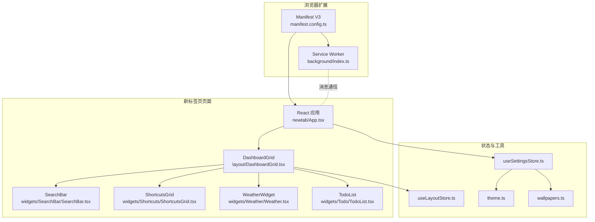
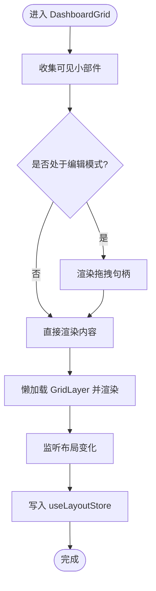
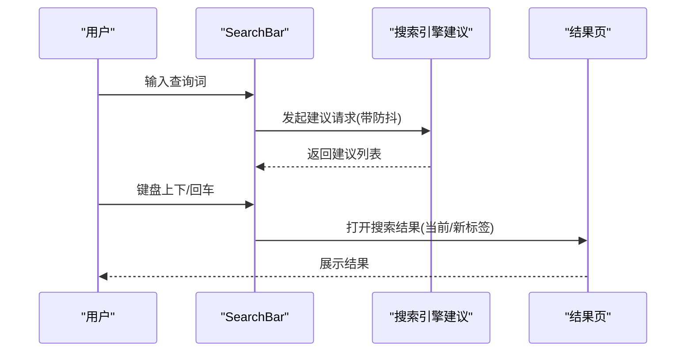
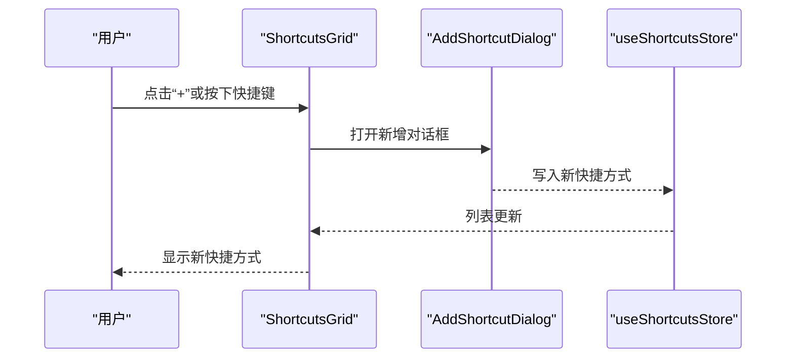
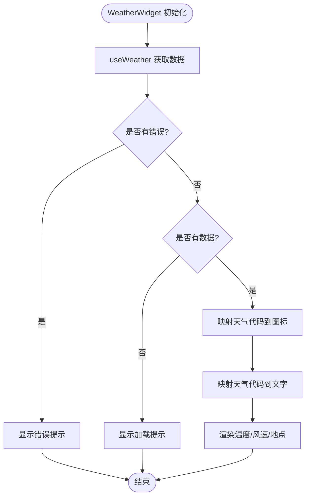
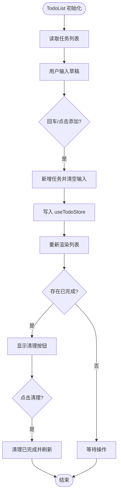
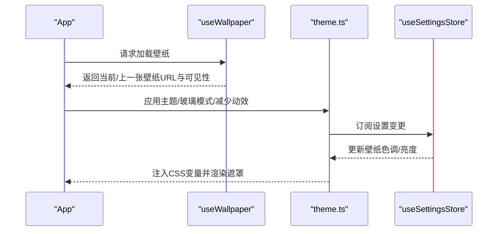
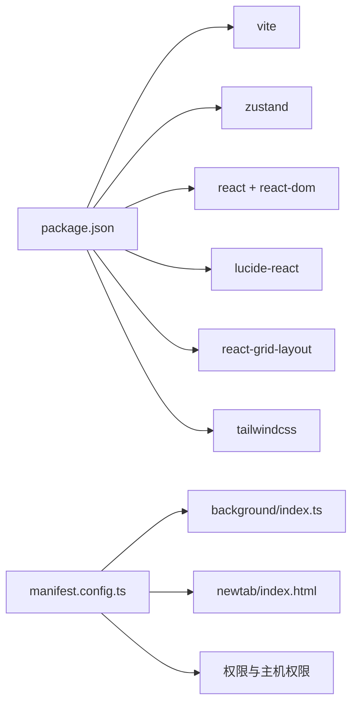

# 项目概述

<cite>
**本文档引用的文件**
- [README.md](file://README.md)
- [package.json](file://package.json)
- [manifest.config.ts](file://manifest.config.ts)
- [src/newtab/App.tsx](file://src/newtab/App.tsx)
- [src/background/index.ts](file://src/background/index.ts)
- [src/components/layout/DashboardGrid.tsx](file://src/components/layout/DashboardGrid.tsx)
- [src/components/widgets/SearchBar/SearchBar.tsx](file://src/components/widgets/SearchBar/SearchBar.tsx)
- [src/components/widgets/Shortcuts/ShortcutsGrid.tsx](file://src/components/widgets/Shortcuts/ShortcutsGrid.tsx)
- [src/components/widgets/Weather/Weather.tsx](file://src/components/widgets/Weather/Weather.tsx)
- [src/components/widgets/Todo/TodoList.tsx](file://src/components/widgets/Todo/TodoList.tsx)
- [src/store/useLayoutStore.ts](file://src/store/useLayoutStore.ts)
- [src/store/useSettingsStore.ts](file://src/store/useSettingsStore.ts)
- [src/lib/theme.ts](file://src/lib/theme.ts)
- [src/lib/wallpapers.ts](file://src/lib/wallpapers.ts)
- [src/types/widget.ts](file://src/types/widget.ts)
</cite>

## 目录

1. [引言](#引言)
2. [项目结构](#项目结构)
3. [核心组件](#核心组件)
4. [架构总览](#架构总览)
5. [详细组件分析](#详细组件分析)
6. [依赖关系分析](#依赖关系分析)
7. [性能考量](#性能考量)
8. [故障排除指南](#故障排除指南)
9. [结论](#结论)
10. [附录](#附录)

## 引言

Tab 是一款面向 macOS 风格的 Chrome 新标签页扩展，采用 React + Vite 构建，旨在为用户提供简洁、美观且功能完备的新标签页体验。项目强调“无账户、无云端”的本地化设计，所有数据均通过浏览器存储持久化，确保隐私与离线可用性。核心目标是将 macOS 的美学与现代 Web 技术结合，提供可拖拽布局、多搜索引擎、壁纸系统、快捷方式、天气、待办事项以及书签树等实用功能。

## 项目结构

项目采用按功能分层的组织方式，核心目录包括新标签页入口、组件层、状态管理、工具库与样式资源。整体结构清晰，便于维护与扩展。

```mermaid
graph TB
A["src/newtab/"] --> A1["App.tsx"]
A --> A2["index.html"]
A --> A3["main.tsx"]
B["src/components/"] --> B1["layout/"]
B --> B2["widgets/"]
B --> B3["settings/"]
B --> B4["ui/"]
C["src/store/"] --> C1["useLayoutStore.ts"]
C --> C2["useSettingsStore.ts"]
C --> C3["useShortcutsStore.ts"]
C --> C4["useTodoStore.ts"]
C --> C5["useBookmarksUiStore.ts"]
C --> C6["useFavoriteWallpapersStore.ts"]
D["src/lib/"] --> D1["theme.ts"]
D --> D2["wallpapers.ts"]
D --> D3["search.ts"]
D --> D4["useWallpaper.ts"]
D --> D5["wallpaperTint.ts"]
E["src/types/"] --> E1["widget.ts"]
F["manifest.config.ts"]
G["package.json"]
```

图表来源

- [manifest.config.ts:1-38](file://manifest.config.ts#L1-L38)
- [package.json:1-56](file://package.json#L1-L56)
- [src/newtab/App.tsx:1-110](file://src/newtab/App.tsx#L1-L110)
- [src/components/layout/DashboardGrid.tsx:1-110](file://src/components/layout/DashboardGrid.tsx#L1-L110)
- [src/store/useLayoutStore.ts:1-58](file://src/store/useLayoutStore.ts#L1-L58)
- [src/store/useSettingsStore.ts:1-89](file://src/store/useSettingsStore.ts#L1-L89)
- [src/lib/theme.ts:1-123](file://src/lib/theme.ts#L1-L123)
- [src/lib/wallpapers.ts:1-69](file://src/lib/wallpapers.ts#L1-L69)
- [src/types/widget.ts:1-34](file://src/types/widget.ts#L1-L34)

章节来源

- [README.md:54-68](file://README.md#L54-L68)
- [package.json:1-56](file://package.json#L1-L56)
- [manifest.config.ts:1-38](file://manifest.config.ts#L1-L38)

## 核心组件

- 布局系统：基于可拖拽网格的仪表盘，支持响应式断点与自定义尺寸，允许用户自由调整小部件位置与大小。
- 搜索栏：支持多搜索引擎（Google、Bing、百度、DuckDuckGo）与自动补全建议，具备键盘导航与快速打开能力。
- 快捷方式：可自定义网站快捷方式，自动抓取图标，支持从当前打开的标签页导入。
- 天气：集成 Open-Meteo 获取天气数据，无需 API 密钥，支持降级提示与风速展示。
- 待办事项：基础的增删改查与完成状态管理，支持一键清理已完成项。
- 书签树：展示 Chrome 书签，提供层级浏览与快速访问。
- 壁纸系统：内置预设、自定义上传、Unsplash 随机每日壁纸；支持明暗主题与动效过渡。
- 设置抽屉：集中管理主题、玻璃模式、搜索引擎、壁纸与动效等偏好。
- 键盘快捷键：覆盖搜索聚焦、编辑模式切换、设置抽屉、快捷键帮助等常用操作。

章节来源

- [README.md:5-18](file://README.md#L5-L18)
- [src/components/layout/DashboardGrid.tsx:24-31](file://src/components/layout/DashboardGrid.tsx#L24-L31)
- [src/components/widgets/SearchBar/SearchBar.tsx:1-116](file://src/components/widgets/SearchBar/SearchBar.tsx#L1-L116)
- [src/components/widgets/Shortcuts/ShortcutsGrid.tsx:1-38](file://src/components/widgets/Shortcuts/ShortcutsGrid.tsx#L1-L38)
- [src/components/widgets/Weather/Weather.tsx:1-81](file://src/components/widgets/Weather/Weather.tsx#L1-L81)
- [src/components/widgets/Todo/TodoList.tsx:1-69](file://src/components/widgets/Todo/TodoList.tsx#L1-L69)
- [src/newtab/App.tsx:1-110](file://src/newtab/App.tsx#L1-L110)

## 架构总览

项目采用 Chrome Extension Manifest V3，新标签页由 React 应用承载，后台服务通过 MV3 Service Worker 提供受限的网络请求能力（如壁纸随机抓取）。状态管理使用 Zustand 并持久化到浏览器存储，UI 采用 TailwindCSS 与自定义 CSS 变量实现 macOS 风格的毛玻璃效果与主题适配。

图表来源

- [manifest.config.ts:1-38](file://manifest.config.ts#L1-L38)
- [src/background/index.ts:1-174](file://src/background/index.ts#L1-L174)
- [src/newtab/App.tsx:1-110](file://src/newtab/App.tsx#L1-L110)
- [src/components/layout/DashboardGrid.tsx:1-110](file://src/components/layout/DashboardGrid.tsx#L1-L110)
- [src/store/useLayoutStore.ts:1-58](file://src/store/useLayoutStore.ts#L1-L58)
- [src/store/useSettingsStore.ts:1-89](file://src/store/useSettingsStore.ts#L1-L89)
- [src/lib/theme.ts:1-123](file://src/lib/theme.ts#L1-L123)
- [src/lib/wallpapers.ts:1-69](file://src/lib/wallpapers.ts#L1-L69)

## 详细组件分析

### 布局系统与可拖拽网格

- 组件职责：负责渲染可见小部件、处理布局变更、在编辑模式下提供拖拽句柄与视觉反馈。
- 关键特性：延迟加载网格库以优化首屏；根据断点生成不同布局；限制最小宽高保证可用性。
- 数据流：读取布局与启用状态，监听网格回调更新持久化存储。

图表来源

- [src/components/layout/DashboardGrid.tsx:42-109](file://src/components/layout/DashboardGrid.tsx#L42-L109)
- [src/store/useLayoutStore.ts:32-54](file://src/store/useLayoutStore.ts#L32-L54)

章节来源

- [src/components/layout/DashboardGrid.tsx:1-110](file://src/components/layout/DashboardGrid.tsx#L1-L110)
- [src/store/useLayoutStore.ts:1-58](file://src/store/useLayoutStore.ts#L1-L58)

### 搜索栏与多搜索引擎支持

- 组件职责：提供输入框、引擎选择器、自动补全建议与键盘导航。
- 关键特性：防抖请求、组合键在新标签页打开、无障碍属性完善。
- 数据流：根据当前引擎与查询词调用建议接口，支持上下键选择与回车提交。

图表来源

- [src/components/widgets/SearchBar/SearchBar.tsx:20-63](file://src/components/widgets/SearchBar/SearchBar.tsx#L20-L63)
- [src/lib/search.ts:1-200](file://src/lib/search.ts#L1-L200)

章节来源

- [src/components/widgets/SearchBar/SearchBar.tsx:1-116](file://src/components/widgets/SearchBar/SearchBar.tsx#L1-L116)

### 快捷方式管理

- 组件职责：展示快捷方式网格，支持添加、编辑与删除；提供从打开标签页导入的能力。
- 关键特性：编辑模式下按钮显隐；自动抓取站点图标；支持键盘快捷键触发新增对话框。
- 数据流：读取存储中的快捷方式列表，触发新增或删除操作。

图表来源

- [src/components/widgets/Shortcuts/ShortcutsGrid.tsx:9-37](file://src/components/widgets/Shortcuts/ShortcutsGrid.tsx#L9-L37)
- [src/store/useShortcutsStore.ts:1-200](file://src/store/useShortcutsStore.ts#L1-L200)

章节来源

- [src/components/widgets/Shortcuts/ShortcutsGrid.tsx:1-38](file://src/components/widgets/Shortcuts/ShortcutsGrid.tsx#L1-L38)

### 天气信息

- 组件职责：展示天气状况、温度与风速；根据天气代码映射图标与文字描述。
- 关键特性：错误与加载态提示；定位失败时的降级提示；支持默认城市显示。
- 数据流：通过天气钩子获取数据，进行图标与文本映射后渲染。

图表来源

- [src/components/widgets/Weather/Weather.tsx:36-80](file://src/components/widgets/Weather/Weather.tsx#L36-L80)
- [src/lib/useWeather.ts:1-200](file://src/lib/useWeather.ts#L1-L200)

章节来源

- [src/components/widgets/Weather/Weather.tsx:1-81](file://src/components/widgets/Weather/Weather.tsx#L1-L81)

### 待办事项

- 组件职责：提供输入框添加任务、勾选完成、批量清理已完成项。
- 关键特性：无障碍标签与状态播报；空状态友好提示；回车快速添加。
- 数据流：读取存储中的任务列表，执行新增、切换完成与清理操作。

图表来源

- [src/components/widgets/Todo/TodoList.tsx:6-68](file://src/components/widgets/Todo/TodoList.tsx#L6-L68)
- [src/store/useTodoStore.ts:1-200](file://src/store/useTodoStore.ts#L1-L200)

章节来源

- [src/components/widgets/Todo/TodoList.tsx:1-69](file://src/components/widgets/Todo/TodoList.tsx#L1-L69)

### 壁纸系统与主题适配

- 组件职责：应用壁纸、渐变遮罩与明暗主题；根据壁纸亮度动态调整文本对比度。
- 关键特性：跨页淡入淡出过渡；支持壁纸色调提取与 CSS 变量注入；响应系统主题与减少动效偏好。
- 数据流：读取设置存储，订阅变更并应用到根节点样式。

图表来源

- [src/newtab/App.tsx:17-62](file://src/newtab/App.tsx#L17-L62)
- [src/lib/theme.ts:47-122](file://src/lib/theme.ts#L47-L122)
- [src/store/useSettingsStore.ts:35-89](file://src/store/useSettingsStore.ts#L35-L89)
- [src/lib/wallpapers.ts:1-69](file://src/lib/wallpapers.ts#L1-L69)

章节来源

- [src/newtab/App.tsx:1-110](file://src/newtab/App.tsx#L1-L110)
- [src/lib/theme.ts:1-123](file://src/lib/theme.ts#L1-L123)
- [src/lib/wallpapers.ts:1-69](file://src/lib/wallpapers.ts#L1-L69)
- [src/store/useSettingsStore.ts:1-89](file://src/store/useSettingsStore.ts#L1-L89)

### 书签树形视图

- 组件职责：展示 Chrome 书签树，支持层级展开与快速访问。
- 关键特性：与浏览器书签 API 集成；提供可访问的树形结构与交互。
- 数据流：通过书签钩子获取数据并渲染树形组件。

章节来源

- [src/components/widgets/Bookmarks/BookmarksTree.tsx:1-200](file://src/components/widgets/Bookmarks/BookmarksTree.tsx#L1-L200)
- [src/components/widgets/Bookmarks/useBookmarks.ts:1-200](file://src/components/widgets/Bookmarks/useBookmarks.ts#L1-L200)

## 依赖关系分析

- 构建与打包：Vite + CRXJS 插件用于开发与打包 Chrome 扩展。
- 运行时依赖：React 生态、Zustand 状态管理、TailwindCSS 样式框架、react-grid-layout 拖拽网格。
- 浏览器权限：storage、bookmarks、unlimitedStorage、tabs、geolocation；主机权限覆盖各搜索引擎与天气、壁纸相关域名。
- 后台服务：MV3 Service Worker 负责受限网络请求（如壁纸随机抓取），通过消息通道与前台通信。

图表来源

- [package.json:1-56](file://package.json#L1-L56)
- [manifest.config.ts:1-38](file://manifest.config.ts#L1-L38)
- [src/background/index.ts:1-174](file://src/background/index.ts#L1-L174)

章节来源

- [package.json:1-56](file://package.json#L1-L56)
- [manifest.config.ts:1-38](file://manifest.config.ts#L1-L38)

## 性能考量

- 懒加载与首屏优化：网格库与部分组件采用动态导入，避免首屏包体膨胀。
- 动画与过渡：通过 CSS 变量与系统偏好减少动画，降低视觉干扰。
- 网络请求：建议接口与天气数据采用防抖与超时控制，减少无效请求。
- 存储策略：Zustand 结合持久化中间件，确保状态快速恢复与跨标签页同步。

## 故障排除指南

- 壁纸随机抓取失败：检查后台 Service Worker 是否正常运行，确认网络请求未被拦截；查看错误提示与重试机制。
- 搜索建议无响应：确认已授予相应主机权限；检查输入防抖与取消逻辑。
- 天气数据异常：验证地理位置与网络连通性；留意降级提示与默认城市显示。
- 设置不生效：确认持久化存储是否成功；检查主题订阅与 CSS 变量更新。

章节来源

- [src/background/index.ts:113-173](file://src/background/index.ts#L113-L173)
- [src/components/widgets/SearchBar/SearchBar.tsx:20-32](file://src/components/widgets/SearchBar/SearchBar.tsx#L20-L32)
- [src/components/widgets/Weather/Weather.tsx:39-44](file://src/components/widgets/Weather/Weather.tsx#L39-L44)

## 结论

Tab 将 macOS 美学与现代 Web 技术融合，提供高度可定制的新标签页体验。通过本地存储、无账户设计与严格的隐私保护，满足对简洁与私密性的需求。其模块化的组件架构与完善的工具链，使其易于扩展与维护，适合个人生产力与桌面环境优化场景。

## 附录

- 目标用户：追求简洁界面与高效启动页的 macOS 用户、开发者与内容创作者。
- 使用场景：日常浏览、快速搜索、任务提醒、壁纸欣赏与书签整理。
- 价值主张：在 Chrome 中复刻 macOS 风格体验，提供即插即用的生产力工具集，强调隐私与本地化。
